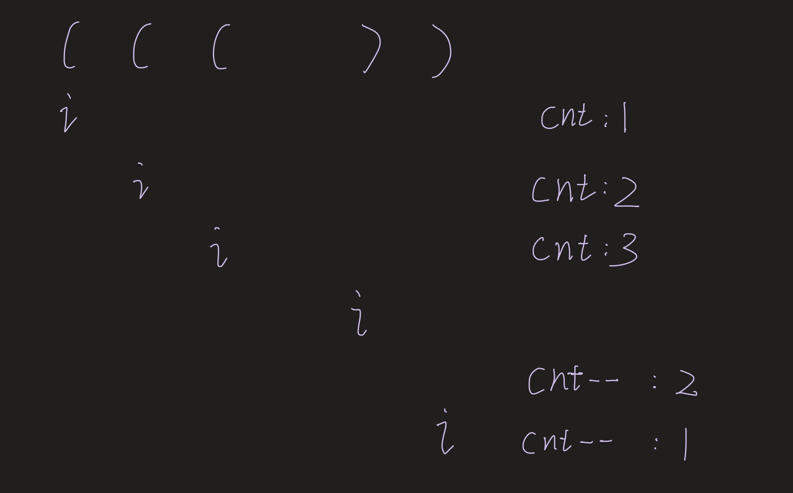

## 1249. Minimum Remove to Make Valid Parentheses

---



- Result: After this step, **sb** contains a string where all **invalid closing parentheses** have been **removed**, 
  but there may still be **unmatched opening parentheses**.


#### Backward Pass to Filter Invalid Opening Parentheses `(`


- Purpose: In this step, we process the intermediate string sb from right to left to remove any unmatched opening parentheses `(`.

---

```java
class _1249_MinimumRemove_to_MakeValidParentheses {
    public String minRemoveToMakeValid(String s) {
        int n = s.length();
        if (s == null || s.length() == 0) return "";

        StringBuilder sb = new StringBuilder();
        int cnt = 0;
        for (int i = 0; i < n; i++) {
            char c = s.charAt(i);
            if (c == '(') {
                sb.append(c);
                cnt++;
            } else if (c == ')' && cnt > 0) {
                sb.append(c);
                cnt--;
            } else if (c == ')' && cnt == 0) {
                continue;
            } else if (c != ')') {
                sb.append(c);
            }
        }

        StringBuilder filtered = new StringBuilder();
        for (int i = sb.length() - 1; i >= 0; i--) {
            char c = sb.charAt(i);
            if (c == '(' && cnt > 0) {
                cnt--;
            } else {
                filtered.append(c);
            }
        }

        return filtered.reverse().toString();
    }
}
```

---
#### Python

```py
class Solution:
    def minRemoveToMakeValid(self, s: str) -> str:
        n = len(s)
        if not s or n == 0:
            return ""

        # Forward pass to remove invalid closing parentheses ')'
        sb = []
        cnt = 0
        for i in range(n):
            c = s[i]
            if c == '(':
                sb.append(c)
                cnt += 1
            elif c == ')' and cnt > 0:
                sb.append(c)
                cnt -= 1
            elif c == ')' and cnt == 0:
                continue                
            elif c != ')':  # "x x ( x x"
                sb.append(c)

        print("".join(sb))  # Output intermediate result: le(e(t(co)de)

        # Backward pass to remove invalid opening parentheses '('
        filtered = []
        for i in range(len(sb) - 1, -1, -1):
            c = sb[i]
            if c == '(' and cnt > 0:
                cnt -= 1
            else:
                filtered.append(sb[i])

        return "".join(filtered[::-1])


if __name__ == "__main__":
    soln = Solution()
    s = "le(e(t(co)de)"
    print(soln.minRemoveToMakeValid(s))
```