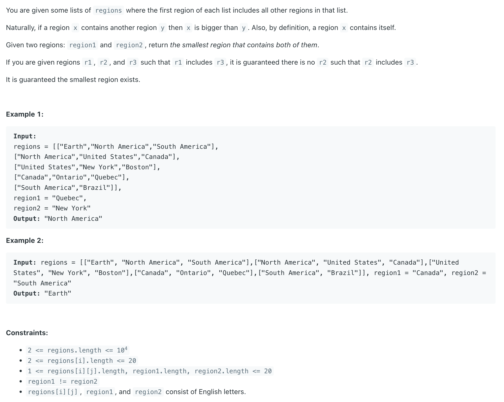

## 1257. Smallest Common Region

---

- a region **X contains itself**.

```java
/**
    The idea is very simple here. We need to get one of the region and its ancestors in a set and 
    then check if region2 or its any of the parent or ancestor is present in the set. 
    If we find a match then that is the smallest common region between region1 and region2.
    
    Follwing are the steps:
    1. Get the map of child-parent, Key = child, Value = parent
        This will make our life easier as iterating a map is easy than a bunch of lists
    2. We have to keep adding region1, its parent, grandparent, etc. in a set till it doesn't become null
    3. Now keep checking for region2 or its parents/ancestors in a set
    4. Wherever we find a match, that is our answer!
 */

 class smallestCommonRegion {
    public String findSmallestRegion(List<List<String>> regions, String region1, String region2) {
        Map<String, String> childParentMap = new HashMap<>();

        // 1. Get the map of child-parent, Key = child, Value = parent
        for (List<String> list : regions) {
            String parent = list.get(0);
            for (int i = 1; i < list.size(); i++) {
                childParentMap.put(list.get(i), parent);
            }
        }

        // 2. We have to keep adding region1, its parent, grandparent, etc. in a set till it doesn't become null
        Set<String> set = new HashSet<>();
        while (region1 != null) {
            set.add(region1);
            region1 = childParentMap.get(region1);
        }

        // 3. Now keep checking for region2 or its parents/ancestors in a set
        while (region2 != null) {
            // 4. Wherever we find a match, that is our answer!
            if (set.contains(region2)) {
                return region2;
            }
            region2 = childParentMap.get(region2);
        }

        return null;
    }
}
```