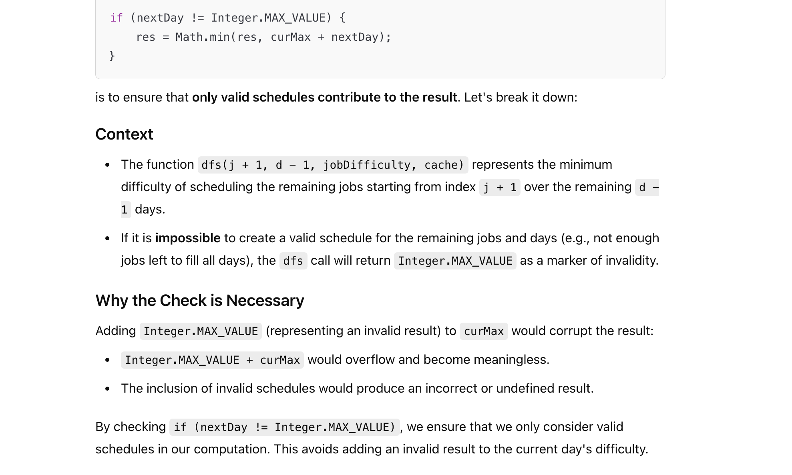
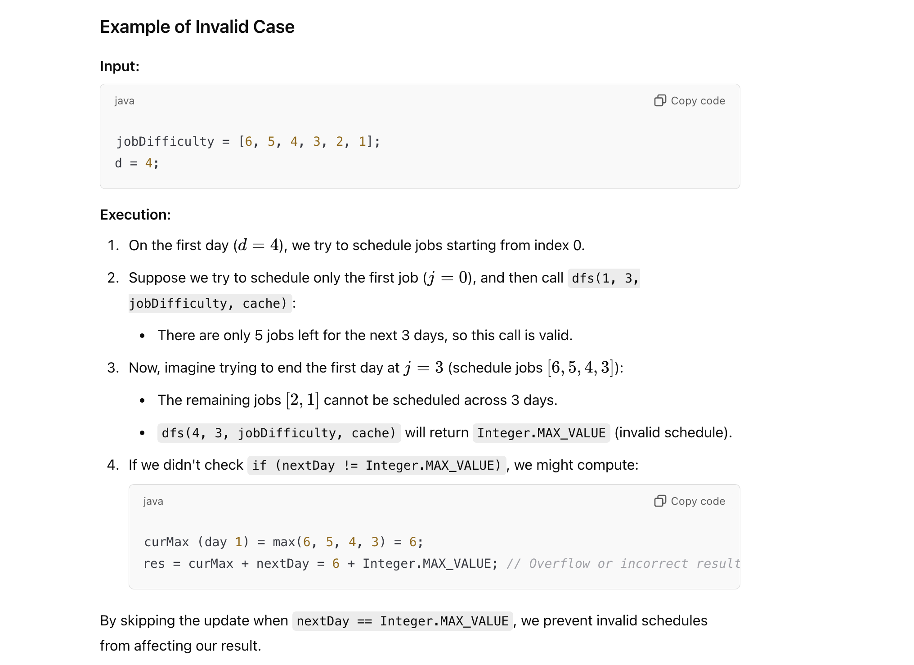
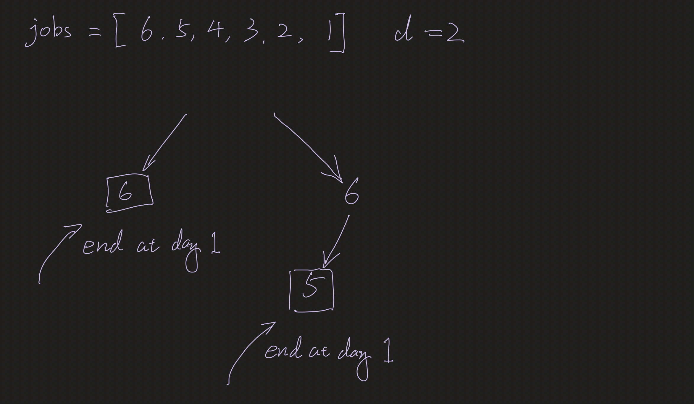
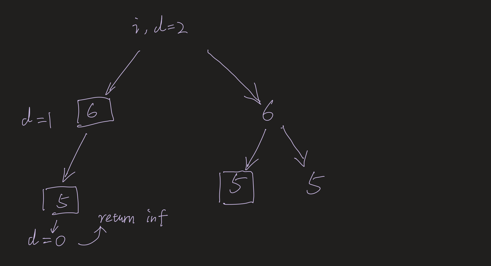
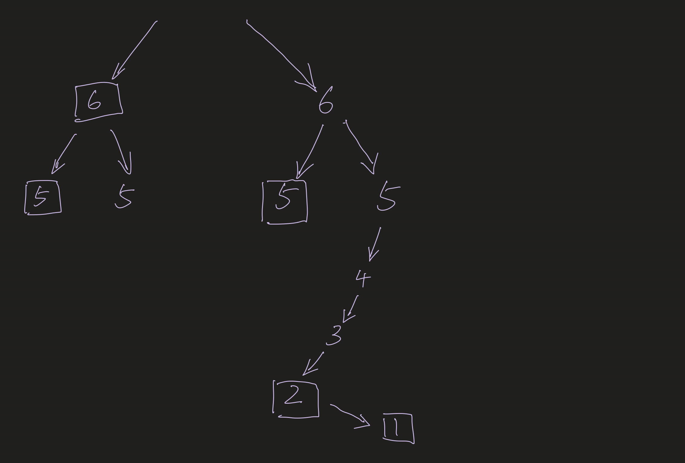
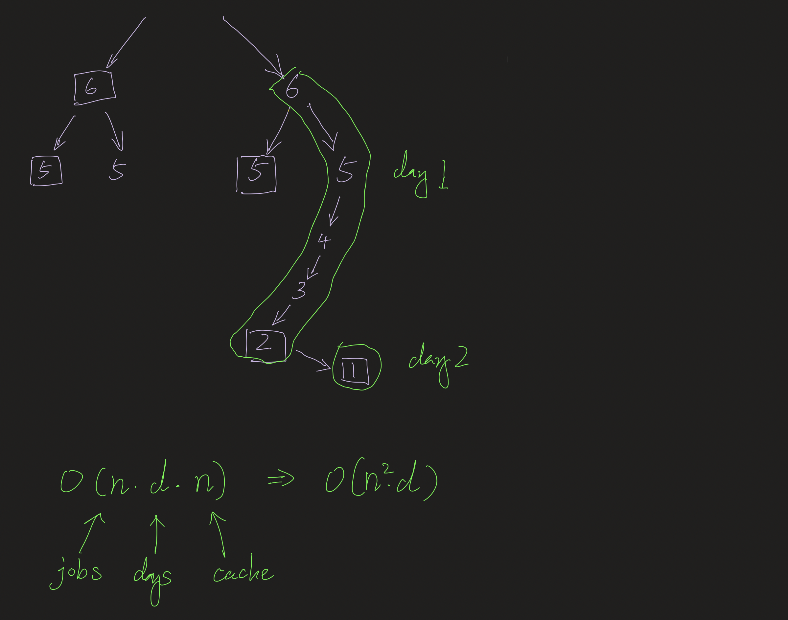

## 1335. Minimum Difficulty of a Job Schedule

---

- [youtube](https://www.youtube.com/watch?v=DAAULrZFeLI)

- the goal is: **Minimize** the total difficulty across d days by splitting the jobs **optimally**.


- i.e. : `Day 1: [5,2,4] | Day 2: [1] | Day 3: [6,2,7] = 5+1+7 = 13`

---

#### Without Memoization

```java
class Solution {
    public int minDifficulty(int[] jobDifficulty, int d) {
        if (d > jobDifficulty.length) {
            return -1;
        }
        return dfs(jobDifficulty, d - 1, 0);
    }

    private int dfs(int[] jobDifficulty, int day, int pos) {
        if (day == 0) {
            int curMax = jobDifficulty[pos];
            for (int i = pos; i < jobDifficulty.length; i++) {
                curMax = Math.max(curMax, jobDifficulty[i]);
            }
            return curMax;
        }

        int max = Integer.MIN_VALUE;
        int min = Integer.MAX_VALUE;

        // try out all ranges for that day
        for (int i = pos; i < jobDifficulty.length - day; i++) {
            max = Math.max(max, jobDifficulty[i]);
            min = Math.min(min, max + dfs(jobDifficulty, day - 1, i + 1));
        }
        return min;
    }
}
```
---


- A careful look at this will tell you that there's a lot of repeated work in this recursive function. For example, 
  look at these two splits during the recursive:

```ruby
    Day 1: [5, 2] | Day 2 [4, 1] | Day 3: [6,2,7]
    Day 1: [5, 2, 4] | Day 2: [1] | Day 3: [6,2,7]
```
---

#### Memoization

My task is to schedule the jobs over 𝑑 days such that:

- 1. Every day you work on at least one job.
- 2. The difficulty of a day is the **maximum difficulty** of the jobs scheduled for that day.
- 3. Minimize the sum of difficulties over all 𝑑 days.

If it's not possible to schedule the jobs over 𝑑 days, return −1

---


---
```java
class dfs_memo {
    public int minDifficulty(int[] jobDifficulty, int d) {
        if (jobDifficulty.length < d) {
            return -1; // Not enough jobs for the required days
        }
        Map<String, Integer> cache = new HashMap<>();
        return dfs(0, d, jobDifficulty, cache);
    }

    private int dfs(int i, int d, int[] jobDifficulty, Map<String, Integer> cache) {
        if (i == jobDifficulty.length) {
            return d == 0 ? 0 : Integer.MAX_VALUE;
        }
        if (d == 0) {
            return Integer.MAX_VALUE;
        }

        // Cache key should uniquely identify the state
        String key = i + "," + d;
        if (cache.containsKey(key)) {
            return cache.get(key);
        }

        int curMax = 0;
        int res = Integer.MAX_VALUE;

        // Try ending the current day at each possible job index from i onwards
        for (int j = i; j < jobDifficulty.length; j++) {
            curMax = Math.max(curMax, jobDifficulty[j]);
            int nextDay = dfs(j + 1, d - 1, jobDifficulty, cache);
            if (nextDay != Integer.MAX_VALUE) {
                res = Math.min(res, curMax + nextDay);
            }
        }

        cache.put(key, res);
        return res;
    }
}
```
---







---


#### Python

- rectange represents one of days is done (schedule one job in one day)










---




```py
class Solution:
    def minDifficulty(self, jobDifficulty: List[int], d: int) -> int:
        if len(jobDifficulty) < d:
            return -1

        cache = {}
        def dfs(i, d, cur_max):
            if i == len(jobDifficulty):
                return 0 if d == 0 else float("inf")
            if d == 0:
                return float("inf")

            if (i, d, cur_max) in cache:
                return cache[(i, d, cur_max)]

            cur_max = max(cur_max, jobDifficulty[i])
            res = min(
                dfs(i + 1, d, cur_max),
                cur_max + dfs(i + 1, d - 1, -1)
            )

            cache[(i, d, cur_max)] = res
            return res

        return dfs(0, d, -1)
```