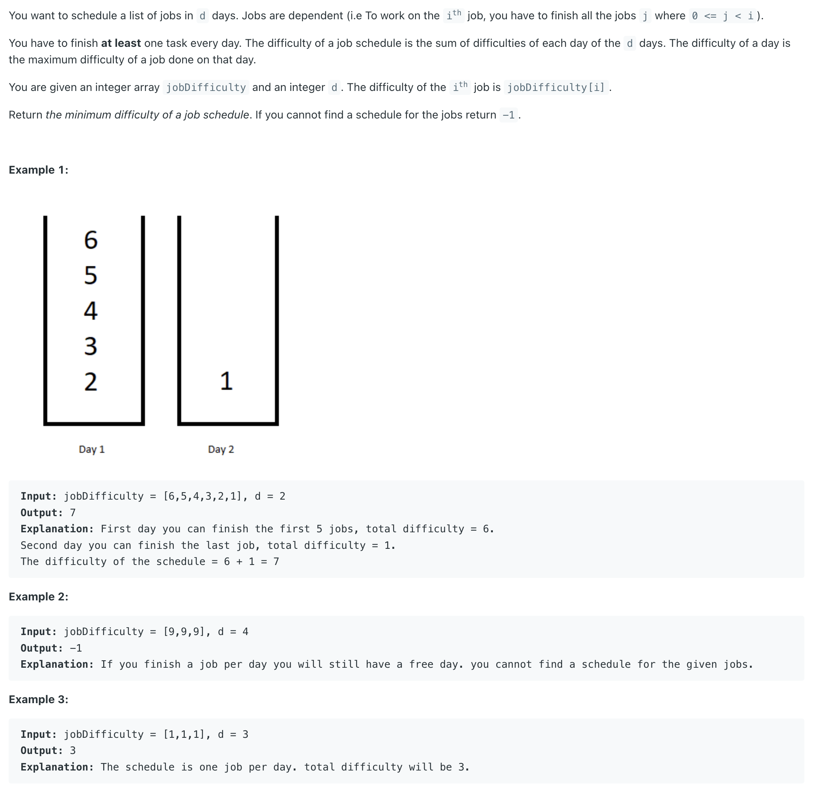
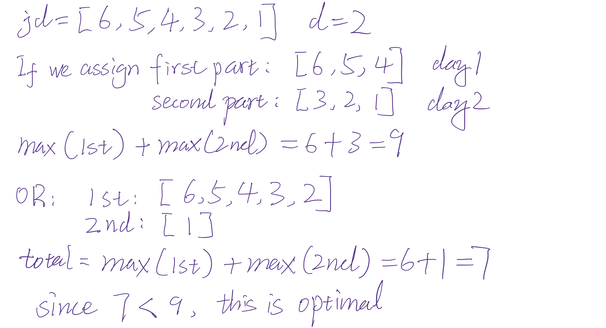
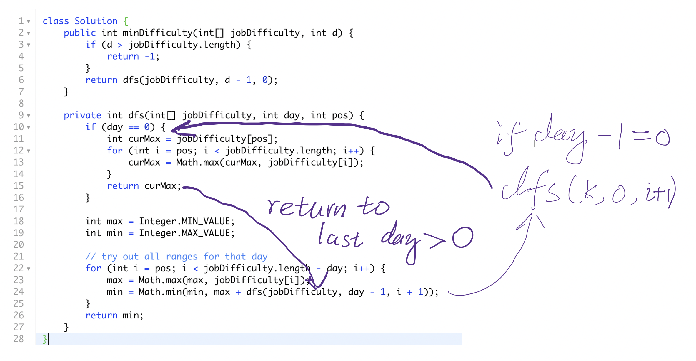
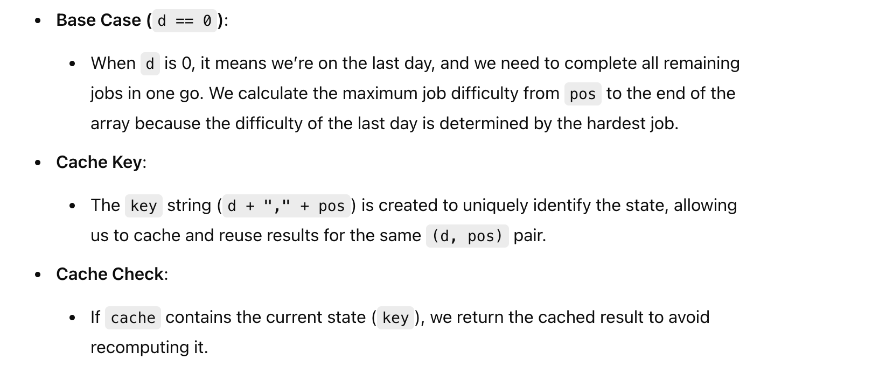
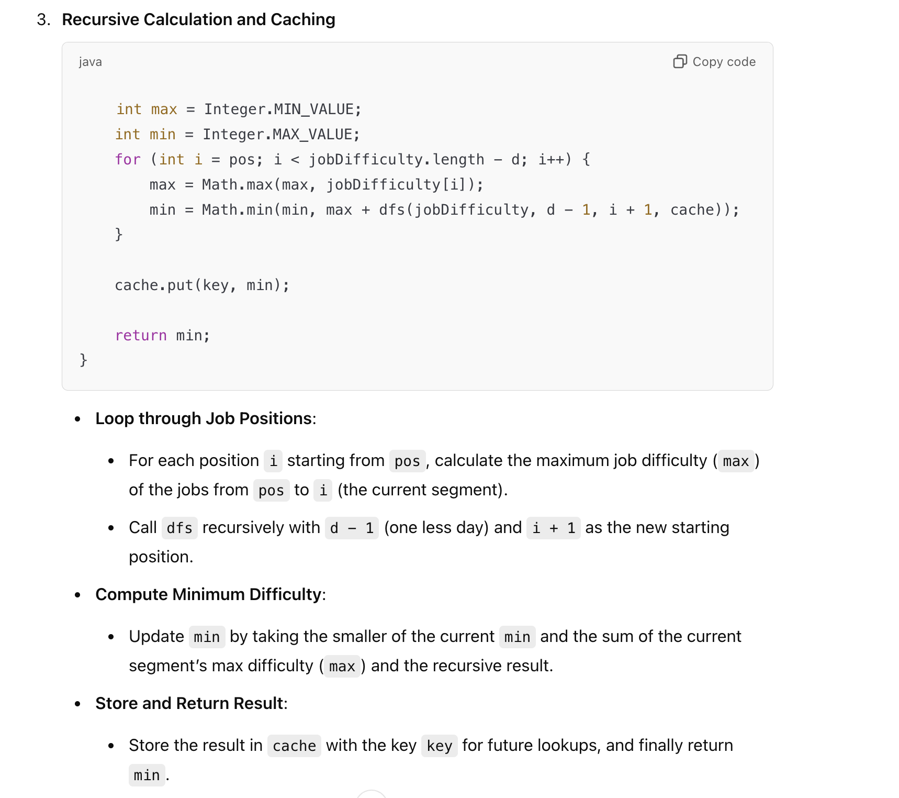
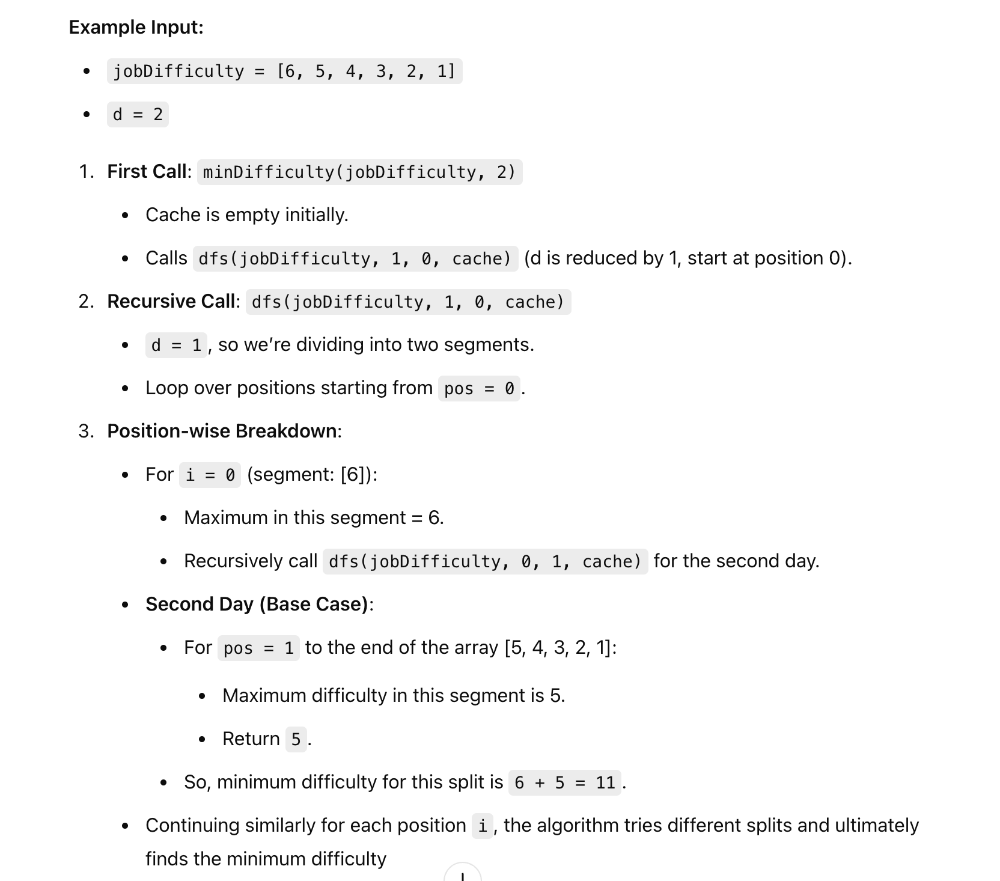

## 1335. Minimum Difficulty of a Job Schedule

---

- [youtube](https://www.youtube.com/watch?v=DAAULrZFeLI)

- the goal is: **Minimize** the total difficulty across d days by splitting the jobs **optimally**.



- i.e. : `Day 1: [5,2,4] | Day 2: [1] | Day 3: [6,2,7] = 5+1+7 = 13`

---

#### Without Memoization

```java
class Solution {
    public int minDifficulty(int[] jobDifficulty, int d) {
        if (d > jobDifficulty.length) {
            return -1;
        }
        return dfs(jobDifficulty, d - 1, 0);
    }

    private int dfs(int[] jobDifficulty, int day, int pos) {
        if (day == 0) {
            int curMax = jobDifficulty[pos];
            for (int i = pos; i < jobDifficulty.length; i++) {
                curMax = Math.max(curMax, jobDifficulty[i]);
            }
            return curMax;
        }

        int max = Integer.MIN_VALUE;
        int min = Integer.MAX_VALUE;

        // try out all ranges for that day
        for (int i = pos; i < jobDifficulty.length - day; i++) {
            max = Math.max(max, jobDifficulty[i]);
            min = Math.min(min, max + dfs(jobDifficulty, day - 1, i + 1));
        }
        return min;
    }
}
```
---




- A careful look at this will tell you that there's a lot of repeated work in this recursive function. For example, 
  look at these two splits during the recursive:

```ruby
    Day 1: [5, 2] | Day 2 [4, 1] | Day 3: [6,2,7]
    Day 1: [5, 2, 4] | Day 2: [1] | Day 3: [6,2,7]
```
---

#### Memoization


- What we could do instead is maintain a memo/cache for this so the next time our function knows 
  "hey, when you make the cut for day 2 at position 4, I know the answer is 7, I've done this before, don't call dfs again". 







---
```java
class dfs_memo {
    public int minDifficulty(int[] jobDifficulty, int d) {
        if (d > jobDifficulty.length) {
            return -1;
        }

        // Set up a cache with a HashMap where key is a string "d, pos" and value is the result
        Map<String, Integer> cache = new HashMap<>();
        
        return dfs(jobDifficulty, d - 1, 0, cache);
    }

    private int dfs(int[] jobDifficulty, int d, int pos, Map<String, Integer> cache) {
        if (d == 0) {
            int curMax = jobDifficulty[pos];
            for (int i = pos; i < jobDifficulty.length; i++) {
                curMax = Math.max(curMax, jobDifficulty[i]);
            }
            return curMax;
        }

        // Create a unique key for the cache based on `d` and `pos`
        String key = d + "," + pos;
        
        // Check the cache to avoid redundant calculations
        if (cache.containsKey(key)) {
            return cache.get(key);
        }

        int max = Integer.MIN_VALUE;
        int min = Integer.MAX_VALUE;
        for (int i = pos; i < jobDifficulty.length - d; i++) {
            max = Math.max(max, jobDifficulty[i]);
            min = Math.min(min, max + dfs(jobDifficulty, d - 1, i + 1, cache));
        }

        // Store the computed result in the cache
        cache.put(key, min);
        
        return min;
    }
}
```
---


#### Example Walkthrough




#### why we set `i < jobDifficulty.length - d`  ?


