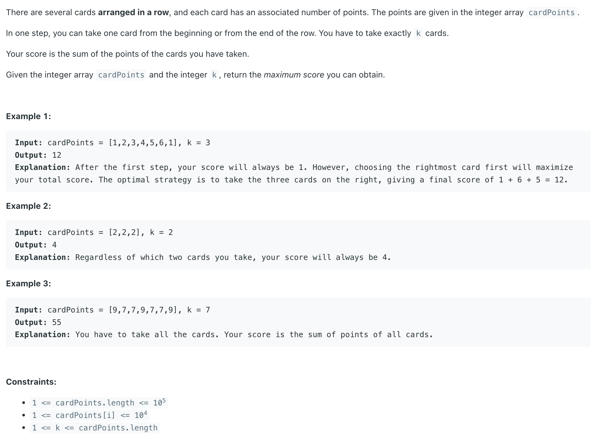
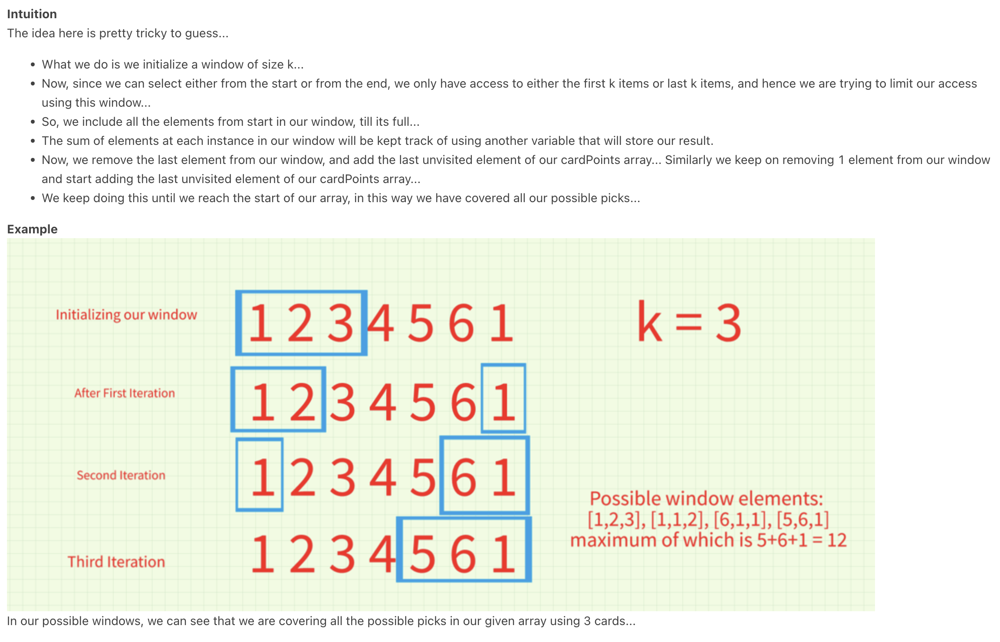

## 1423. Maximum Points You Can Obtain from Cards

---
- Note: for **cardPoints = [1,2,3,4,5,6,1]**, either from leftmost => **[1, 2, 3]**
  - or from rightmost => **[5,6,1]**



---

```java
class Solution {
    public int maxScore(int[] cardPoints, int k) {
        int res = 0;
        for (int i = 0; i < k; i++) {
            res += cardPoints[i];
        }
        
        int cur = res;

        //First k elements in our window
        for (int i = k - 1; i >= 0; i--) {

            //We remove the last visited element and add the non-visited element from the last
            cur -= cardPoints[i];
            cur += cardPoints[cardPoints.length - k + i];
            
            //We check the maximum value any possible combination can give
            res = Math.max(res, cur);
        }
        
        return res;
    }
}
```
---


#### Python

```py
class Solution:
    def maxScore(self, cardPoints: List[int], k: int) -> int:
        res = 0
        for p in cardPoints[:k]:
            res += p
        # res = sum(cardPoints[:k]

        cur = res

        # range(start, stop, step)
        for i in range(k - 1, -1, -1):
            cur -= cardPoints[i]
            cur += cardPoints[len(cardPoints) - k + i]
            res = max(res, cur)

        return res
```