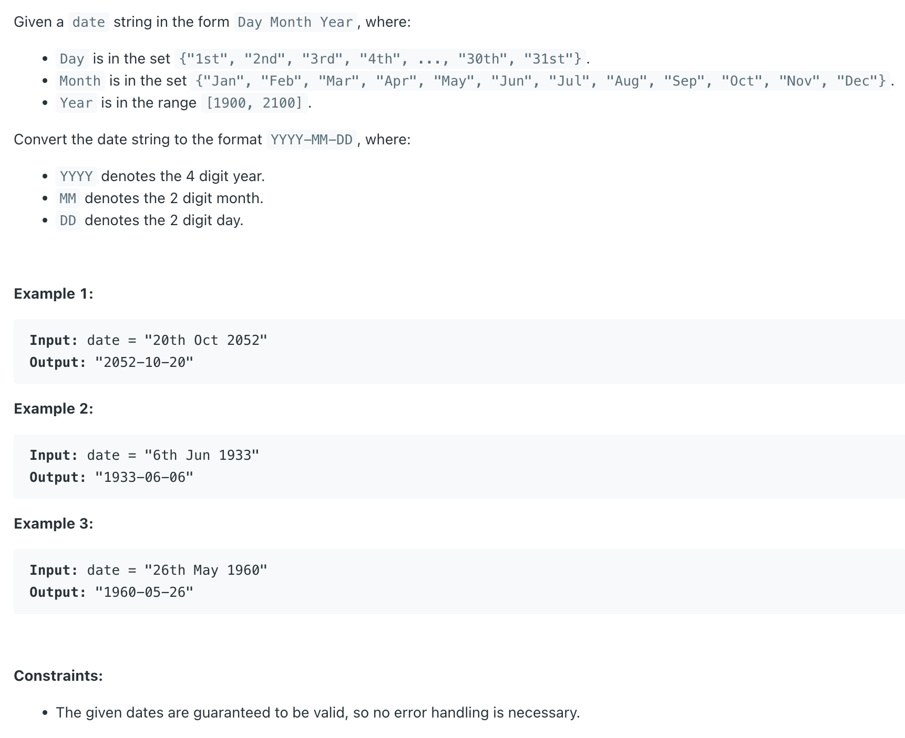

## 1507. Reformat Date


---
```java
class Solution {
    final Map<String, String> months = getMonths();

    public String reformatDate(String date) {
        String[] strs = date.split(" ");
        StringBuilder sb = new StringBuilder();
        sb.append(strs[2]).append("-");
        sb.append(months.get(strs[1])).append("-");
        String zero_plus_digit = strs[0].length() == 3 ? "0" + strs[0].substring(0, 1)
                : strs[0].substring(0, 2);
        sb.append(zero_plus_digit);
        return sb.toString();
    }

    private Map<String, String> getMonths() {
        Map<String, String> months = new HashMap<>();
        months.put("Jan", "01");
        months.put("Feb", "02");
        months.put("Mar", "03");
        months.put("Apr", "04");
        months.put("May", "05");
        months.put("Jun", "06");
        months.put("Jul", "07");
        months.put("Aug", "08");
        months.put("Sep", "09");
        months.put("Oct", "10");
        months.put("Nov", "11");
        months.put("Dec", "12");
        return months;
    }
}
```