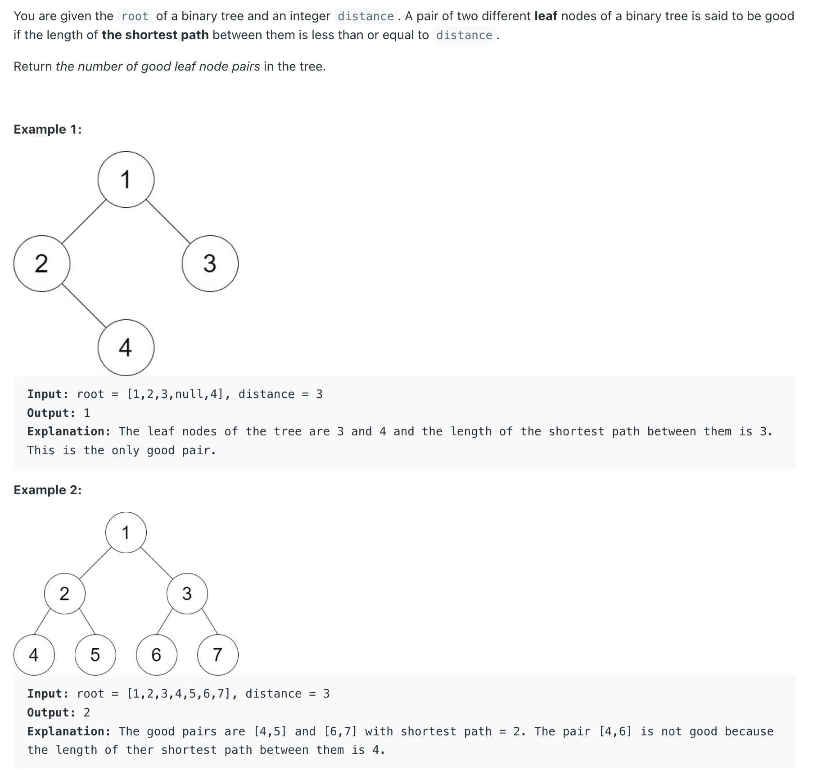
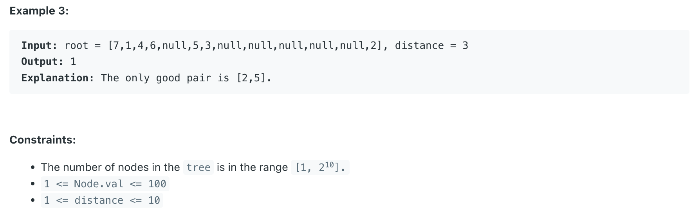
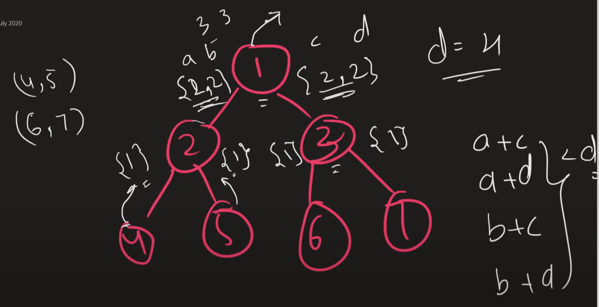

## 1530. Number of Good Leaf Nodes Pairs


---


---

```java
class _1530_NumberOfGoodLeafNodesPairs {
    int count = 0;
    public int countPairs(TreeNode root, int distance) {
        dfs(root, distance);
        return count;
    }

    private List<Integer> dfs(TreeNode root, int distance) {
        if (root == null) {
            return new ArrayList<>();
        }
        if (root.left == null && root.right == null) {
            List<Integer> sublist = new ArrayList<>();
            sublist.add(1);
            return sublist;
        }

        List<Integer> l1 = dfs(root.left, distance);
        List<Integer> l2 = dfs(root.right, distance);

        for (int d1 : l1) {
            for (int d2 : l2) {
                if (d1 + d2 <= distance) {
                    count++;
                }
            }
        }

        List<Integer> list = new ArrayList<>();
        for (int val : l1) {
            list.add(val + 1);
        }
        for (int val : l2) {
            list.add(val + 1);
        }
        return list;
    }
}
```