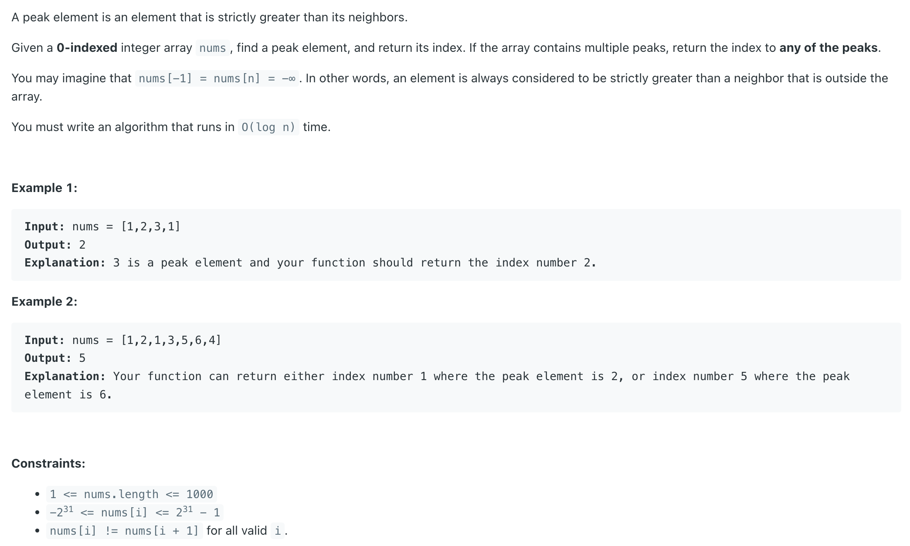
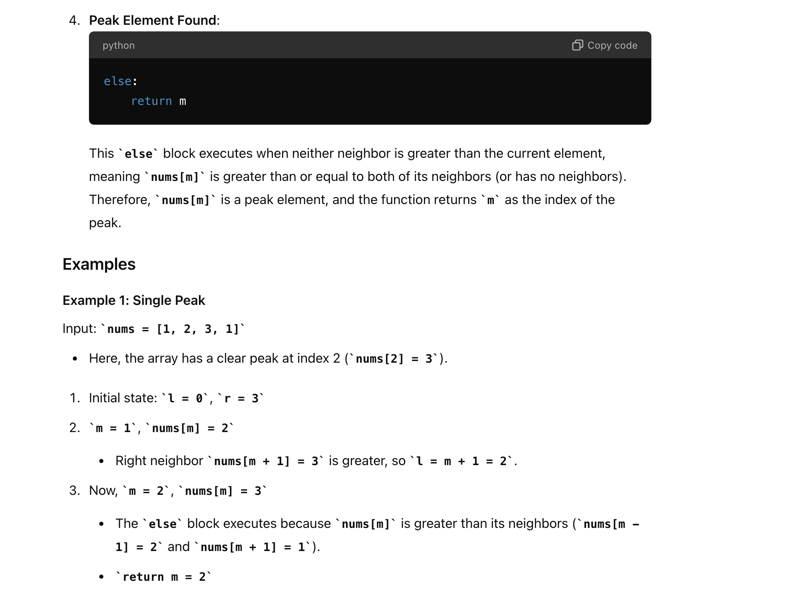

## 162. Find Peak Element

---

#### Brute Force

```java
class Solution {
    public int findPeakElement(int[] nums) {
        int peakIdx = 0;
        for (int i = 1; i < nums.length; i++) {
            if (nums[i - 1] > nums[i]) {
                return i - 1;
            } 
        }
        return nums.length - 1;
    }
}
```
---

### Binary Search




```java
class findPeakElement_v1 {
    public int findPeakElement(int[] nums) {
        int n = nums.length;
        int left = 0, right = n - 1;
        while (left <= right) {
            int mid = left + (right - left) / 2;

            // left neighour greater
            if (mid > 0 && nums[mid - 1] > nums[mid]) {
                right = mid - 1;
            } else if (mid < n - 1 && nums[mid] < nums[mid + 1]) {
                left = mid + 1;
            } else  {
                return mid;
            }
        }
        return -1;
    }
}
```

---

#### Python

```py
class Solution:
    def findPeakElement(self, nums: List[int]) -> int:
        l, r = 0, len(nums) - 1

        while l <= r:
            m = l + (r - l) // 2
            # left neighbor greater
            if m > 0 and nums[m - 1] > nums[m]:
                r = m - 1
            # right neighbor greater
            elif m < len(nums) - 1 and nums[m] < nums[m + 1]:
                l = m + 1
            else:
                return m
```