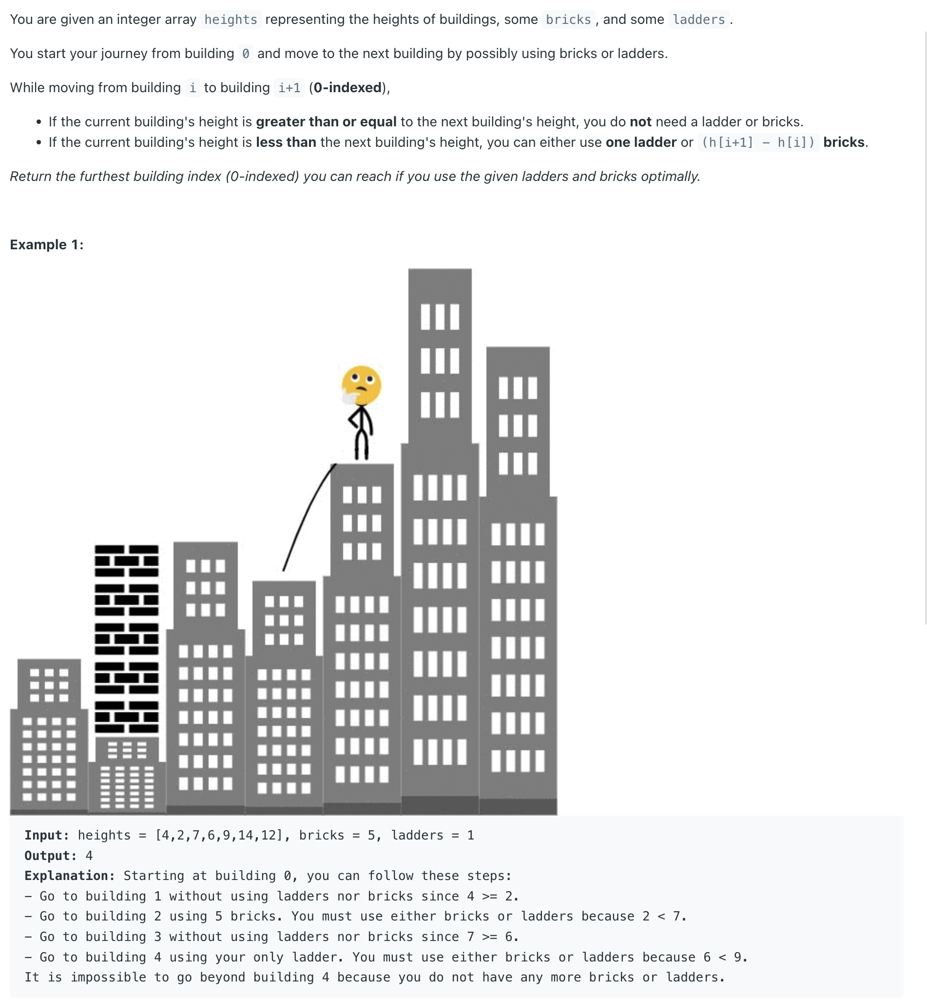
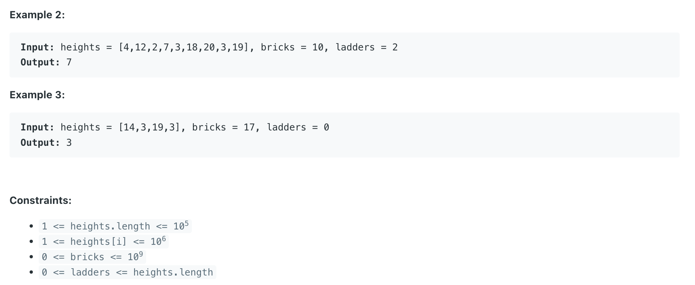
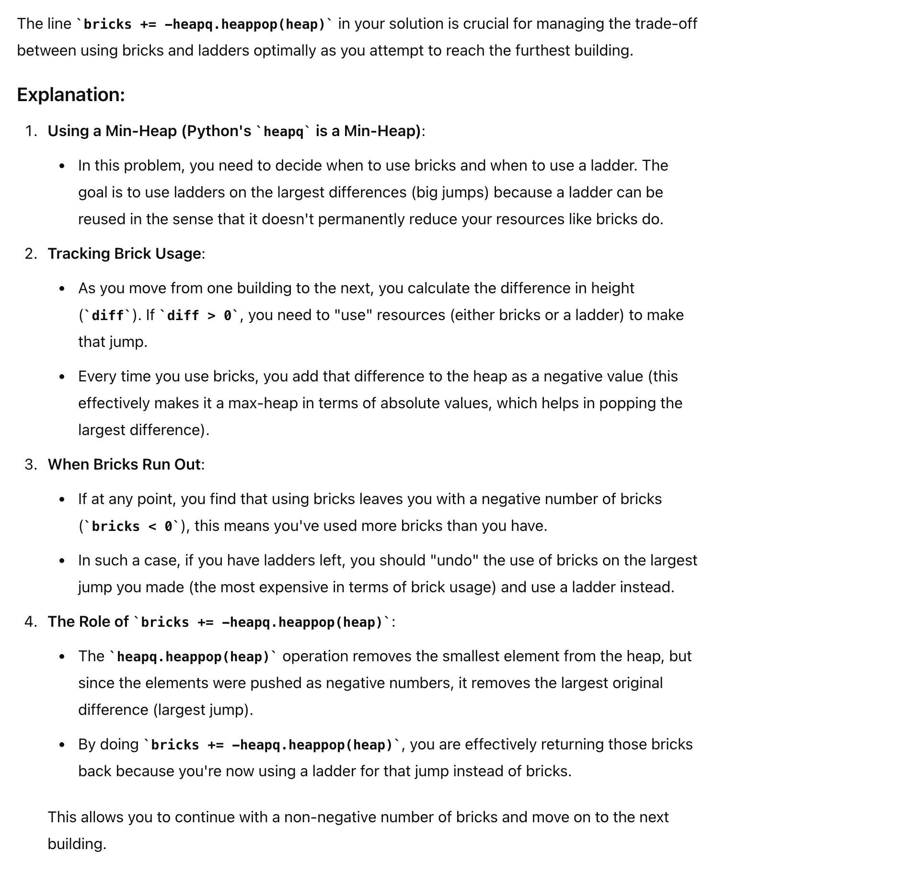

## 1642. Furthest Building You Can Reach


---



- **本体精髓在于 greedy 的同时 需要注意 trade off**. 
  - **如果贪心吃不下，需要把吃不下的吐出来，补回来**！
  - 所以 `bricks += maxHeap.poll()`, 这一步就是不选择使用bricks的时候，把bricks补回来，选择使用ladder 
---

```java
class Solution {
    public int furthestBuilding(int[] heights, int bricks, int ladders) {
        PriorityQueue<Integer> maxHeap = new PriorityQueue<>((a, b) -> b - a);
        int diff = 0;
        for (int i = 1; i < heights.length; i++) {
            diff = heights[i] - heights[i - 1];
            if (diff < 0) {
                continue;
            }
            maxHeap.offer(diff);
            bricks -= diff;
            if (bricks < 0) {
                if (ladders == 0) {
                    return i - 1;
                }
                ladders--;
                bricks += maxHeap.poll();
            }
        }
        
        return heights.length - 1;
    }
}
```
---

#### Python

```py
class Solution:
    def furthestBuilding(self, heights: List[int], bricks: int, ladders: int) -> int:
        heap = []  # max heap of bricks

        for i in range(len(heights) - 1):
            diff = heights[i + 1] - heights[i]
            if diff <= 0:
                continue

            bricks -= diff
            heapq.heappush(heap, -diff)

            if bricks < 0:
                if ladders == 0:
                    return i
                ladders -= 1
                bricks += -heapq.heappop(heap)

        return len(heights) - 1
```