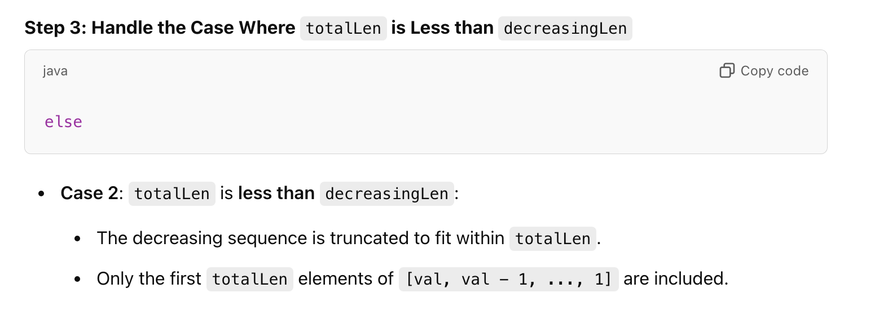

## 1802. Maximum Value at a Given Index in a Bounded Array


1. 注意：**abs(nums[i] - nums[i+1]) <= 1 where 0 <= i < n-1**, `The difference between any two adjacent numbers` 不能超过 **1** 
2. num[index] is **maximum**
3. the sum of all nums doen't exceed **maxSum**


---


- 最优解的图如上所示， **sum compare with maxsum**, 如果比maxsum 小，则 `H derreasing`!, OR, `H increasing`


- [youtube](https://www.youtube.com/watch?v=3CgUO6G4nOk)

---


---

#### Key Variables

- **left** and **right**:
  - Represent the binary search range for the possible value at `index`.
  - Initially: `left = 1` and `right = maxSum`.

- **leftCount** is the number of elements to the left of index. It is calculated as **index**.
- **rightCount** is the number of elements to the right of index. It is calculated as **n - index - 1**.


#### Compare with `maxSum`

- If **totalSum** exceeds **maxSum**, then **mid** is too large, so the search space is reduced by setting `right = mid - 1`.
- If **totalSum** is within **maxSum**, then **mid** is a feasible value, and we move to a larger possible value 
  by setting `ans = mid` and `left = mid + 1`.


#### sum of numbers from [1 to n]


---





---

```java
class _1802_MaximumValueAt_a_GivenIndex_in_a_BoundedArray {
    public int maxValue(int n, int index, int maxSum) {
        int left = 1, right = maxSum;
        int leftCount = index, rightCount = n - index - 1;
        int ans = -1;
        while (left <= right) {
            int mid = (left + right) >>> 1;

            long  leftSum = getSum(leftCount, mid - 1);
            long  rightSum = getSum(rightCount, mid - 1);
            long  totalSum = leftSum + mid + rightSum;

            if (totalSum > maxSum) {
                right = mid - 1;
            } else {
                ans = mid;
                left = mid + 1;
            }
        }
        return ans;
    }

    private long calc(long n) { //sum of numbers from [1 to n]
        return (n * (n + 1)) / 2;
    }

    private long getSum(int totalLen, int val) {
        long totalSum = 0;
        int decreasingLen = val; //count of decreasing elements [val, val - 1, .., 1]

        //[val, val - 1, val - 2, ... 1, 1, 1, 1]
        if (totalLen >= decreasingLen)
        {
            long currSum = calc(val);
            int remainingSum = totalLen - decreasingLen; //all 1's, the reamining all 1's
            totalSum = currSum + remainingSum;
        }
        else //[val, val - 1, val - 2]
        {
            long lastVal = decreasingLen - totalLen;
            totalSum = calc(val) - calc(lastVal);
        }
        return totalSum;
    }
}
```
---


#### Python

```py
class Solution:
    def maxValue(self, n: int, index: int, maxSum: int) -> int:
        left, right = 1, maxSum
        leftCount, rightCount = index, (n - index - 1)
        ans = -1

        while left <= right:
            mid = (left + right) >> 1

            leftSum = self.getSum(leftCount, mid - 1)
            rightSum = self.getSum(rightCount, mid - 1)
            totalSum = leftSum + mid + rightSum

            if totalSum > maxSum:
                right = mid - 1
            else:
                ans = mid
                left = mid + 1
        return ans
    

    def getSum(self, countOfElments, val):
        total_sum = 0
        decreasingLen = val

        if (countOfElments >= decreasingLen):
            remainingSum = countOfElments - decreasingLen
            total_sum = self.calc(val) + remainingSum
        else:
            lastVal = decreasingLen - countOfElments
            total_sum = self.calc(val) - self.calc(lastVal)

        return total_sum

    def calc(self, n):
        return n * (n + 1) >> 1
```