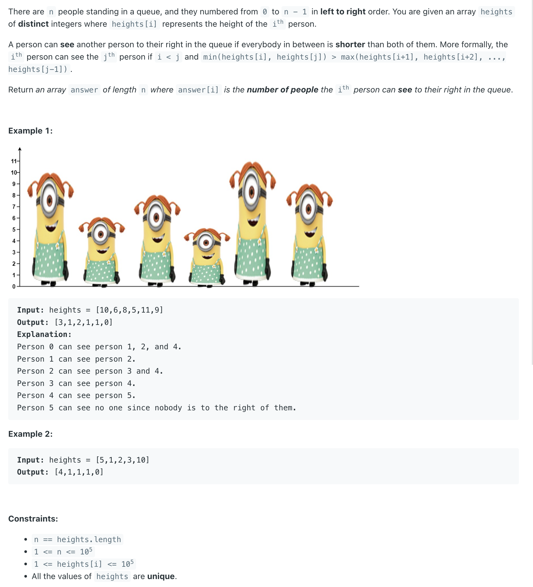
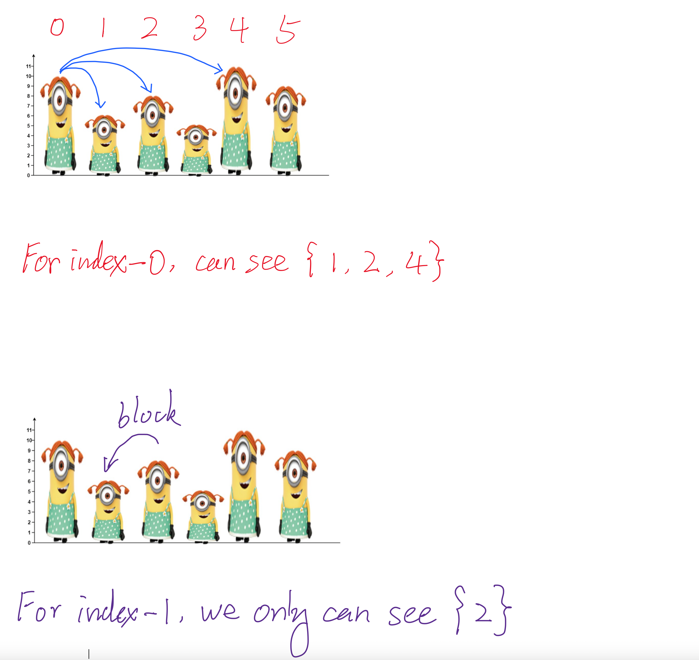
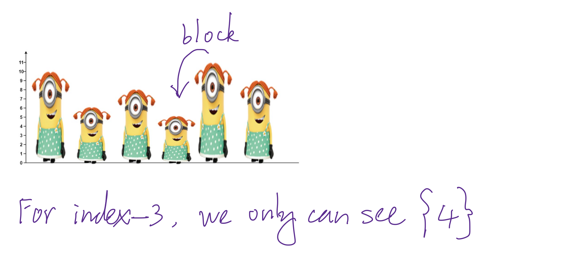
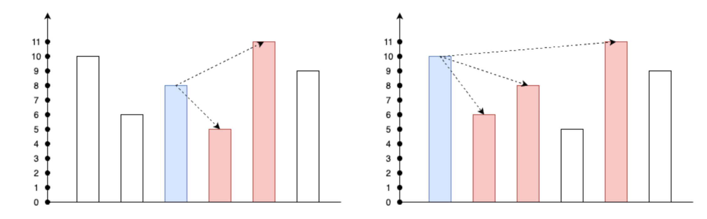
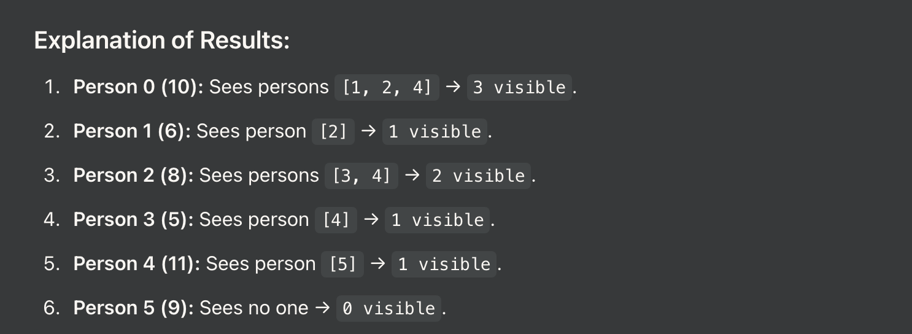

## 1944. Number of Visible People in a Queue

---








---

#### Examples


- heights = [10, 6, 8, 5, 11, 9]

1. Iteration 1:
   - i = 0, heights[0] = 10
   - Stack: empty, so no one in front to process.
   - Push 0 (index of 10) onto the stack
   - Stack: [0]

2. Iteration 2:
   - i = 1, heights[1] = 6
   - Stack: [0]. heights[stack.peek()] = heights[0] = 10 > heights[1] = 6.
     - Increment result[0]: result = [1, 0, 0, 0, 0, 0] (person 0 can see person 1).
   - Push 1 (index of 6) onto the stack.
   - Stack: [0, 1]


3. Iteration 3:
   - i = 2, heights[2] = 8
   - Stack: [0, 1]. Compare heights[1] = 6 < heights[2] = 8.
     - Increment result[1]: result = [1, 1, 0, 0, 0, 0] (person 1 can see person 2).
     - Pop index 1 (index-1 is now fully processed).
   - Compare heights[0] = 10 > heights[2] = 8.
     - Increment result[0]: result = [2, 1, 0, 0, 0, 0] (person 0 can also see person 2).
   - Push 2 (index of 8) onto the stack.
   - Stack: [0, 2]


4. Iteration 4:
   - i = 3, heights[3] = 5
   - Stack: [0, 2]. heights[2] = 8 > heights[3] = 5.
     - Increment result[2]: result = [2, 1, 1, 0, 0, 0] (person 2 can see person 3).
   - Push 3 (index of 5) onto the stack.
   - Stack: [0, 2, 3]


5. Iteration 5:
   - i = 4, heights[4] = 11
   - Stack: [0, 2, 3]. Compare heights[3] = 5 < heights[4] = 11.
     - Increment result[3]: result = [2, 1, 1, 1, 0, 0] (person 3 can see person 4).
     - Pop index 3.
   - Compare heights[2] = 8 < heights[4] = 11.
     - Increment result[2]: result = [2, 1, 2, 1, 0, 0] (person 2 can also see person 4).
     - Pop index 2.
   - Compare heights[0] = 10 < heights[4] = 11.
     - Increment result[0]: result = [3, 1, 2, 1, 0, 0] (person 0 can also see person 4).
     - Pop index 0.
   - Push 4 (index of 11) onto the stack.
   - Stack: [4]


6. Iteration 6:
   - i = 5, heights[5] = 9
   - Stack: [4]. heights[4] = 11 > heights[5] = 9.
     - Increment result[4]: result = [3, 1, 2, 1, 1, 0] (person 4 can see person 5).
   - Push 5 (index of 9) onto the stack.
   - Stack: [4, 5]



---


```java
class Solution {
    public int[] canSeePersonsCount(int[] heights) {
        int n = heights.length;
        int[] result = new int[n]; // To store the number of visible people for each person
        Stack<Integer> stack = new Stack<>(); // Monotonic decreasing stack to store indices

        for (int i = 0; i < n; i++) {
            // Process all people in the stack shorter than the current person
            while (!stack.isEmpty() && heights[stack.peek()] < heights[i]) {
                result[stack.pop()]++; // Increment visible count for the shorter person
            }
            // If the stack is not empty, the current person blocks the view of the top of the stack
            if (!stack.isEmpty()) {
                result[stack.peek()]++;
            }
            // Push the current person's index onto the stack
            stack.push(i);
        }

        return result;
    }
}
```
---

#### Python

```py
class Solution:
    def canSeePersonsCount(self, heights: List[int]) -> List[int]:
        n = len(heights)
        if heights is None or n == 0:
            return []

        ans = [0] * n
        stk = []
        for i in range(n - 1, -1, -1):
            while stk and heights[i] > heights[stk[-1]]:
                stk.pop()
                ans[i] += 1
            if stk:
                ans[i] += 1
            stk.append(i)

        return ans
```