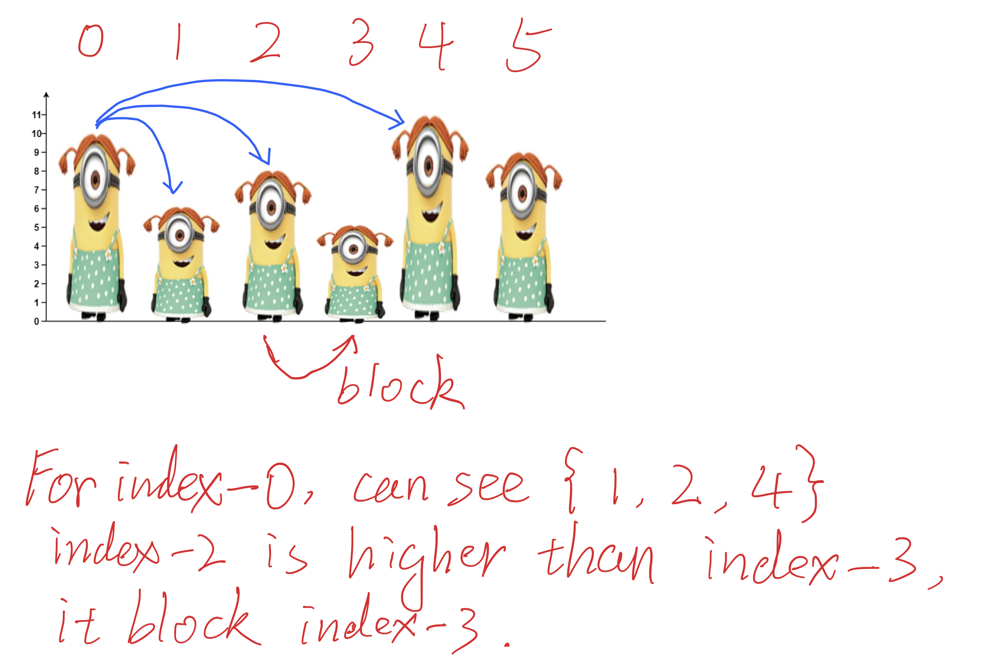
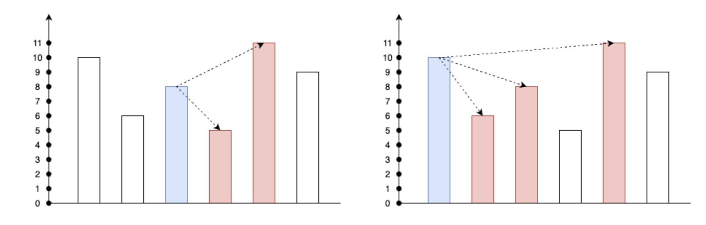

## 1944. Number of Visible People in a Queue

---






```ruby
    index = 5,     stk{5}                                 ans[5] = 0


    index = 4,   height[index] > height[stk.peek()],  stk.pop()
                  ans[4]++,                               ans[4] = 1,     stk{4}
    

    index = 3,   height[index] < height[stk.peek()],  
                  ans[3]++,                               ans[3] = 1,    stk{4, 3}
                

    index = 2,   height[index] > height[stk.peek()],  stk.pop()
                  ans[2]++,    ans[2]++,                  ans[2] = 2,    stk{4, 2}


    index = 1,   height[index] < height[stk.peek()],  
                  ans[1]++,                               ans[1] = 1,    stk{4, 2, 1}


    
    index = 0,   height[index] > height[stk.peek()],   stk.pop(), stk.pop(), stk{4}
                  ans[0]++, ans[0]++,       ans[0]++,     ans[0] = 3,    stk{4}
    


    ans[3, 1, 2, 1, 1, 0]
```
---


```java
class Solution {
    public int[] canSeePersonsCount(int[] heights) {
        if (heights == null || heights.length == 0) {
            return new int[]{};
        }

        int[] ans = new int[heights.length];
        Deque<Integer> stk = new ArrayDeque<>();
        for (int i = heights.length - 1; i >= 0; i--) {
            while (!stk.isEmpty() && heights[i] > heights[stk.peek()]) {
                stk.pop();
                ans[i]++;
            }
            if (!stk.isEmpty()) {
                ans[i]++;
            }

            stk.push(i);
        }
        
        return ans;
    }
}
```
---

#### Python

```py
class Solution:
    def canSeePersonsCount(self, heights: List[int]) -> List[int]:
        n = len(heights)
        if heights is None or n == 0:
            return []

        ans = [0] * n
        stk = []
        for i in range(n - 1, -1, -1):
            while stk and heights[i] > heights[stk[-1]]:
                stk.pop()
                ans[i] += 1
            if stk:
                ans[i] += 1
            stk.append(i)

        return ans
```