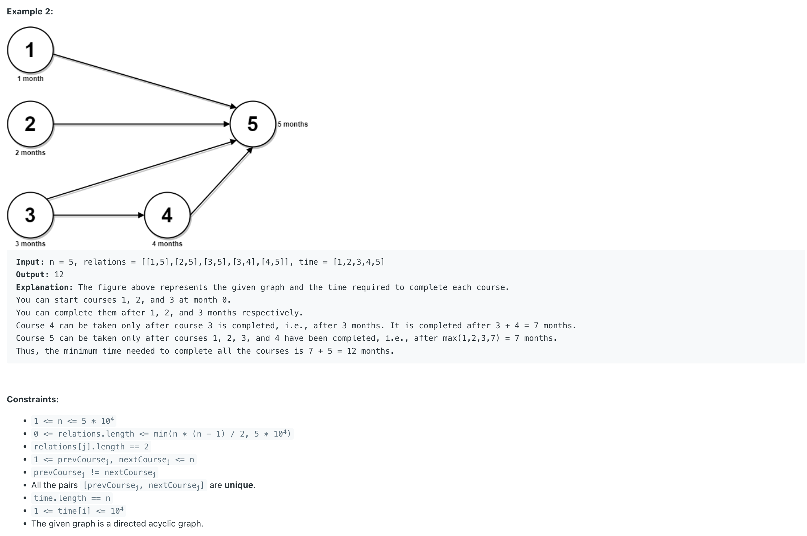

## 2050. Parallel Courses III


---

- Requirement:
  - find the the minimum number of months needed to complete all the courses


---


- T = **O(N + M)**, `N is number of courses`, where `M is number of edges`.
- space = **O(N + M)**


```java
class _2050_ParallelCourses_III {
    public int minimumTime(int n, int[][] relations, int[] time) {
        List<Integer>[] edges = new ArrayList[n];
        int[] indegree = new int[n];
        int[] completionTime = new int[n];
        for (int i = 0; i < n; i++) {
            edges[i] = new ArrayList<>();
        }
        for (int[] relation : relations) {
            int u = relation[0] - 1;
            int v = relation[1] - 1;
            edges[u].add(v);
            indegree[v]++;
        }
        Queue<Integer> queue = new ArrayDeque<>();
        for (int i = 0; i < n; i++) {
            if (indegree[i] == 0) { // if no prerequisite add it to queue
                completionTime[i] = time[i];
                queue.offer(i);
            }
        }

        while (!queue.isEmpty()) {
            int u = queue.poll();
            for (int v : edges[u]) {
                completionTime[v] = Math.max(completionTime[v], completionTime[u] + time[v]);
                indegree[v]--;
                if (indegree[v] == 0) { // when all prerequisite are complete add the next course
                    queue.offer(v);
                }
            }
        }

        int res = 0;
        for (int complete : completionTime) {
            res = Math.max(res, complete);
        }
        return res;
    }
}
```