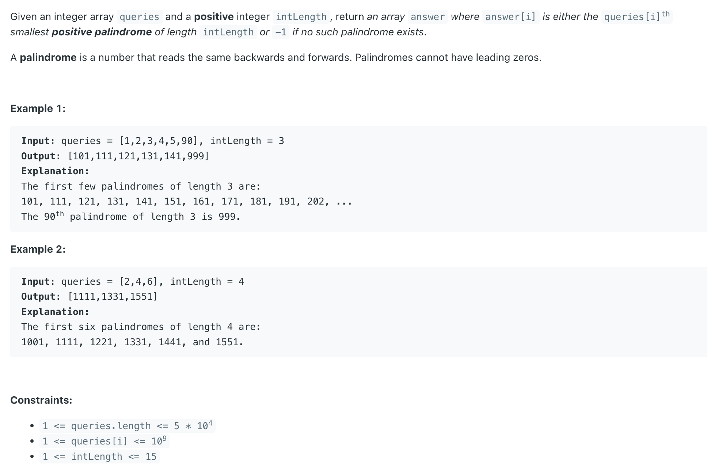

## 2217. Find Palindrome With Fixed Length

---

```ruby
Example 1:
    Input: queries = [1, 2, 3, 4, 5, 90], intLength = 3
    Output: [101, 111, 121, 131, 141, 999]


Example 2:
    Input: queries = [2, 4, 6], intLength = 4
    Output: [1111, 1331, 1551]
```

- **Approach**
  - 1. Palindrome Generation: To generate a palindrome of a given length, we can **construct the first half** and 
    **mirror it to form the second half**.
  - 2. Handling Queries: For each query, determine the `k-th smallest palindrome` by constructing it based on the length and position.


- **Detailed Steps**
  - 1. Calculate the Half Length:
    - If `intLength` is **odd**, the first half **includes** the **middle digit**.
    - If `intLength` is **even**, the first half is exactly half the length.
  - 2. Determine the Start and End:
    - The first half `starts` at `10^(halfLength - 1)`.
    - The first half `ends` at `10^halfLength - 1`.
  - 3. Generate the Palindrome:
    - For each query, calculate the corresponding number in the first half.
    - Convert this number to a string.
    - Mirror the string to create the full palindrome.
    - If `intLength` is **odd**, **exclude the middle digit from the mirroring part** to avoid duplication.

---

```ruby
    Query = 91
    half = start + 91 - 1 = 100
    100 is greater than 99 (end), so we add -1.
```


```java
class _2217_FindPalindromeWithFixedLength {
    public long[] kthPalindrome(int[] queries, int intLength) {
        int halfLength = (intLength + 1) / 2; // contains both odd and even
        long start = (long) Math.pow(10, halfLength - 1);
        long end = (long) Math.pow(10, halfLength) - 1;

        List<Long> res = new ArrayList<>();

        for (int query : queries) {
            long half = start + query - 1;
            if (half > end) { // -1 if no such palindrome exists.
                res.add(-1L);
            } else {
                String halfStr = Long.toString(half);
                StringBuilder fullStr = new StringBuilder(halfStr);
                if (intLength % 2 == 1) {
                    halfStr = halfStr.substring(0, halfStr.length() - 1);
                }
                fullStr.append(new StringBuilder(halfStr).reverse());
                res.add(Long.parseLong(fullStr.toString()));
            }
        }
        return res.stream().mapToLong(l -> l).toArray();
    }
}
```