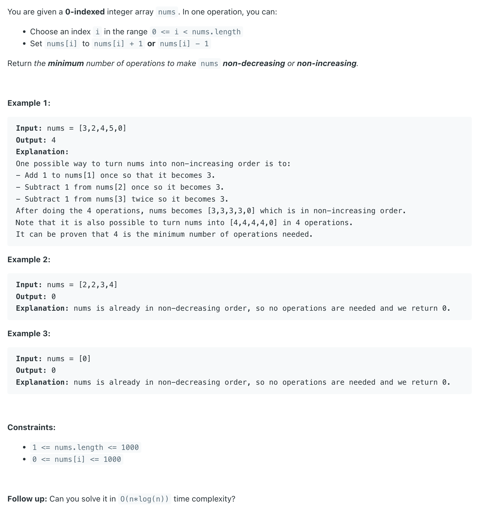
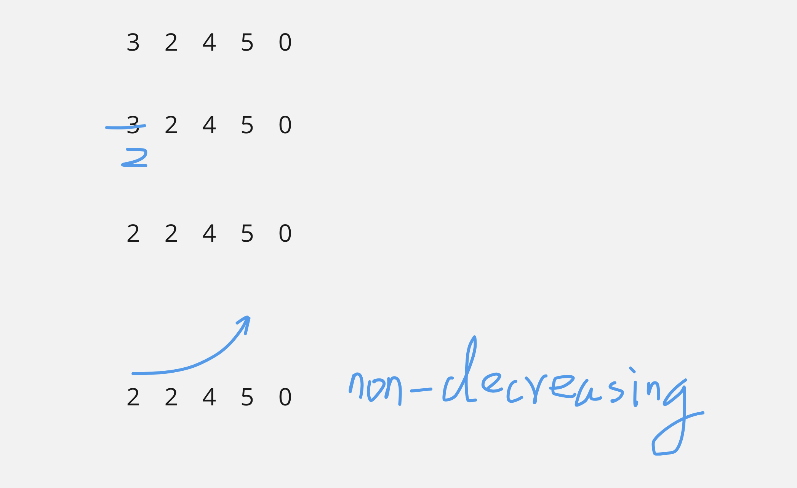
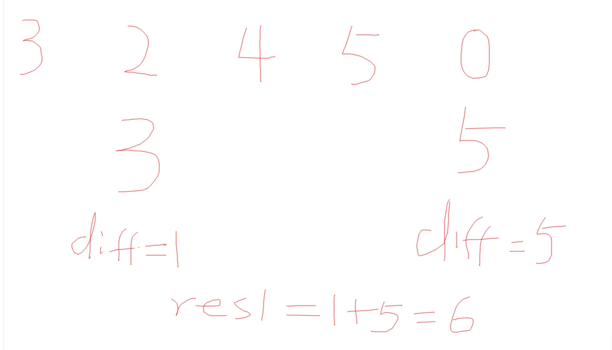
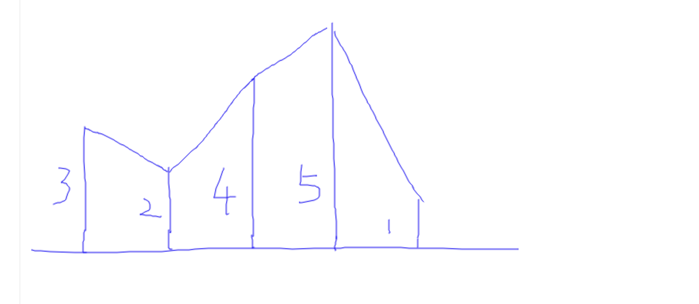

## 2263. Make Array Non-decreasing or Non-increasing

---


---




- non-decreasing:



- vice versa.


- maxHeap find the previous max, and compare its top() with current nums[i]
- keep the sea level with **the maximum value excluding the top one** 

---

```java
class Solution {
    public int convertArray(int[] nums) {
        int n = nums.length;
	    int res1 = 0;
	    int res2 = 0;
	    int diff = 0;
        //find the costs to ascending
        PriorityQueue<Integer> maxHeap = new PriorityQueue<>((a, b) -> b - a);
        for (int i = 0; i < n; i++) {
			//if current max(cur sea level) is larger than nums[i], that means 
			//we need to set it to the new number.
            if (!maxHeap.isEmpty() && maxHeap.peek() >= nums[i]) {
                diff = maxHeap.peek() - nums[i];
                res1 += diff;
                maxHeap.poll();
                maxHeap.add(nums[i]);
            }
			//if current max is smaller than nums[i], it's already acending
			//just set the new sea level to nums[i]
            maxHeap.add(nums[i]);
        }

        //find the costs to descending
        diff = 0;
        PriorityQueue<Integer> minHeap = new PriorityQueue<>();
        for (int i = 0; i < n; i++) {
            if (!minHeap.isEmpty() && minHeap.peek() <= nums[i]) {
                diff = nums[i] - minHeap.element();
                res2 += diff;
                minHeap.poll();
                minHeap.add(nums[i]);
            }
            minHeap.add(nums[i]);
        }
        return Math.min(res1, res2);
    }
}
```