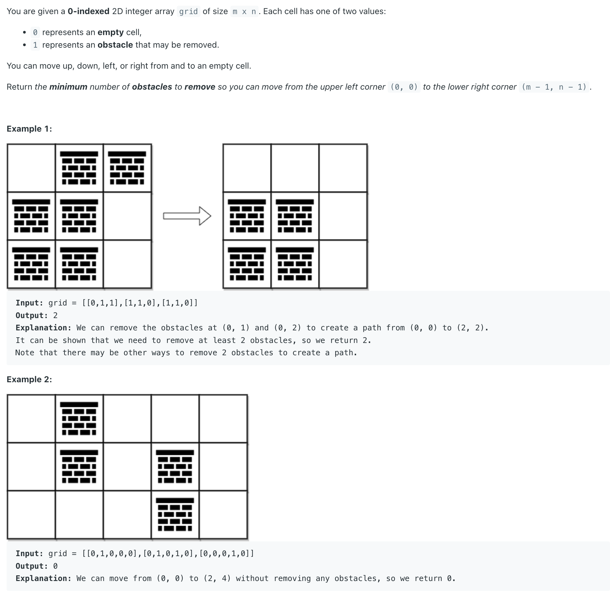

## 2290. Minimum Obstacle Removal to Reach Corner


- [leetcode discussion](https://leetcode.com/problems/minimum-obstacle-removal-to-reach-corner/discuss/2085640/JavaPython-3-2-codes%3A-Shortest-Path-and-BFS-w-brief-explanation-analysis-and-similar-problems.)

- don't need to create a 2D array of visited.
  - The PriorityQueue/heap always keep track of the cell that we currently can reach with **shortest path**, 
    and `grid[i][j] + o < dist[i][j]` makes sure we don't need to visit the cell again if we can not reach it with less obstacles.


```java
class _2290_MinimumObstacleRemovalToReachCorner {
    final int[][] dirs =  {{0, 1},{1, 0},{0, -1},{-1, 0}};
    public int minimumObstacles(int[][] grid) {
        int m = grid.length, n = grid[0].length;
        int[][] dist = new int[m][n];
        for (int[] di : dist) {
            Arrays.fill(di, Integer.MAX_VALUE);
        }
        dist[0][0] = grid[0][0];
        PriorityQueue<int[]> pq = new PriorityQueue<>((a, b) -> a[0] - b[0]);
        pq.offer(new int[]{dist[0][0], 0, 0});
        while (!pq.isEmpty()) {
            int[] cur = pq.poll();
            int o = cur[0], row = cur[1], col = cur[2];
            if (row == m - 1 && col == n - 1) {
                return o;
            }
            for (int[] dir : dirs) {
                int r = row + dir[0], c = col + dir[1];
                if (0 <= r && r < m && 0 <= c && c < n && o + grid[r][c] < dist[r][c]) {
                    dist[r][c] = o + grid[r][c];
                    pq.offer(new int[]{dist[r][c], r, c});
                }
            }
        }
        return dist[m - 1][n - 1];
    }
}
```