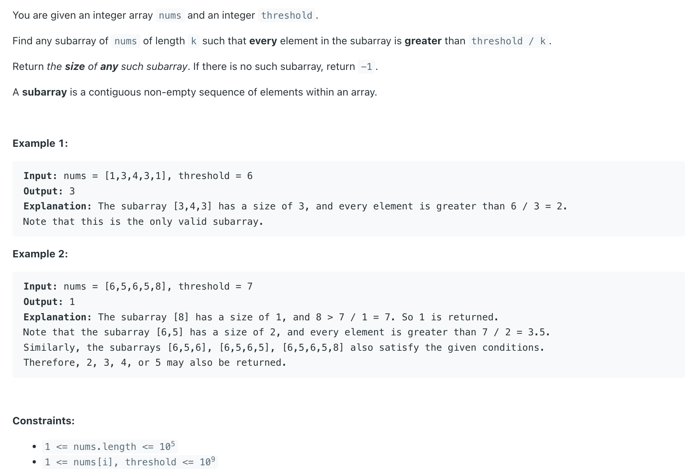
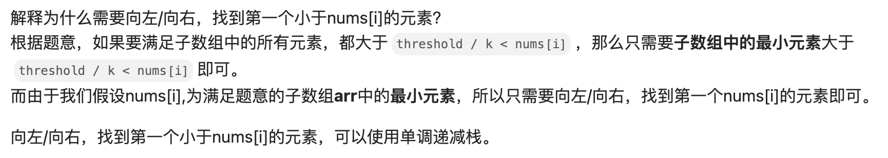

## 2334. Subarray With Elements Greater Than Varying Threshold

---

- [联动 leetcode 907](https://novemberfall.github.io/LeetCode-NoteBook/#/amazon/monotoneStack)

- 题解： 以任意一个 index, 左右延伸寻找最大的长方体，如果满足条件: 
  subarray of `nums` of length `k` such that every element in the subarray is **greater than threshold / k**
  - 这个长方体内的每一个元素维持在比相邻的元素尽可能的小，这么做的目的可以只要有其中的某些元素值>=平均值，就可以满足条件



---

```java
class _2334_SubarrayWithElementsGreaterThanVaryingThreshold {
    public int validSubarraySize(int[] nums, int threshold) {
        int n = nums.length;
        int[] next_small = new int[n];
        int[] prev_small = new int[n];
        Stack<Integer> stack = new Stack<>();
        stack.push(0);
        Arrays.fill(next_small, n);
        Arrays.fill(prev_small, -1);
        for (int i = 1; i < n; i++) {
            while (!stack.isEmpty() && nums[stack.peek()] >= nums[i]) {
                stack.pop();
            }
            if (stack.size() != 0) {
                prev_small[i] = stack.peek();
            }
            stack.push(i);
        }
        stack = new Stack<>();
        stack.push(n - 1);
        for (int i = n - 2; i >= 0; i--) {
            while (!stack.isEmpty() && nums[stack.peek()] >= nums[i]) {
                stack.pop();
            }
            if (stack.size() != 0) {
                next_small[i] = stack.peek();
            }
            stack.push(i);
        }
        for (int i = 0; i < n; i++) {
            int len = next_small[i] - prev_small[i] - 1;
            if (threshold / (double) len < nums[i]) {
                return len;
            }
        }
        return -1;
    }
}
```
---

#### Python

```py
class Solution:
    def validSubarraySize(self, nums: List[int], threshold: int) -> int:
        n = len(nums)
        prev_small = [-1] * n
        next_small = [n] * n
        stack = []
        stack.append(0)

        for i in range(1, n):
            while stack and nums[stack[-1]] >= nums[i]:
                stack.pop()
            if stack:
                prev_small[i] = stack[-1]
            stack.append(i)

        stack = []
        stack.append(n - 1)
        for i in range(n - 2, -1, -1):
            while stack and nums[stack[-1]] >= nums[i]:
                stack.pop()
            if stack:
                next_small[i] = stack[-1]
            stack.append(i)

        for i in range(n):
            length = next_small[i] - prev_small[i] - 1
            if (threshold / length) < nums[i]:
                return length

        return -1
```
