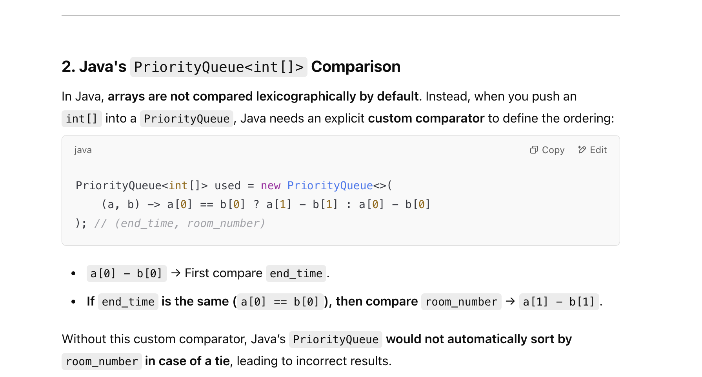

## 2402. Meeting Rooms III

---

#### Question's meaning:


---

- [youtube](https://youtu.be/2VLwjvODQbA?t=528)


1. 当会议室处于**未占用状态**的时候，将会优先提供给 开始时间更早的会议。
    先来先到 => 排序后，依次处理每个会议
2. 用两个heap来模拟，一个表示**可以用的会议室**，另一个表示


- 由于是 **[ )** 右边是开区间， 所以必须用 `<=`


- T = **O(n + m(logn + logm))**
- Space = **o(n)**
---

```py
class Solution:
    def mostBooked(self, n: int, meetings: List[List[int]]) -> int:
        meetings.sort(key=lambda x: x[0])

        available = [i for i in range(n)]   # 0, 1, 2, 3, ...
        used = []  # (end_time, room_number)
        count = [0] * n  # count[n] = meetings schedule

        for start, end in meetings:
            # Finish meetings
            while used and used[0][0] <= start:
                __, room_num = heapq.heappop(used)  # since this room is no longer being used
                heapq.heappush(available, room_num)  # add room back to available

            # no room is available
            if not available:
                end_time, room_num = heapq.heappop(used)
                end = end_time + (end - start)  # (end - start) represents duration
                #  end represents new-end time
                heapq.heappush(available, room_num)

            # a room is available
            if available:
                room = heapq.heappop(available)
                heapq.heappush(used, (end, room))
                count[room] += 1

        return count.index(max(count))
```

---

#### Java

- we need to set **used** heap with customize order:





- Example:

```java
used.offer(new int[]{10, 2});
used.offer(new int[]{10, 1});  // If we don't specify ordering, this might stay after {10, 2}
used.offer(new int[]{8, 3});   // This should be first, as 8 < 10

```
---

```java
class Solution {
    public int mostBooked(int n, int[][] meetings) {
        Arrays.sort(meetings, (a, b) -> a[0] - b[0]);
        PriorityQueue<Integer> available = new PriorityQueue<>((a, b) -> a - b);
        PriorityQueue<int[]> used = new PriorityQueue<>(
                (a, b) -> a[0] == b[0] ? a[1] - b[1] : a[0] - b[0]
        ); // (end_time, room_number)

        for (int i = 0; i < n; i++) {
            available.offer(i);
        }
        int[] count = new int[n];

        for (int[] meeting : meetings) {
            int start = meeting[0], end = meeting[1];

            // Finish meetings
            while (!used.isEmpty() && used.peek()[0] <= start) {
                int room = used.poll()[1];
                available.offer(room);
            }

            // If no room is available, extend the meeting in the earliest finishing room
            if (available.isEmpty()) {
                int[] cur = used.poll();
                int endTime = cur[0], room = cur[1];
                end = endTime + (end - start); // (end - start) represents duration
                available.offer(room);
            }

            // Assign the meeting to an available room
            if (!available.isEmpty()) {
                int room = available.poll();
                used.offer(new int[]{end, room});
                count[room]++;
            }
        }

        // Find the room with the maximum number of meetings
        int maxRoom = 0;
        for (int i = 1; i < n; i++) {
            if (count[i] > count[maxRoom]) {
                maxRoom = i;
            }
        }
        return maxRoom;
    }
}
```

