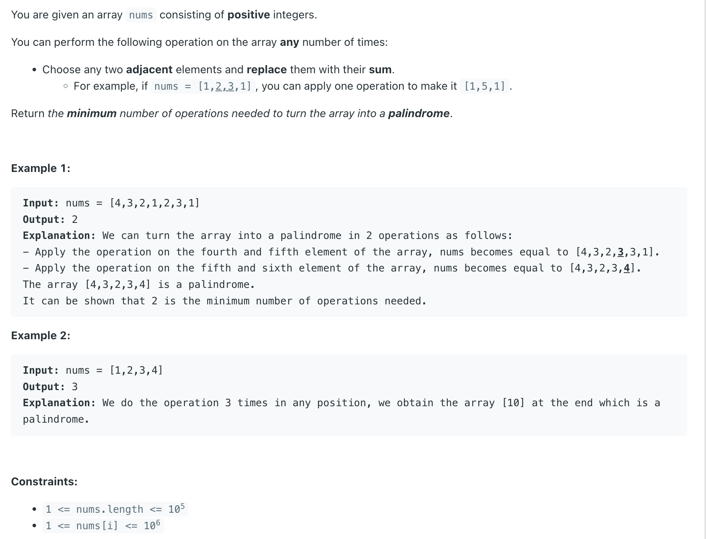

## 2422. Merge Operations to Turn Array Into a Palindrome


---

```java
class _2422_MergeOperationsToTurnArray_Into_a_Palindrome {
    public int minimumOperations(int[] nums) {
        int l = 0, r = nums.length - 1;
        int leftSum = nums[0], rightSum = nums[r];
        int count = 0;
        while (l < r) {
            if (leftSum == rightSum) {
                l++;
                r--;
                leftSum = nums[l];
                rightSum = nums[r];
            } else if (leftSum < rightSum) {
                count++;
                l++;
                leftSum += nums[l];
            } else if (leftSum > rightSum) {
                count++;
                r--;
                rightSum += nums[r];
            }
        }
        return count;
    }
}
```