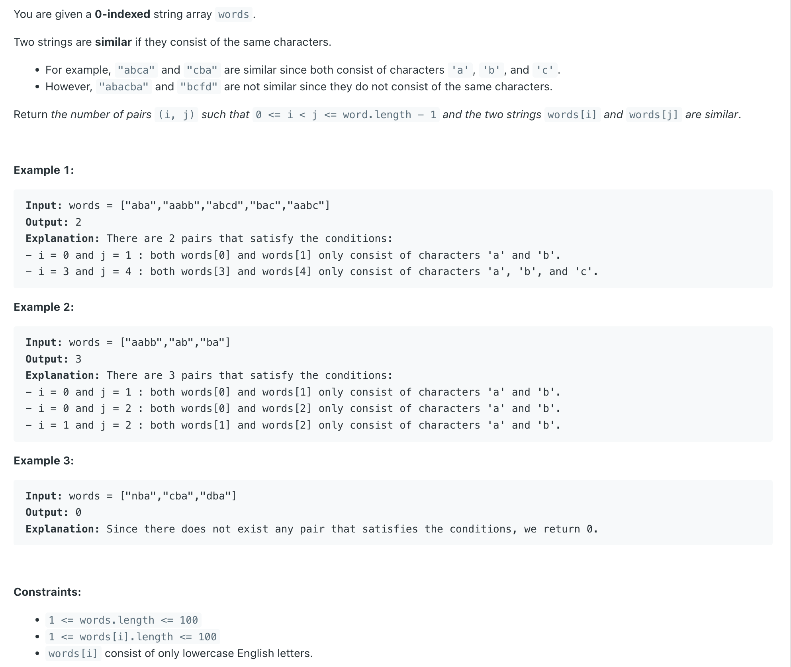

## 2506. Count Pairs Of Similar Strings

---

```java
class Solution {
    public int similarPairs(String[] words) {
        int result = 0;
        int n = words.length;
        int[][] freq = new int[n][26];
        for (int i = 0; i < n; i++) {
            freq[i] = calculateFrequencyArray(words[i]);
        }
        for (int i = 0; i < n - 1; i++) {
            for (int j = i + 1; j < n; j++) {
                if (hasSameCharacters(freq[i], freq[j])) {
                    result++;
                }
            }
        }
        return result;
    }

    private  int[] calculateFrequencyArray(String s) {
        int[] arr = new int[26];
        for (char ch : s.toCharArray()) {
            arr[ch - 'a'] = 1;
        }
        return arr;
    }

    private  boolean hasSameCharacters(int[] arr1, int[] arr2) {
        for (int i = 0; i < 26; i++) {
            if (arr1[i] != arr2[i]) {
                return false;
            }
        }
        return true;
    }
}
```