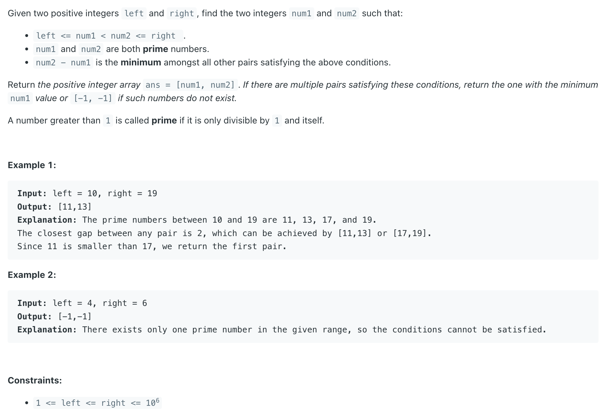

## 2523. Closest Prime Numbers in Range

---

- review Prime formula
---

```java
class Solution {
    public int[] closestPrimes(int left, int right) {
        boolean[] isPrime = new boolean[right + 1];
        generatePrime(isPrime);
        List<Integer> primes = new ArrayList<>();
        for (int p = left; p <= right; p++) {
            if (isPrime[p]) {
                primes.add(p);
            }
        }
        if (primes.size() <= 1) {
            return new int[]{-1, -1};
        }
        int mn = Integer.MAX_VALUE;
        int num1 = -1, num2 = -1;
        for (int i = 0; i < primes.size() - 1; i++) {
            if (primes.get(i + 1) - primes.get(i) == mn) {
                if (num1 > primes.get(i)) {
                    num1 = primes.get(i);
                    num2 = primes.get(i + 1);
                }
            }
            if (primes.get(i + 1) - primes.get(i) < mn) {
                num1 = primes.get(i);
                num2 = primes.get(i + 1);
                mn = primes.get(i + 1) - primes.get(i);
            }
        }
        return new int[]{num1, num2};
    }
    
    private void generatePrime(boolean[] isPrime) {
        Arrays.fill(isPrime, true);
        isPrime[0] = false;
        isPrime[1] = false;
        int n = isPrime.length;
        for (int i = 2; i * i < n; i++) {
            if (isPrime[i]) {
                for (int j = i * i; j < n; j += i) {
                    isPrime[j] = false;
                }
            }
        }
    }
}
```
---

#### Python

```py
class Solution:
    def closestPrimes(self, left: int, right: int) -> List[int]:
        isPrime = [True] * (right + 1)
        self.generate_primes(isPrime)
        ans = []
        for p in range(left, right + 1):
            if (isPrime[p]):
                ans.append(p)

        if len(ans) <= 1:
            return [-1, -1]
        mn = float('inf')
        n1, n2 = -1, -1
        for i in range(len(ans) - 1):
            if ans[i + 1] - ans[i] == mn:
                if n1 > ans[i]:
                    n1 = ans[i]
                    n2 = ans[i + 1]
            if ans[i + 1] - ans[i] < mn:
                n1 = ans[i]
                n2 = ans[i + 1]
                mn = ans[i + 1] - ans[i]
        return [n1, n2]

    def generate_primes(self, isPrime):
        isPrime[0] = isPrime[1] = False
        n = len(isPrime)
        for i in range(2, int(n ** 0.5) + 1):
            if isPrime[i]:
                for j in range(i * i, n, i):
                    isPrime[j] = False
```