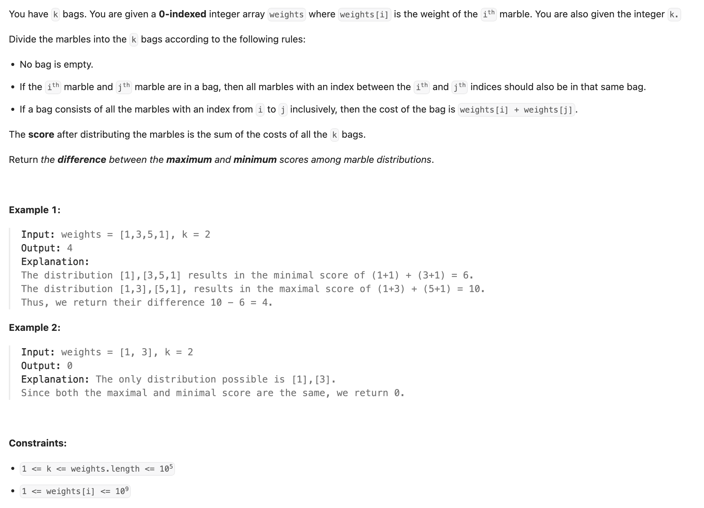
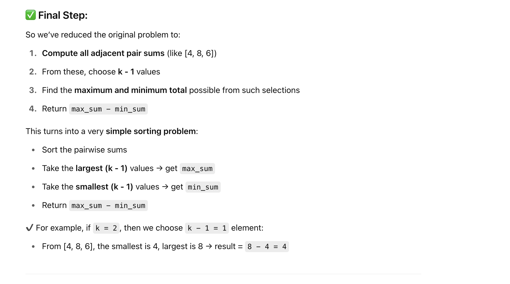

## 2551. Put Marbles in Bags

---

-[中文解释](https://leetcode.cn/problems/put-marbles-in-bags/solutions/2080577/by-wan-shi-liang-de-mang-fu-mwjh)

Let’s take the example:
weights = [1, 3, 5, 1], k = 2

If we follow the original problem definition and use brute-force enumeration, there are **3 ways** to split into 2 bags (i.e., make 1 cut):

- [1], [3, 5, 1] → score = (**1** + 1) + (3 + **1**) = 6
- [1, 3], [5, 1] → score = (**1** + 3) + (5 + **1**) = 10
- [1, 3, 5], [1] → score = (**1** + 5) + (1 + **1**) = 8

Now, notice that **the first and last element (1 and 1)** are always added in every split. These are **fixed** no matter how we split the array.
Since the problem asks for the **difference** between the maximum and minimum score, **these fixed parts will cancel out** and can be ignored.


So we simplify the scoring as:

- [1], [3, 5, 1] → score from the cut is: (1 + 3) = 4
- [1, 3], [5, 1] → score from the cut is: (3 + 5) = 8
- [1, 3, 5], [1] → score from the cut is: (5 + 1) = 6

The score in each case is just the **sum of the two numbers around the split point "],["**.

**Extended Example (k = 3)**:
Let’s now change `k = 3`. This means we need to make `k - 1 = 2` cuts.
Brute-force gives us these possible splits:

- [1], [3], [5, 1] → score = (1 + 3) + (3 + 5) = 12
- [1], [3, 5], [1] → score = (1 + 3) + (5 + 1) = 10
- [1, 3], [5], [1] → score = (3 + 5) + (5 + 1) = 14


To simplify calculation, we **precompute** the pairwise sums between adjacent elements:
From [1, 3, 5, 1] → compute:
[(1 + 3), (3 + 5), (5 + 1)] = [4, 8, 6]

Now each cut corresponds to picking one of these pairwise sums.
For example:

- First case [1], [3], [5, 1] → picked (1+3)=4 and (3+5)=8 → total = 12
- Other cases similarly use (4+6), (8+6), etc.



---

```py
class Solution:
    def putMarbles(self, weights: List[int], k: int) -> int:
        if k == 1:
            return 0

        splits = []
        for i in range(len(weights) - 1):
            splits.append(weights[i] + weights[i + 1])
        splits.sort()

        i = k - 1
        max_score = weights[0] + weights[-1] + sum(splits[-i:])
        min_score = weights[0] + weights[-1] + sum(splits[:i])
        return max_score - min_score
```