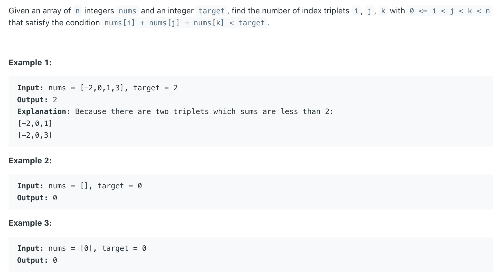

## 259. 3Sum Smaller

---

```java
class _259_3SumSmaller {
    public int threeSumSmaller(int[] nums, int target) {
        Arrays.sort(nums);
        int len = nums.length;
        int count = 0;
        for (int first = 0; first < len - 2; first++) {
            int second = first + 1, third = len - 1;
            while (second < third) {
                int res = nums[first] + nums[second] + nums[third];
                if (res < target) {
                    count += third - second;
                    second++;
                } else {
                    third--;
                }
            }
        }
        return count;
    }
}
```