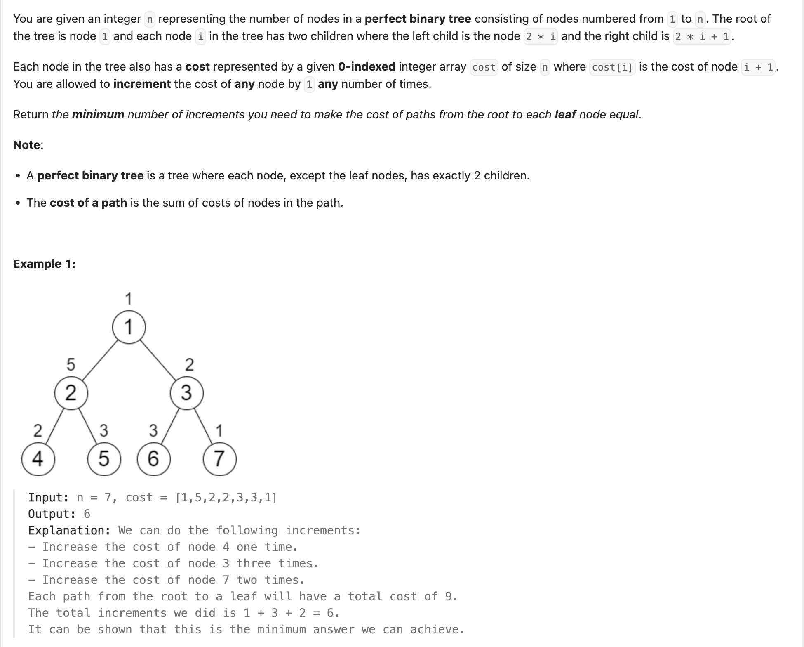
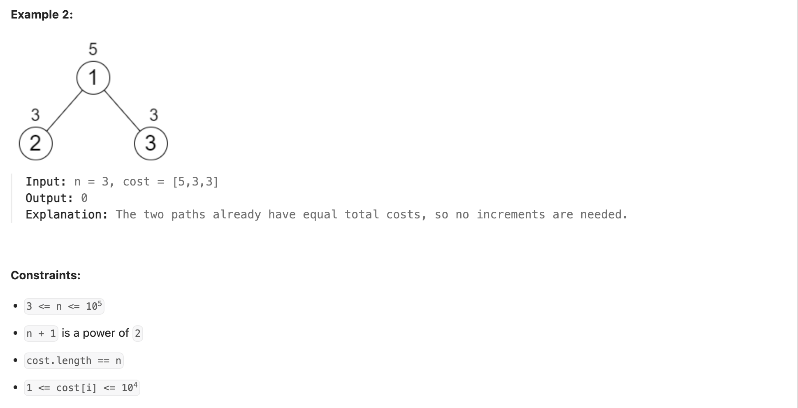
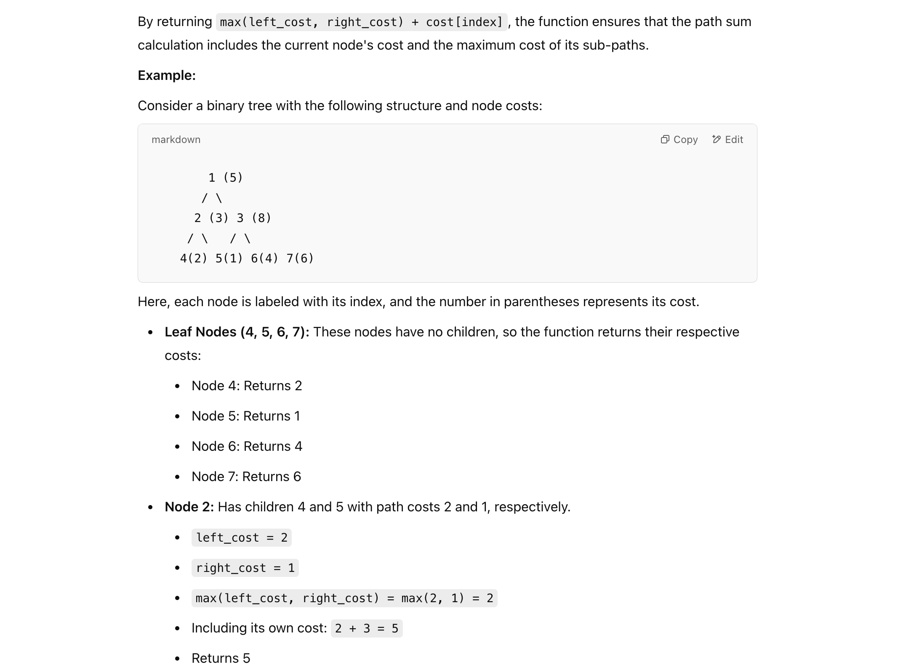
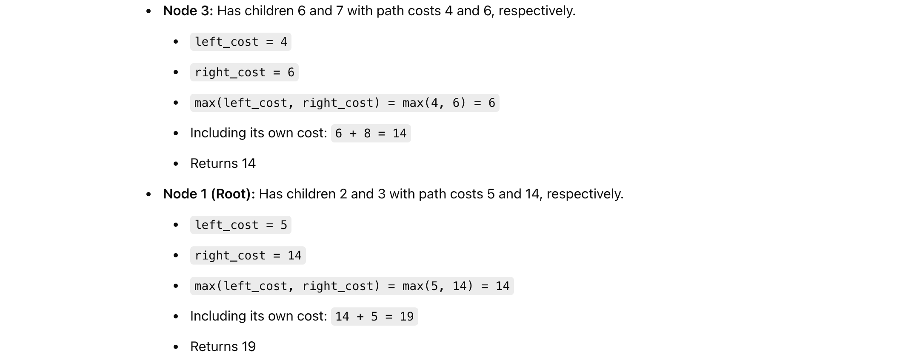

## 2673. Make Costs of Paths Equal in a Binary Tree


---



---

```py
class Solution:
    def minIncrements(self, n: int, cost: List[int]) -> int:
        increment = 0
        def dfs(index):
            nonlocal increment
            if index > len(cost):
                return 0

            # Calculate left and right subtree costs
            left_cost = dfs(index * 2)
            right_cost = dfs(index * 2 + 1)

            # Balance the subtree costs and add the difference to correction
            increment += abs(right_cost - left_cost)

            # Return the max path sum including the current node
            return max(left_cost, right_cost) + cost[index - 1]

        dfs(1)
        return increment
```