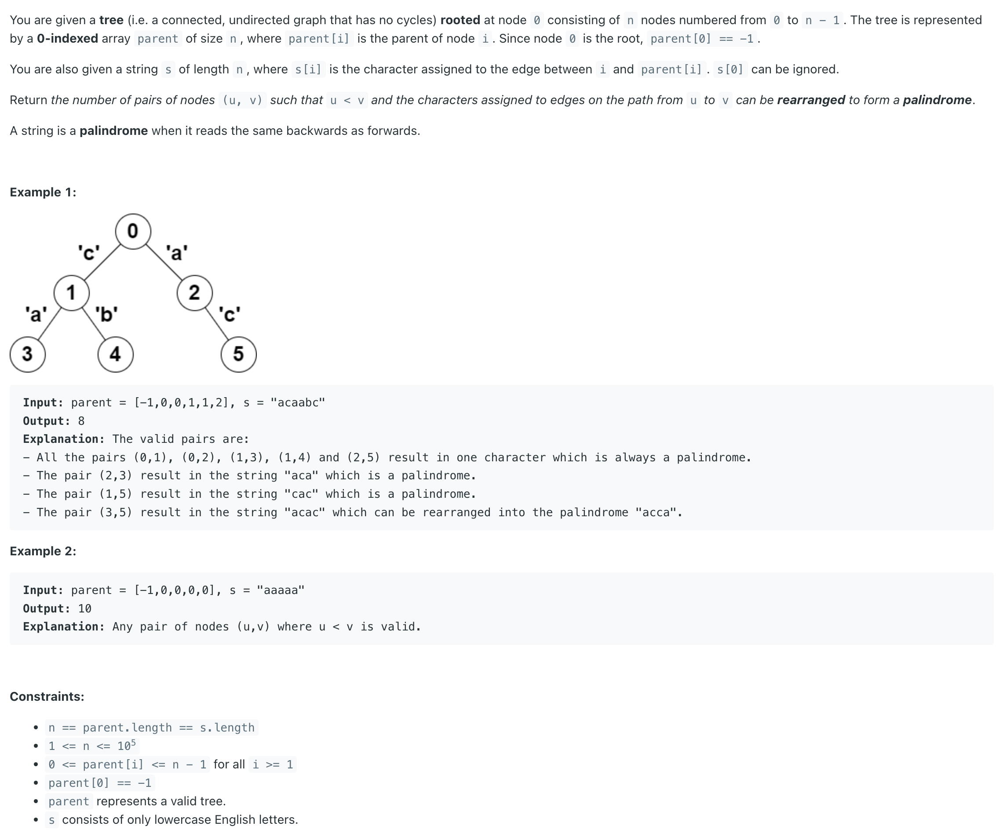
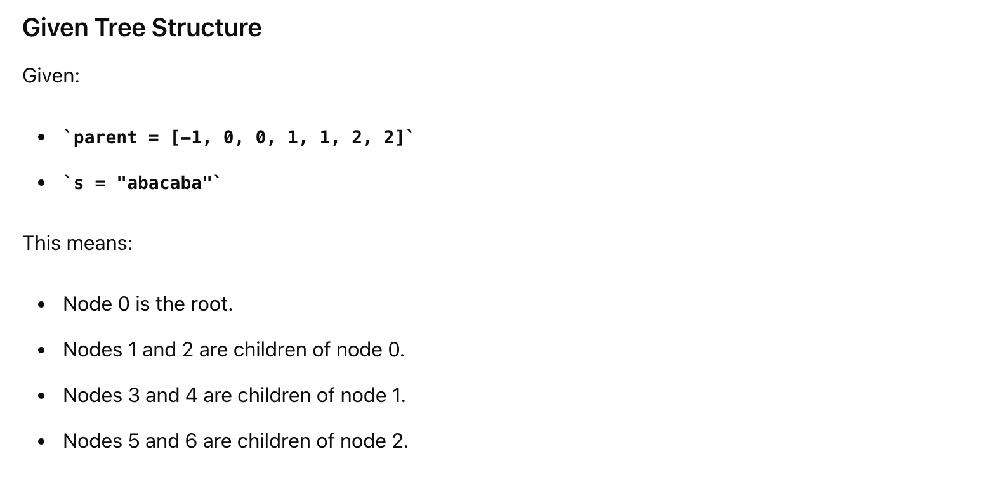
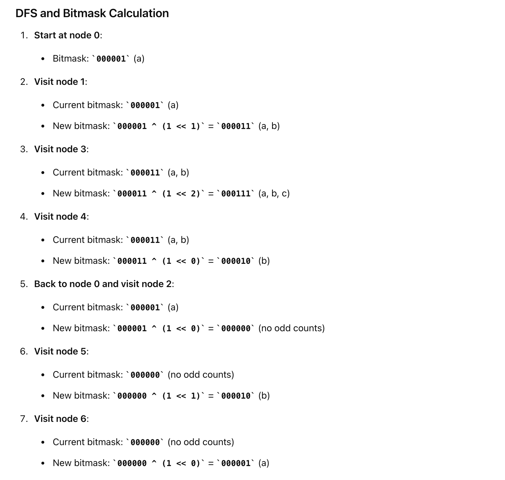

## 2791. Count Paths That Can Form a Palindrome in a Tree

---

- For a string to be rearranged as a palindrome:
  - 1. there has to be **at most one character** that **occurs odd number of times**. 
  - Using **BitMask**
  - 2. Let’s represent the sequences of character **from one node to another using bits 0 to 25** of a number where each bit 
    represents the parity of the occurrence of a specific character. 
  - 3. calculate the values from the root 0 to all nodes using **dfs** and exclusive
  - If the path between two nodes passes through **edges a, b, and d**. The character sequence would be represented 
    **by 11 (1011 in binary)**
  - the nodes which can form palindrome with a nodes are the node whose values from root differ by **at most 1 bit**.
---


```ruby
        s = "a b a c a b a"


               0 (a)
            /         \
        1 (b)          2 (a)
        /    \         /      \
   3 (c)   4 (a)     5 (b)    6 (a)
```




```java
class _2791_CountPathsThatCanForm_a_Palindrome_In_a_Tree {
    List<int[]>[] graph;
    int[] nodeVals;
    Map<Integer, Integer> map;
    public long countPalindromePaths(List<Integer> parent, String s) {
        int n = parent.size();

        graph = new List[n];
        nodeVals = new int[n];
        map = new HashMap<>();

        for (int i = 0; i < n; i++) {
            graph[i] = new ArrayList<>();
        }
        for (int i = 1; i < n; i++) {
            // node, bitMaskVal
            graph[parent.get(i)].add(new int[]{i, s.charAt(i) - 'a'});
            // 这一行，可以对照树形看一下，就能理解，因为 root node's parent is -1, 所以从 i = 1 开始
        }
        dfs(0, 0);

        long total = 0;
        long val = 0;
        int current = 0, nCurrent = 0;
        
        for (int i = 0; i < n; i++) {
            current = nodeVals[i];
            val = map.get(current) - 1;

            for (int j = 0; j <= 26; j++) {
                nCurrent = current ^ (1 << j);
                val += map.getOrDefault(nCurrent, 0);
            }
            total += val;
        }
        return total / 2;
    }

    private void dfs(int node, int val) {
        nodeVals[node] = val;
        int nextNode, nextBit;
        map.put(val, map.getOrDefault(val, 0) + 1);
        for (int[] next : graph[node]) {
            nextNode = next[0];
            nextBit = next[1];
            dfs(nextNode, val ^ (1 << nextBit));
        }
    }
}
```