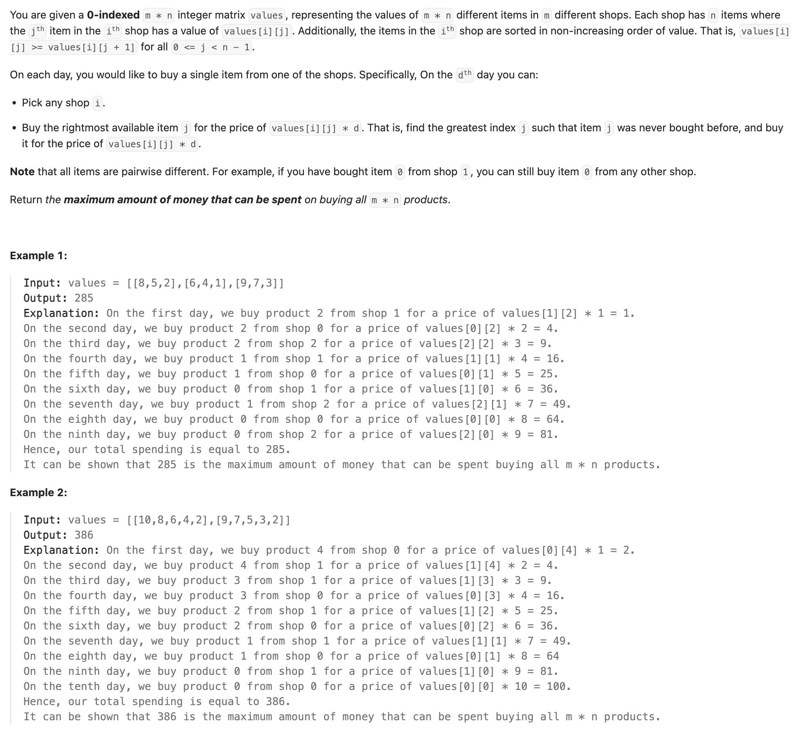
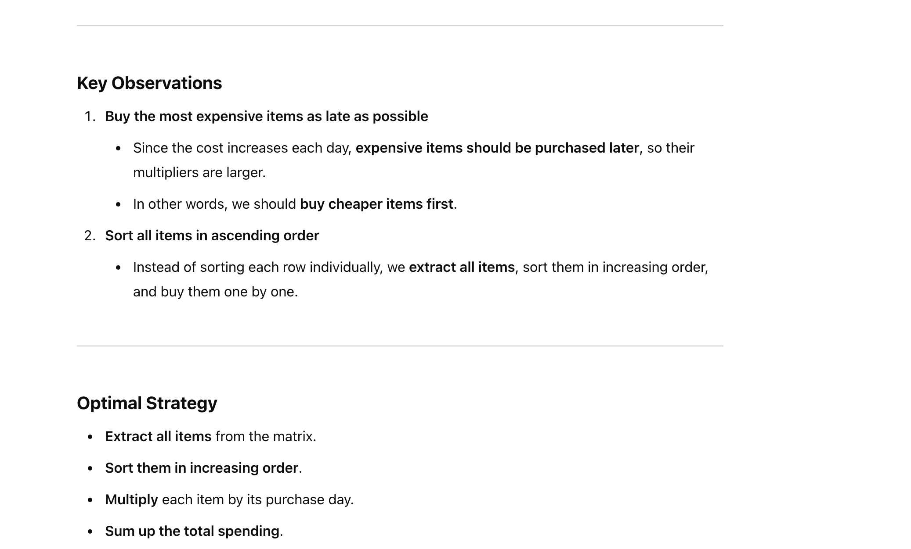
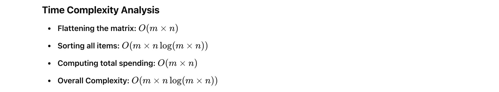
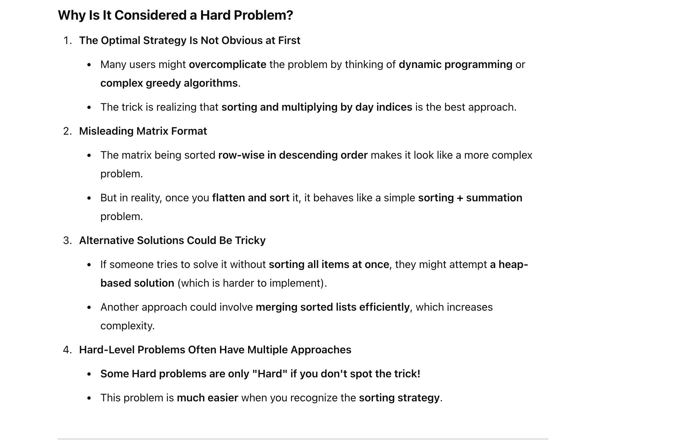

## 2931. Maximum Spending After Buying Items









---

```py
class Solution:
    def maxSpending(self, values: List[List[int]]) -> int:
        
        all_items = [num for row in values for num in row]

        all_items.sort()

        return sum((day + 1) * price for day, price in enumerate(all_items))
```