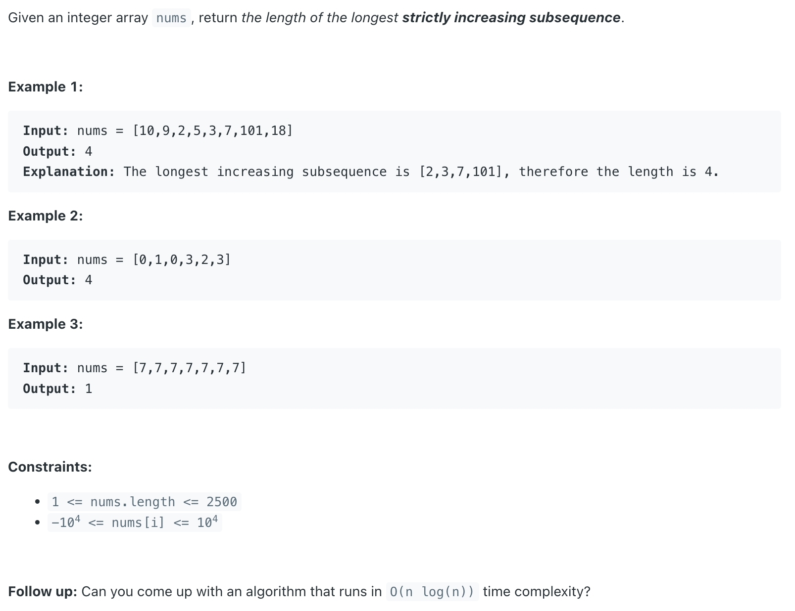
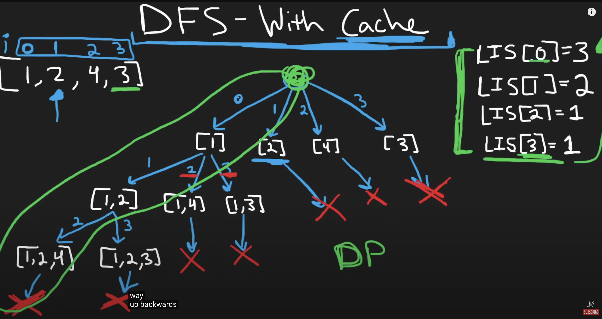
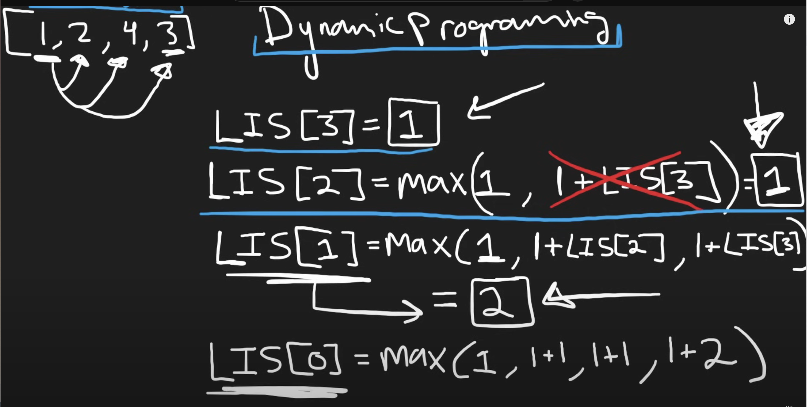

## 300. Longest Increasing Subsequence

---

- [youtube](https://www.youtube.com/watch?v=cjWnW0hdF1Y)






- **T = O(n^2)**

---

```java
class _300_LongestIncreasingSubsequence {
    public int lengthOfLIS(int[] nums) {
        int n = nums.length;
        int[] T = new int[n];
        for (int i = 0; i < n; i++) {
            T[i] = 1;
        }

        for (int i = n - 1; i >= 0; i--) {
            for (int j = i + 1; j < n; j++) {
                if (nums[i] < nums[j]) {
                    T[i] = Math.max(T[i], 1 + T[j]);
                }
            }
        }

        int maxLen = 1; // Find the maximum value in LIS
        for (int len : T) {
            maxLen = Math.max(maxLen, len);
        }
        return maxLen;
    }
}
```
---


### Python

```py
class Solution:
    def lengthOfLIS(self, nums: List[int]) -> int:
        LIS = [1] * len(nums)

        for i in range(len(nums) - 1, -1, -1):
            for j in range(i + 1, len(nums)):
                if nums[i] < nums[j]:
                    LIS[i] = max(LIS[i], 1 + LIS[j])
        return max(LIS)

## T = O(n^2)
```