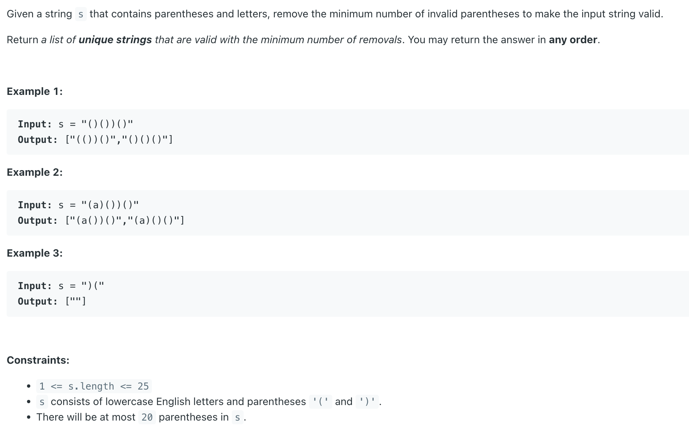

## 301. Remove Invalid Parentheses

---

- [youtube](https://youtu.be/lEMDEmQje1Q?t=990)

---
- # of open parenthese = # of close parenthese
- stack or a counter iterate the string
- current char c : `(` => **stack++**, `)` => **stack--**
- if `stack < 0` exit => remove `)` to be valid => continue the rest part
- else if `stck > 0`:
  - need to remove `(` previous redundant `(`
  - reverse string to reuse the code
- else add stirng to result list   

---


```java
/**
 * Input: s = "()())()" --> ["(())()","()()()"]
 * <p>
 * Input: s = "(a)())()" --> ["(a())()","(a)()()"]
 * <p>
 * Input: s = ")("  --> [""]
 */
class _301_RemoveInvalidParentheses {
    public List<String> removeInvalidParentheses(String s) {
        List<String> res = new ArrayList<>();
        helper(res, s, 0, 0, new char[]{'(', ')'});
        return res;
    }

    private void helper(List<String> res, String s, int left, int right, char[] pair) {
        int stack = 0;
        for (; right < s.length(); right++) {
            if (s.charAt(right) == pair[0]) stack++;
            if (s.charAt(right) == pair[1]) stack--;

            if (stack < 0) { // right `)` is more than left `(`
                break;
            }
        }
        if (stack < 0) { // `)` is more than `(`
            for (; left <= right; left++) {
                if (s.charAt(left) != pair[1]) continue;

                if (left > 1 && s.charAt(left) == s.charAt(left - 1))  continue;

                // remove first `)` from `( ) )`
                helper(res, s.substring(0, left) + s.substring(left + 1), left, right, pair);
            }
        } else if (stack > 0) { // `(` is more than `)`
            // 一整个String 反过来了，当然 left, right 也从 0 开始处理
            helper(res, new StringBuilder(s).reverse().toString(), 0, 0, new char[]{')','('});
        } else if (stack == 0) {
            res.add(pair[0] == '(' ? s : new StringBuilder(s).reverse().toString());
        }
    }

    public static void main(String[] args) {
       String str = "(a)())()";
       System.out.println(new StringBuilder(str).reverse().toString()); // `)())()a(`
       str = "((())";
       System.out.println(new StringBuilder(str).reverse().toString()); // `))(((`
    }
}
```
---

#### Python

```py
class Solution:
    def removeInvalidParentheses(self, s: str) -> List[str]:
        res = []
        self.helper(res, s, 0, 0, ['(', ')'])
        return res

    def helper(self, res: List[str], s: str, left: int, right: int, pair: List[str]):
        stack = 0
        for right in range(right, len(s)):
            if s[right] == pair[0]:
                stack += 1
            if s[right] == pair[1]:
                stack -= 1
            if stack < 0:  # If stack becomes negative, it means there are more `)` than `(`, indicating an invalid parentheses sequence.
                break      # The break statement is executed, immediately exiting the for loop

        if stack < 0:  # if `)` is more than `(`
            for left in range(left, right + 1):
                if s[left] != pair[1]:
                    continue
                if left > 0 and s[left] == s[left - 1]:
                    continue

                # remove first `)` from `( ) )`
                self.helper(res, s[:left] + s[left + 1:], left, right, pair)
        elif stack > 0:  # if `(` is more than `)`
            # reverse the current str, `((())` => `))(((`, handle the current str from begining
            self.helper(res, s[::-1], 0, 0, [')', '('])
        elif stack == 0:
            res.append(s if pair[0] == '(' else s[::-1])
```