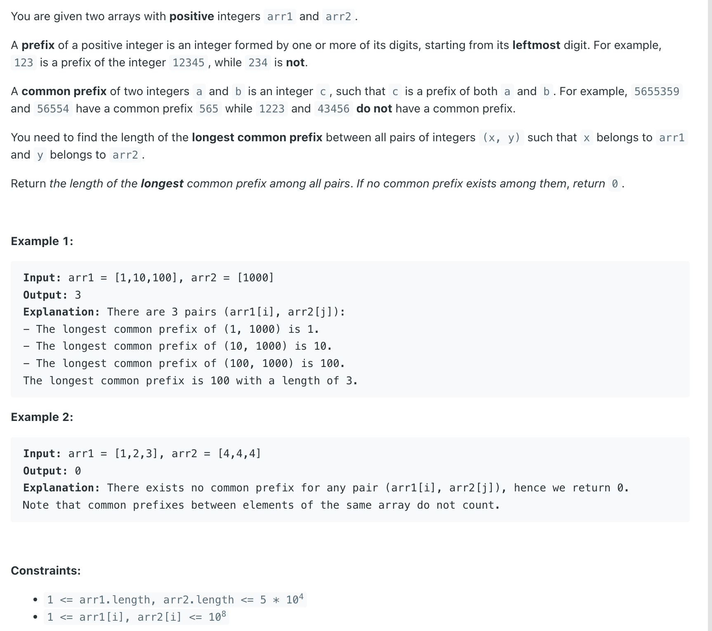

## 3043. Find the Length of the Longest Common Prefix

---

```java
class Solution {
    private TrieNode root = new TrieNode();
    
    class TrieNode {
        TrieNode[] children;

        public TrieNode() {
            children = new TrieNode[10];
        }

        public void insert(int num) {
            TrieNode node = root;
            String str = Integer.toString(num);
            for (int i = 0; i < str.length(); i++) {
                if (node.children[str.charAt(i) - '0'] == null) {
                    node.children[str.charAt(i) - '0'] = new TrieNode();
                }
                node = node.children[str.charAt(i) - '0'];
            }
        }

        public int check(int num) {
            TrieNode node = root;
            String str = Integer.toString(num);
            int len = 0;
            for (char c : str.toCharArray()) {
                if (node.children[c - '0'] != null) {
                    len++;
                } else {
                    break;
                }
                node = node.children[c - '0'];
            }
            return len;
        }
    }

    public int longestCommonPrefix(int[] arr1, int[] arr2) {
        TrieNode trie = new TrieNode();
        int res = 0;
        for (int num : arr1) {
            trie.insert(num);
        }
        for (int num : arr2) {
            res = Math.max(res, trie.check(num));
        }
        return res;
    }
}
```
---

#### Python

```py
class Solution:
    class TrieNode:
        def __init__(self):
            self.children = [None] * 10

        def insert(self, num):
            node = self
            str_num = str(num)
            for char in str_num:
                if not node.children[ord(char) - ord('0')]:  # or: node.children[int(char)]
                    node.children[ord(char) - ord('0')] = Solution.TrieNode()
                node = node.children[ord(char) - ord('0')]

        def check(self, num):
            node = self
            str_num = str(num)
            length = 0
            for char in str_num:
                if node.children[ord(char) - ord('0')]:
                    length += 1
                else:
                    break
                node = node.children[ord(char) - ord('0')]
            return length

    def __init__(self):
        self.root = self.TrieNode()

    def longestCommonPrefix(self, arr1: List[int], arr2: List[int]) -> int:
        trie = self.root
        res = 0
        for num in arr1:
            trie.insert(num)

        for num in arr2:
            res = max(res, trie.check(num))

        return res
```