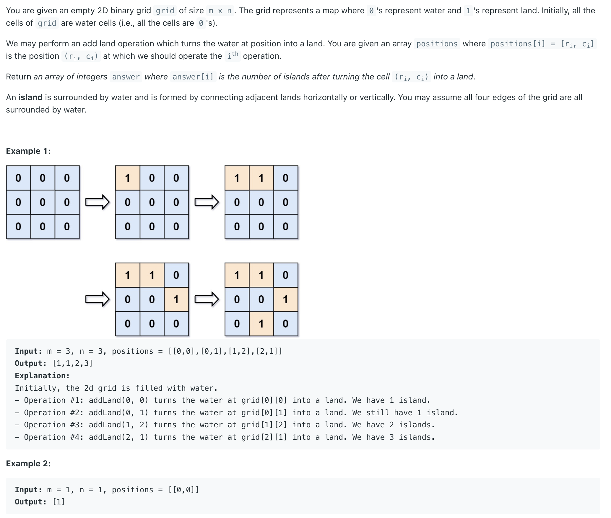
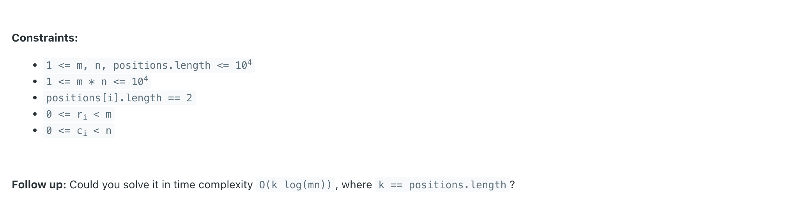
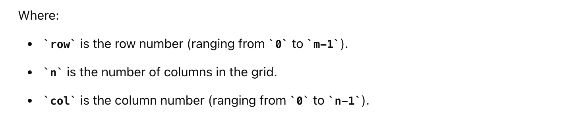
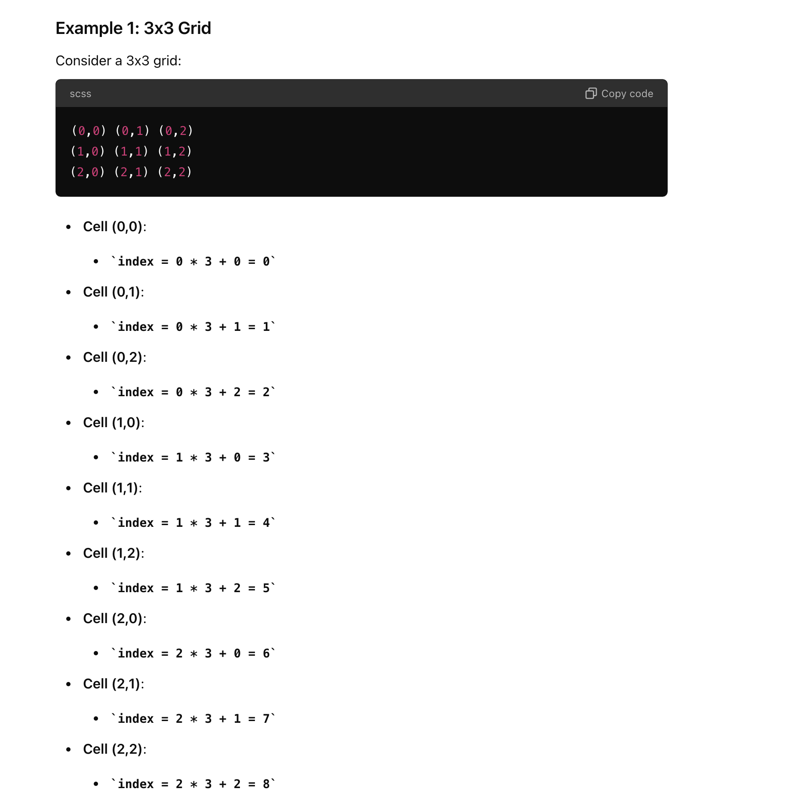
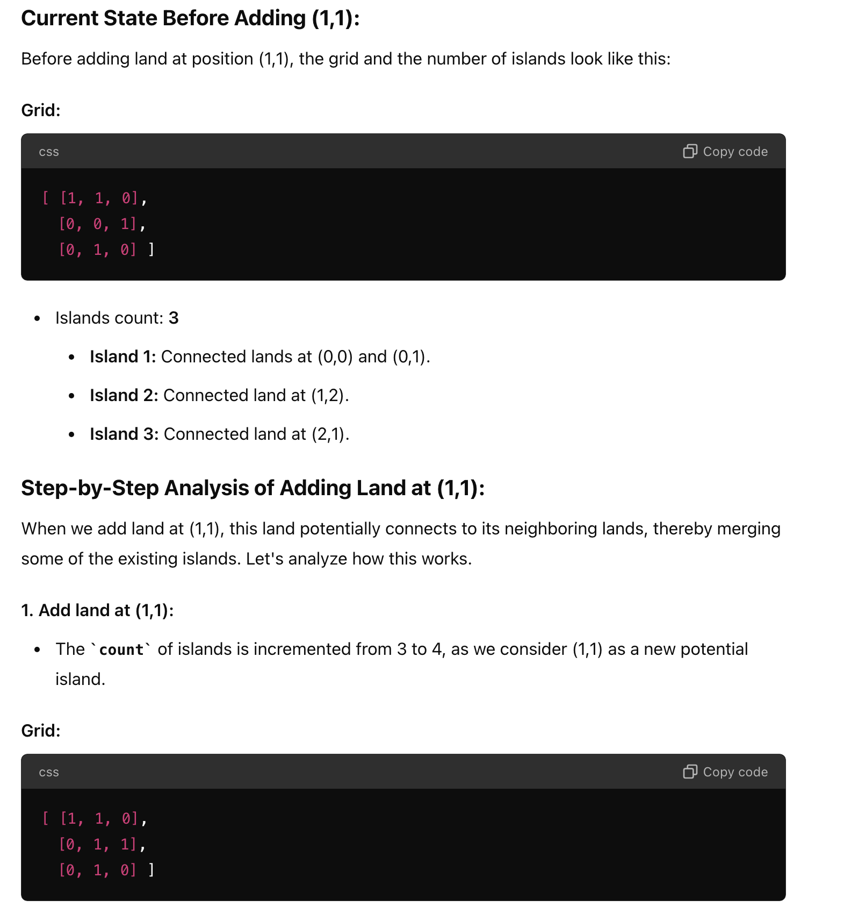
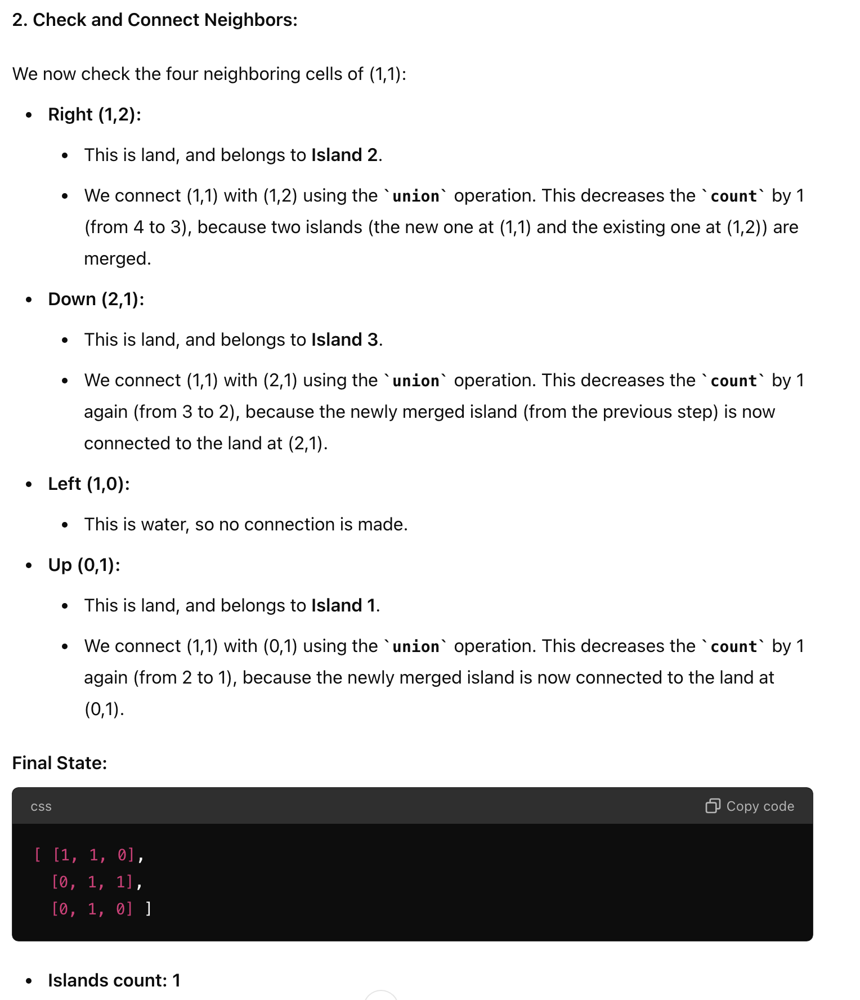
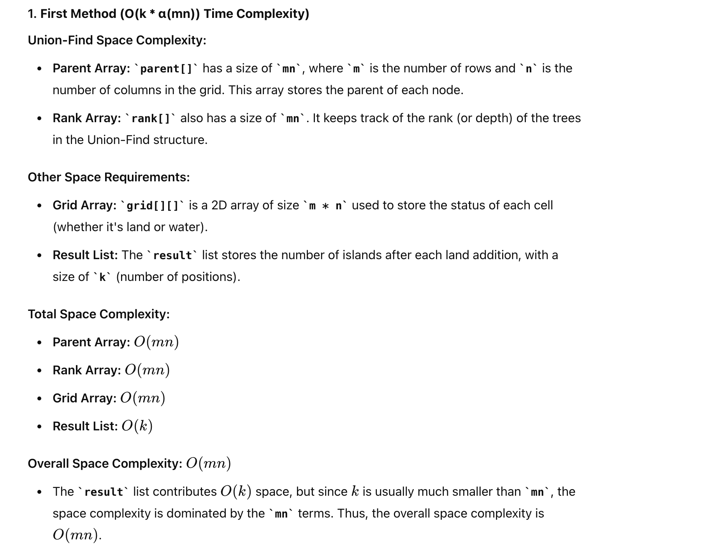

## 305. Number of Islands II


---

- what does int **index = row * n + col** mean here?
  - index is used to convert a 2D grid coordinate (row, col) into a 1D index.
  - **Formula: index = row * n + col**






```ruby
Example:
m = 3, n = 3
positions = [
    [0, 0],
    [0, 1],
    [1, 2],
    [2, 1],
    [1, 1]
]
```

- for the above example, why does it have **After (1,1): 1** ? 





---

```java
class solution_UnionFind {
    int[][] directions = {{0, 1}, {1, 0}, {0, -1}, {-1, 0}};
    class UnionFind {
        private int[] parent;
        private int[] rank;

        public UnionFind(int size) {
            parent = new int[size];
            rank = new int[size];
            for (int i = 0; i < size; i++) {
                parent[i] = i;
                rank[i] = 1; // The initial "rank" of each vertex is 1, because each of them is a standalone vertex with no connection to other vertices.
            }
        }

        // The find function here is the same as that in the disjoint set with path compression.
        public int find(int x) {
            if (x == parent[x]) {
                return x;
            }
            return parent[x] = find(parent[x]);
        }

        // The union function with union by rank
        public void union(int x, int y) {
            int rootX = find(x);
            int rootY = find(y);
            if (rootX == rootY) {
                return;
            }
            if (rank[rootX] > rank[rootY]) {
                parent[rootY] = rootX;
            } else if (rank[rootX] < rank[rootY]) {
                parent[rootX] = rootY;
            } else {
                parent[rootY] = rootX;
                rank[rootX] += 1;
            }
        }

        public boolean connected(int x, int y) {
            return find(x) == find(y);
        }
    }

    public List<Integer> numIslands2(int m, int n, int[][] positions) {
        List<Integer> res = new ArrayList<>();
        UnionFind uf = new UnionFind(m * n);
        int[][] grid = new int[m][n];
        int count = 0;

        for (int[] pos : positions) {
            int row = pos[0], col = pos[1];

            // if the land is already added, skip it
            if (grid[row][col] == 1) {
                res.add(count);
                continue;
            }

            grid[row][col] = 1;
            count++;

            int index = row * n + col;
            //index is used to convert a 2D grid coordinate (row, col) into a 1D index.
            for (int[] dir : directions) {
                int curRow = row + dir[0];
                int curCol = col + dir[1];
                if (curRow < 0 || curRow >= m || curCol < 0 || curCol >= n || grid[curRow][curCol] == 0) {
                    continue;
                }
                int newIndex = curRow * n + curCol;
                if (!uf.connected(index, newIndex)) {
                    uf.union(index, newIndex);
                    count--;
                }
            }
            res.add(count);
        }
        return res;
    }
}

```


---

#### Python

```py
class UnionFind:
    def __init__(self, size: int):
        self.parent = [i for i in range(size)]
        self.rank = [1] * size

    def find(self, x: int) -> int:
        if self.parent[x] != x:
            self.parent[x] = self.find(self.parent[x])
        return self.parent[x]

    def union(self, x: int, y: int):
        rootX = self.find(x)
        rootY = self.find(y)

        if rootX == rootY:
            return

        if self.rank[rootX] > self.rank[rootY]:
            self.parent[rootY] = rootX
        elif self.rank[rootX] < self.rank[rootY]:
            self.parent[rootX] = rootY
        else:
            self.parent[rootY] = rootX
            self.rank[rootX] += 1

    def connected(self, x: int, y: int) -> bool:
        return self.find(x) == self.find(y)

class Solution:
    def numIslands2(self, m: int, n: int, positions: List[List[int]]) -> List[int]:
        directions = [(0, 1), (1, 0), (0, -1), (-1, 0)]
        uf = UnionFind(m * n)
        grid = [[False] * n for _ in range(m)]
        res = []
        count = 0

        for row, col in positions:
            if grid[row][col]:
                res.append(count)
                continue

            grid[row][col] = True
            count += 1
            index = row * n + col

            for d in directions:
                cur_row, cur_col = row + d[0], col + d[1]
                if cur_row < 0 or cur_row >= m or cur_col < 0 or cur_col >= n or grid[cur_row][cur_col] == False:
                    continue

                newIndex = cur_row * n + cur_col
                if not uf.connected(index, newIndex):
                    uf.union(index, newIndex)
                    count -= 1
            res.append(count)

        return res
```

