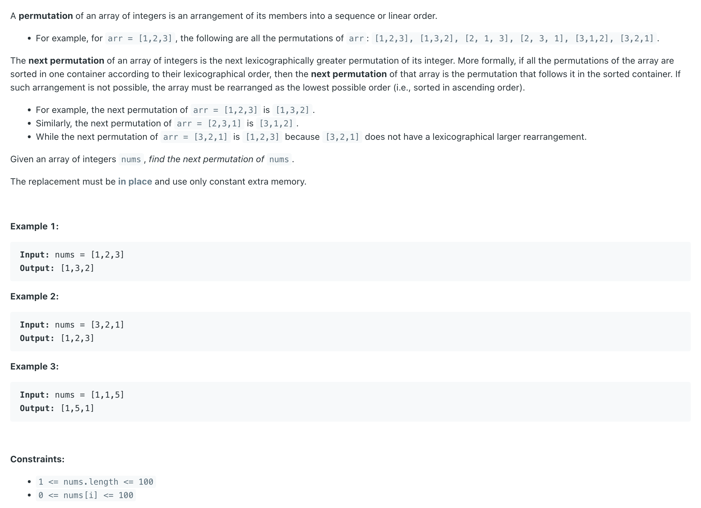
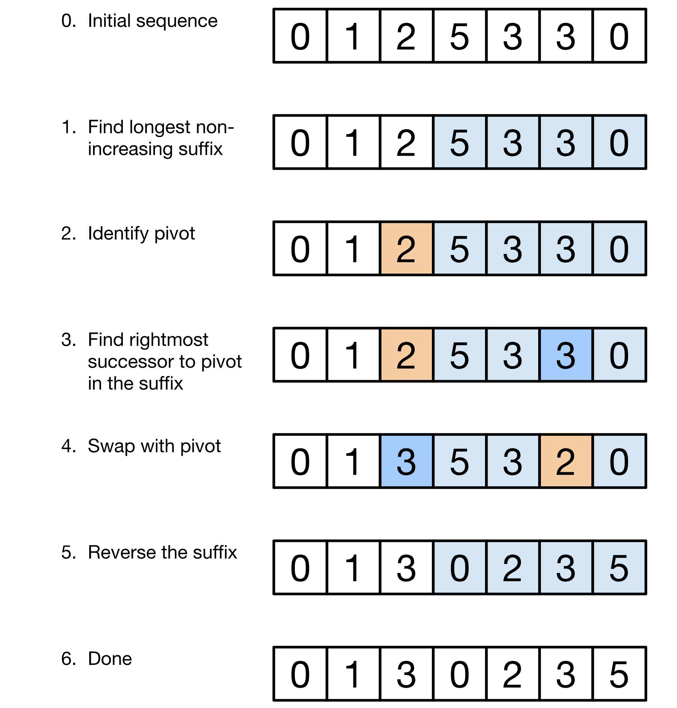
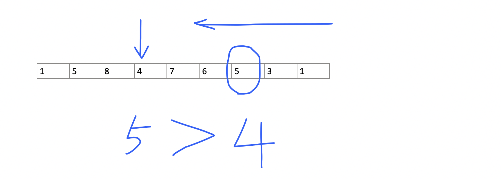
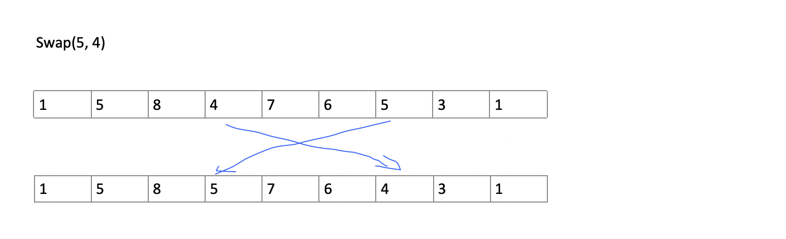
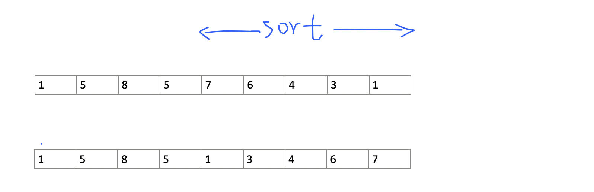

## 31. Next Permutation

---

- [youtube](https://www.youtube.com/watch?v=K-QCteGM-Bk)




- **pivot** is the element just before the non-increasing (weakly decreasing) suffix

- 1. 从后往前 第一个降序 A(X) :


- 2. 从后往前 找到第一个比 A(X) 大的数:




- 3. **swap** `A(X)` and `A(y)` :




- 4. 将 A(X) 之后的数重新排列:



---

```java
class _31_NextPermutation {
    public void nextPermutation(int[] nums) {
        int i = nums.length - 2;
        while (i >= 0 && nums[i] >= nums[i + 1]) {
            i--;
        }

        if (i == -1) { // if all nums are decreasing, just revers all nums
            reverse(nums, 0);
            return;
        }

        int j = nums.length - 1;
        while (j >= 0 && nums[j] <= nums[i]) {
            j--;
        }

        swap(nums, i, j);
        reverse(nums, i + 1);
    }

    private void swap(int[] nums, int i, int j) {
        int tmp = nums[i];
        nums[i] = nums[j];
        nums[j] = tmp;
    }

    private void reverse(int[] nums, int i) {
        int left = i;
        int right = nums.length - 1;
        while (left <= right) {
            swap(nums, left, right);
            left++;
            right--;
        }
    }
}
```
---

#### Python

```py
class Solution:
    def nextPermutation(self, nums: List[int]) -> None:
        """
        Do not return anything, modify nums in-place instead.
        """
        length = len(nums)
        i = length - 2
        while i >= 0 and nums[i] >= nums[i + 1]:
            i -= 1

        if i == -1:
            self.reverse(nums, 0)
            return

        j = length - 1
        while j >= 0 and nums[j] <= nums[i]:
            j -= 1

        self.swap(nums, i, j)
        self.reverse(nums, i + 1)

    def reverse(self, nums: List[int], i: int) -> None:
        left, right = i, len(nums) - 1
        while left <= right:
            self.swap(nums, left, right)
            left += 1
            right -= 1

    def swap(self, nums, left, right) -> None:
        nums[left], nums[right] = nums[right], nums[left]
```