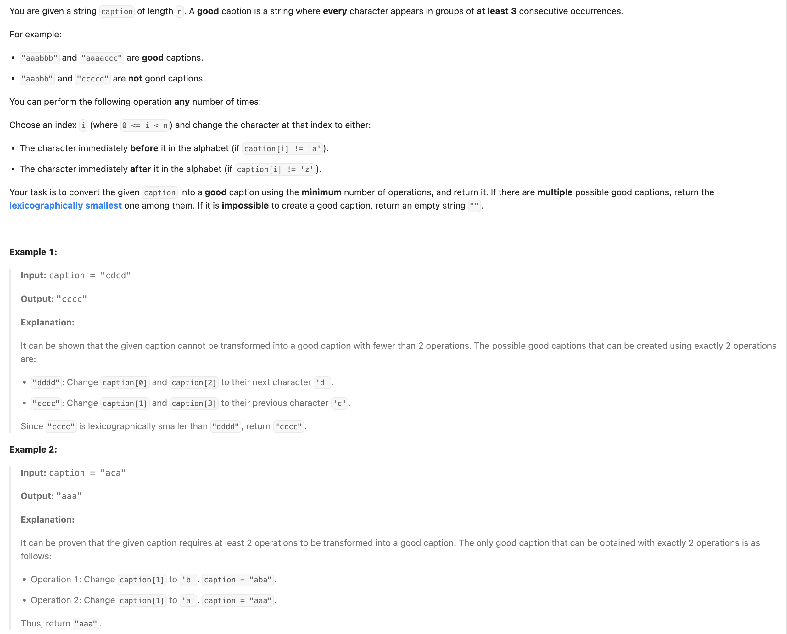
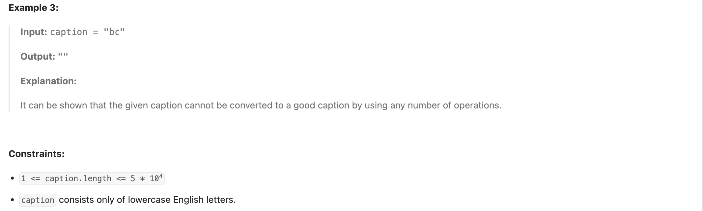
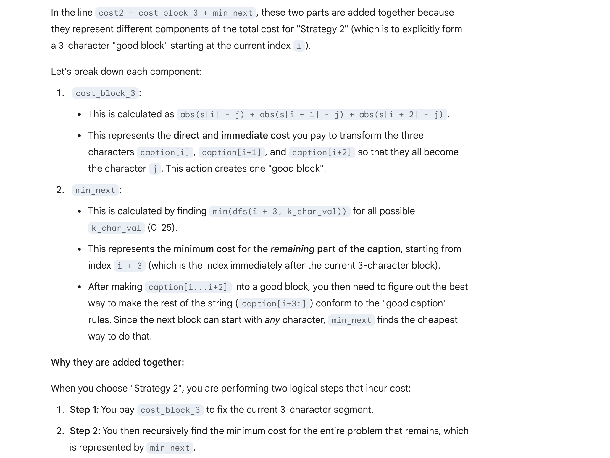
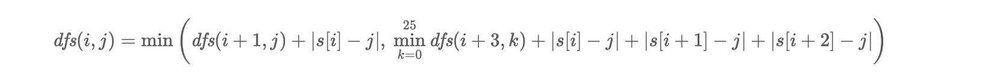
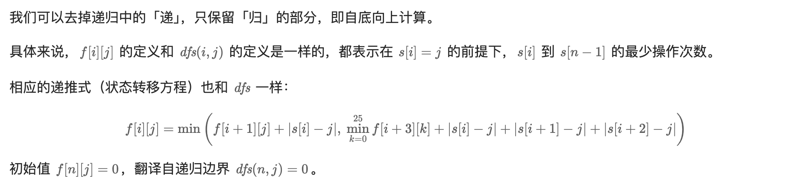
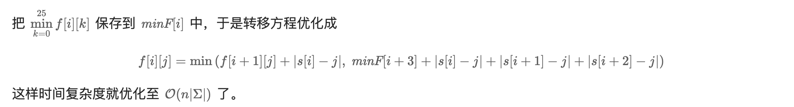

## 3441. Minimum Cost Good Caption


---

- **Note**: "a" -> "b" -> "c", count = 2 (2 operations)
  - You cannot directly trasfer `a => c`
- OR: **c -> b -> a**

- 注意：可以选择每个 group 三个chars, 当然也可以4个一个group, 但最少三个

- [中文解释](https://leetcode.cn/problems/minimum-cost-good-caption/solutions/3061609/zhuang-tai-ji-dp-shu-chu-ju-ti-fang-an-p-kjry/)





---


### V0: Return the minimum operations:




```py
class Solution:
    def minCostGoodCaption(self, caption: str) -> int:
        n = len(caption)
        # it's impossible to form even one 3-character "good block".
        if n < 3:
            return -1 # Return -1 as per problem specification for impossible cases

        # Preprocessing: Convert each character in the input string 'caption'
        # to its 0-25 integer equivalent ('a' is 0, 'b' is 1, ..., 'z' is 25).
        # This simplifies cost calculation (abs(char1_val - char2_val)).
        s = [ord(c) - ord('a') for c in caption]

        @cache
        # dfs(i, j): Calculates the minimum cost to transform the suffix of the caption starting at index 'i' (caption[i:])
        #            'j' (an integer from 0-25) represents the "target character"
        def dfs(i: int, j: int) -> int:
            # it means all characters have been processed, so no further cost is incurred.
            if i == n:
                return 0

            # This condition checks if there are at least two full 3-character blocks remaining from the current index 'i'.
            # (i.e., 'n - i' is 6 or more characters remaining).
            # If so, we have two main strategies to choose from for the segment starting at 'i'.
            if i <= n - 6:
                # Strategy 1: "Extend the current target character 'j' to match caption[i]"
                # Cost is to change caption[i] to 'j' (abs(s[i] - j)).
                # Then, recursively find the minimum cost for the rest of the string (caption[i+1:]),
                # assuming caption[i+1] also needs to conform to the same target character 'j'.
                cost_strategy1_extend_j = abs(s[i] - j) + dfs(i + 1, j)

                # Strategy 2: "Explicitly form a 3-character 'good block' starting at 'i'"
                # First, determine the minimum cost for the caption segment *after* this 3-char block (caption[i+3:]).
                # This next segment can potentially start with ANY new target character (k_char_val, from 'a' to 'z').
                min_cost_for_next_segment = float('inf')
                for k_char_val in range(26): # Iterate through all possible characters 'a' through 'z'
                    min_cost_for_next_segment = min(min_cost_for_next_segment, dfs(i + 3, k_char_val))

                # Calculate the cost to convert the current 3-character block (caption[i], caption[i+1], caption[i+2])
                # all to the target character 'j'.
                cost_to_form_3_char_block = abs(s[i] - j) + abs(s[i + 1] - j) + abs(s[i + 2] - j)

                # The total cost for Strategy 2 is the cost to form this block plus the minimum cost for the subsequent segment.
                cost_strategy2_form_block = cost_to_form_3_char_block + min_cost_for_next_segment

                # Choose the minimum cost between these two strategies for the segment starting at 'i'.
                return min(cost_strategy1_extend_j, cost_strategy2_form_block)
            else:
                # If there is NOT enough space for at least two full 3-character blocks (i.e., less than 6 characters remaining),
                # we only consider Strategy 1: "Extend the current target character 'j' for caption[i]".
                # This part typically handles the remaining characters towards the end of the string that might not form full blocks.
                return abs(s[i] - j) + dfs(i + 1, j)

        # Initialize the overall minimum cost to a very large value (infinity)
        min_overall_cost = float('inf')

        # To find the absolute minimum cost for the entire caption, we need to try
        # all possible starting target characters ('a' through 'z', 0-25) for the very first character (caption[0]).
        # The result will be the minimum cost obtained across all these initial choices.
        for initial_target_char_val in range(26):
            min_overall_cost = min(min_overall_cost, dfs(0, initial_target_char_val))

        # Return the overall minimum cost to transform the caption into a "good caption".
        return min_overall_cost
```
---

### DP  v0:



```py
class Solution:
    def minCostGoodCaption(self, caption: str) -> str:
        n = len(caption)
        if n < 3:
            return -1

        s = [ord(c) - ord('a') for c in caption]
        f = [[0] * 26 for _ in range(n + 1)]
        for i in range(n - 1, -1, -1):
            for j in range(26):
                cost1 = f[i + 1][j] + abs(s[i] - j)
                cost2 = float('inf')
                if i <= n - 6:
                    cost2 = min(abs(s[i] - j) + abs(s[i + 1] - j), abs(s[i + 2] - j) + f[i + 3])

                f[i][j] = min(cost1, cost2)
        return min(f[0])
```
---

### 时间优化 + 输出具体方案



```py

```