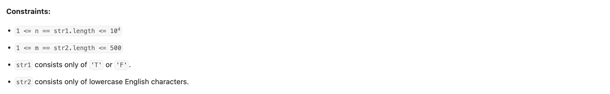

## 3474. Lexicographically Smallest Generated String


---


---

```py
class Solution:
    def generateString(self, str1: str, str2: str) -> str:
        pattern_len, target_len = len(str1), len(str2)

        # Initialize the result array with '?' to mark undecided positions
        # The output string's length is pattern_len + target_len - 1
        result = ['?'] * (pattern_len + target_len - 1)

        # --- Step 1: Process all 'T' positions in pattern ---
        # 'T' means: the substring starting at this index must be exactly target
        for idx, char in enumerate(str1):
            if char != 'T':
                continue  # Skip if not 'T'
            # For every character in target, check/assign at the appropriate position
            for offset, tgt_char in enumerate(str2):
                pos = idx + offset
                # If position already assigned, and it's different, conflict found
                if result[pos] != '?' and result[pos] != tgt_char:
                    return ""
                result[pos] = tgt_char  # Assign character from target

        # Save the initial state of result for later reference (needed for F handling)
        original_result = result[:]

        # Set all undecided positions ('?') to 'a' by default
        result = ['a' if ch == '?' else ch for ch in result]

        # --- Step 2: Process all 'F' positions in pattern ---
        # 'F' means: the substring starting at this index must NOT be target
        for idx, char in enumerate(str1):
            if char != 'F':
                continue
            # Substring must NOT be target
            current_substring = ''.join(result[idx: idx + target_len])
            if current_substring != str2:
                continue  # Already not equal, so OK
            # If equal, we need to break this equality by changing a character
            # Find the last position in this window that was previously undecided ('?')
            for pos in range(idx + target_len - 1, idx - 1, -1):
                if original_result[pos] == '?':  # If previously undecided (now 'a'), set to 'b'
                    result[pos] = 'b'  # Change from 'a' (default) to 'b'
                    break
            else:
                # No undecided positions to change, so it's impossible
                return ""

        return ''.join(result)
```