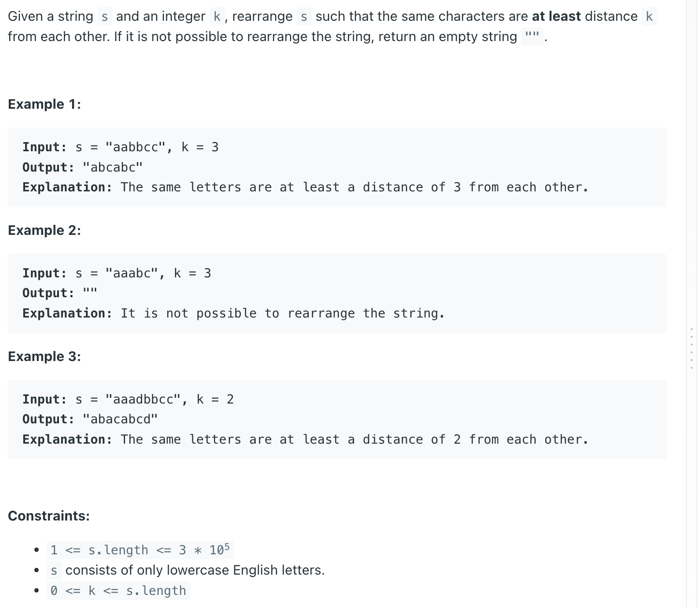

## 358. Rearrange String k Distance Apart

---

```ruby
    s = "aabbcc", k = 3

    map:   a : 2
           b : 2
           c : 2
maxHeap: sorted by frequency. If the same, lexicographically sort


    for loop with s:
        maxHeap.add(new int[]{index in 26, frequency})

    for loop with 26 chars:
        check if every map[index] == 0:
```

---

- `s` takes `O(n)` time, where `n` is the length of the string.
- In the worst case, this will be O(log 26) for each operation (since the heap has at most 26 elements)
- Therefore, the overall **time complexity** is **O(n)**.

- The StringBuilder takes O(n) space to store the final result.
- overall space complexity is **O(n)**

---

```java
class _358_RearrangeString_k_DistanceApart {
    public String rearrangeString(String s, int k) {
        if (k == 0 || s.length() < k) {
            return s;
        }

        int[] map = new int[26];
        for (char c : s.toCharArray()) {
            map[c - 'a']++;
        }

        PriorityQueue<int[]> maxHeap = new PriorityQueue<>(
                (a, b) -> a[1] == b[1] ? a[0] - b[0] : b[1] - a[1]);

        for (int i = 0; i < 26; i++) {
            if (map[i] > 0) {
                maxHeap.offer(new int[]{i, map[i]});
            }
        }

        StringBuilder sb = new StringBuilder();
        while (!maxHeap.isEmpty()) {
            List<Integer> charIndexes = new ArrayList<>();
            for (int i = 0; i < k; i++) {
                int[] cur = maxHeap.poll();
                char c = (char) (cur[0] + 'a');
                sb.append(c);
                charIndexes.add(cur[0]);

                if (maxHeap.size() == 0) {
                    if (i != k - 1 && sb.length() != s.length()) {
                        return "";
                    }
                    break;
                }
            }

            for (int index : charIndexes) {
                if (--map[index] > 0) {
                    maxHeap.offer(new int[]{index, map[index]});
                }
            }
        }

        return sb.toString();
    }
}
```