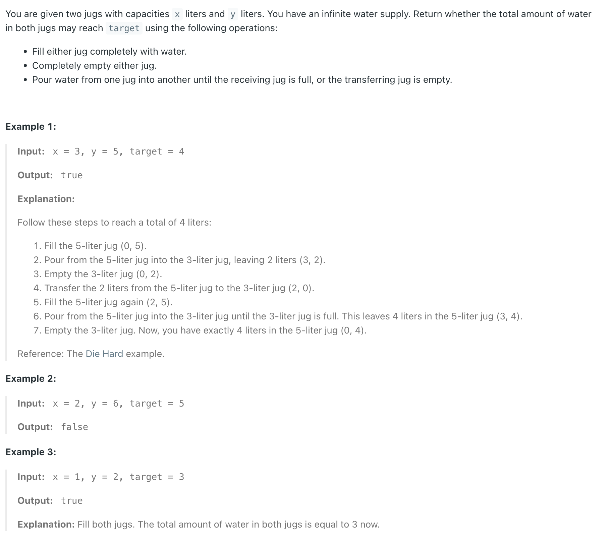
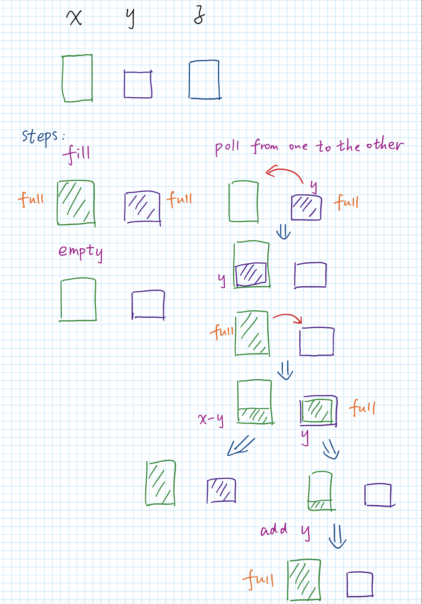
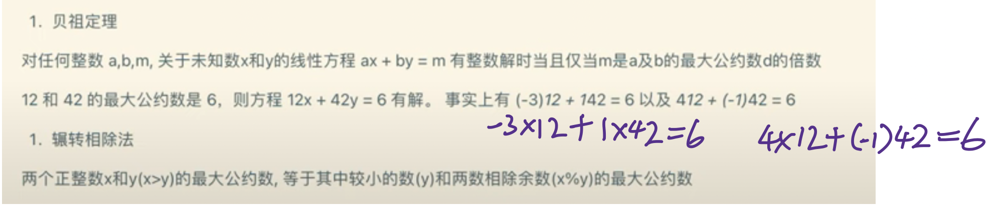
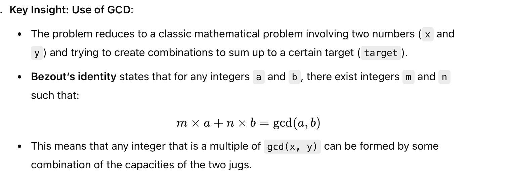

## 365. Water and Jug Problem


- [1071. Greatest Common Divisor of Strings](https://novemberfall.github.io/LeetCode-NoteBook/#/tiktok/1071)
---






---

```java
class Solution {
    public boolean canMeasureWater(int x, int y, int target) {
        if (x + y < target) {
            return false;
        }
        if (x == target || y == target || x + y == target) {
            return true;
        }

        if (x > y) {
            return target % gcd(x, y) == 0;
        } else {
            return target % gcd(y, x) == 0;
        } 
    }

    private int gcd(int x, int y) {
        if (y == 0) {
            return x;
        }
        return gcd(y, x % y);
    }
}
```
---

#### Python

```py
class Solution:
    def canMeasureWater(self, x: int, y: int, target: int) -> bool:
        if (x + y) < target:
            return False
        if x == target or y == target or (x + y) == target:
            return True

        if (x > y):
            return target % self.gcd(x, y) == 0
        else:
            return target % self.gcd(y, x) == 0

    def gcd(self, x, y) -> int:
        if y == 0:
            return x
        return self.gcd(y, x % y)
```