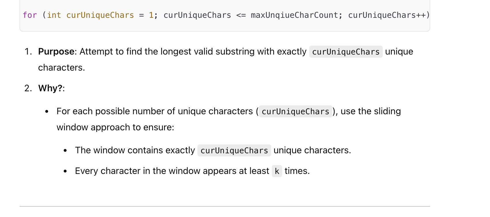

## 395. Longest Substring with At Least K Repeating Characters

---

#### sliding window

- [leetcode discussion](https://leetcode.com/problems/longest-substring-with-at-least-k-repeating-characters/solutions/2821874/why-sliding-window-works-for-this-qustion-and-how-it-works-simple-analysis)




---
```java
class _395_LongestSubstringWithAtLeast_K_RepeatingCharacters {
    public int longestSubstring(String s, int k) {
        int maxUnqiueCharCount = getUniqueCharCounts(s);
        int[] freq = new int[26];
        int res = 0;

        for (int curUniqueChars = 1; curUniqueChars <= maxUnqiueCharCount; curUniqueChars++) {
            Arrays.fill(freq, 0);
            int uniqueCount = 0, countOfCharsWithFreqAtLeastK = 0, slow = 0, fast = 0;

            while (fast < s.length()) {
                if (uniqueCount <= curUniqueChars) {
                    int idx = s.charAt(fast) - 'a';
                    if (freq[idx] == 0) {
                        uniqueCount++;
                    }
                    freq[idx]++;

                    if (freq[idx] == k) {
                        countOfCharsWithFreqAtLeastK++;
                    }
                    fast++;
                } else {
                    // we need to shrink
                    int idx = s.charAt(slow) - 'a';
                    if (freq[idx] == k) {
                        countOfCharsWithFreqAtLeastK--;
                    }
                    freq[idx]--;
                    if (freq[idx] == 0) {
                        uniqueCount--;
                    }
                    slow++;
                }

                if (uniqueCount == curUniqueChars && uniqueCount == countOfCharsWithFreqAtLeastK) {
                    res = Math.max(fast - slow, res);
                }
            }
        }
        return res;
    }

    private int getUniqueCharCounts(String s) {
        boolean[] chars = new boolean[26];
        int uniqueCount = 0;
        for (char c : s.toCharArray()) {
            if (!chars[c - 'a']) {
                uniqueCount++;
                chars[c - 'a'] = true;
            }
        }
        return uniqueCount;
    }
}
```
---

#### Python

```py

```
---

#### dfs


- [Divide and Conquer](https://youtu.be/Dn_Wt6lBt4I?t=105)
---

```java
            a  b  c  b  a  a     , assume k = 2
                

if there is a char `c`,  c's freq is less than k , so this string `abcbaa` is 
not the longest substring because `abcbaa` contains `c`.

由于只要包含了 c (freq = 1), 那么字符串就不符合要求，
所以我们用 divide conquer 的办法，以 c 为 pivot, 向左边递归 and 向右边递归

最终 ` a  b  c  b  a  a`  的 longest substring is `aa`
```
---

```java
class _395_LongestSubstringWithAtLeast_K_RepeatingCharacters {
    public int longestSubstring(String s, int k) {
        return dfs(s.toCharArray(), 0, s.length(), k);
    }

    private int dfs(char[] chars, int start, int end, int k) {
        // 停止条件：字符串长度小于 k
        if (end - start < k) {
            return 0;
        }

        int[] count = new int[26];

        // count the frequencies of current substring
        for (int i = start; i < end; i++) {
            int index = chars[i] - 'a';
            count[index]++;
        }

        for (int i = 0; i < 26; i++) {
            // 下面这个是不满足要求的字符，它不能出现在任何有效的子字符串中
            if (count[i] < k && count[i] > 0) {
                // 需要找到这个字符的位置，然后分别求解它的左半部分和右半部分
                for (int j = start; j < end; j++) {
                    System.out.println("start: " + start + "  " + "end: " + end);
                    if (chars[j] == i + 'a') {
                        System.out.println("chars[j] : "+ chars[j]);
                        int left = dfs(chars, start, j, k);
                        int right = dfs(chars, j + 1, end, k);
                        return Math.max(left, right);
                    }
                }
            }
        }
        System.out.println("end - start: " + "=>" + " "+ (end - start));
        return end - start;
    }
}
```

