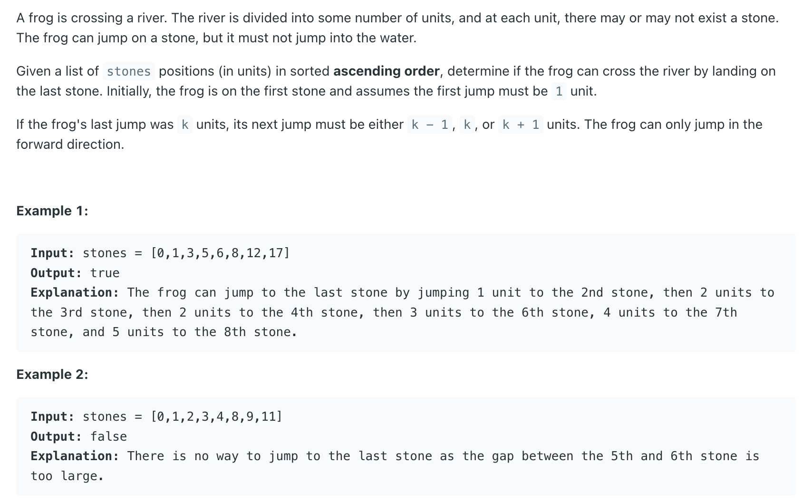
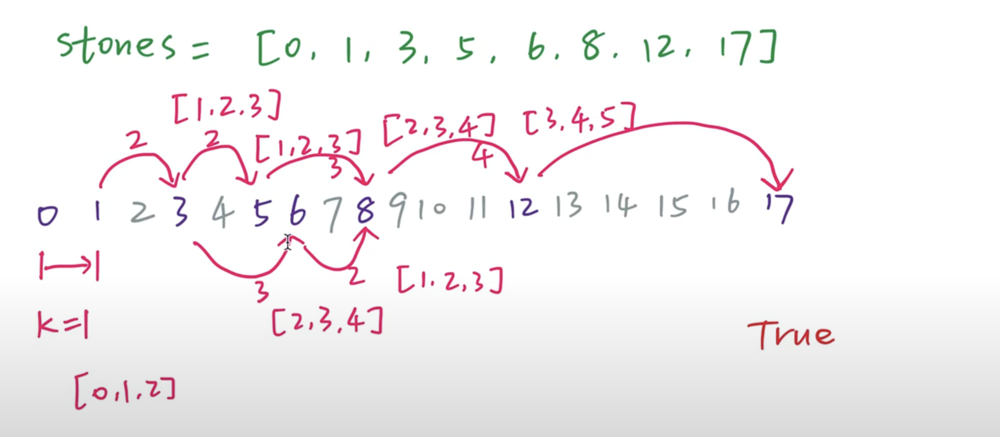
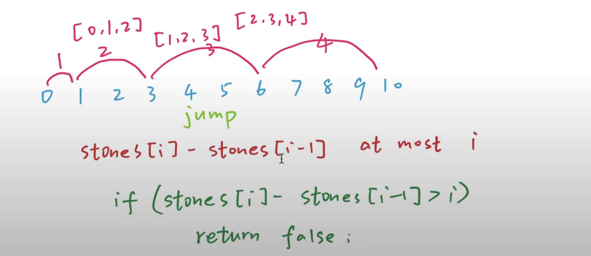

## 403. Frog Jump




- initially, frog **must be stand on step 1**
- 紫色的是石头，灰色的是河，假如它跳了`k`步数, 那么它下一次要么 跳 `k - 1`, `k`, or `k + 1`


1. stone `i` : postion
2. the last jump `k`, `[k - 1, k + 1]`
3. `dp[n][k]` whether `nth` stone with jump `k` is reachable 
   - from left to right check each stone whether is reachable
   - **stones[1] = 1**   `k = stones[1] - stones[0] = 1` 
     - dp[1][1] = dp[0][0] || dp[0][1] || dp[0][2]


---

```java
class _403_FrogJump {
    public boolean canCross(int[] stones) {
        int n = stones.length;
        boolean[][] dp = new boolean[n][n];
        dp[0][0] = true;

        for (int i = 1; i < n; i++) {
            for (int j = i + 1; j >= 0; j--) {
                int k = stones[i] - stones[j];
                if (k > j + 1) {
                    break;
                }
                dp[i][k] = dp[j][k - 1] || dp[j][k] || dp[j][k + 1];
                if (i == n - 1 && dp[i][k]) {
                    return true;
                }
            }
        }
        return false;
    }
}
```