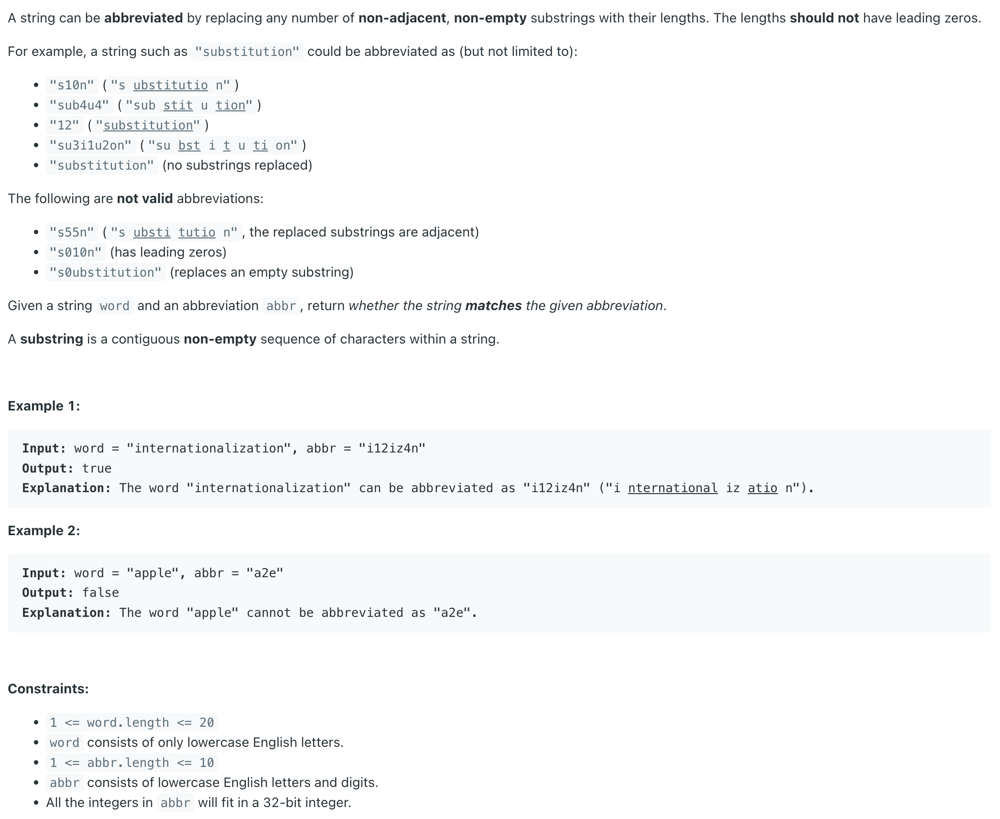

## 408. Valid Word Abbreviation

---

```java
class _408_ValidWordAbbreviation {
    public boolean validWordAbbreviation(String word, String abbr) {
        int i = 0, j = 0;
        while (i < word.length() && j < abbr.length()) {
            if (word.charAt(i) == abbr.charAt(j)) {
                i++;
                j++;
                continue;
            }
            if (abbr.charAt(j) <= '0' || abbr.charAt(j) > '9') {
                return false;
            }
            int start = j;
            while (j < abbr.length() && abbr.charAt(j) >= '0' && abbr.charAt(j) <= '9') {
                j++;
            }
            int num = Integer.parseInt(abbr.substring(start, j));
            i += num;
        }
        return i == word.length() && j == abbr.length();
    }
}
```
---

#### Python

```py
class Solution:
    def validWordAbbreviation(self, word: str, abbr: str) -> bool:
        i, j = 0, 0
        while i < len(word) and j < len(abbr):
            if word[i] == abbr[j]:
                i += 1
                j += 1
                continue
            
            if abbr[j] <= '0' or abbr[j] > '9':
                return False
            
            start = j
            while j < len(abbr) and abbr[j] >= '0' and abbr[j] <= '9':
                j += 1
            
            num = int(abbr[start:j])
            i += num
        
        return i == len(word) and j == len(abbr)
```