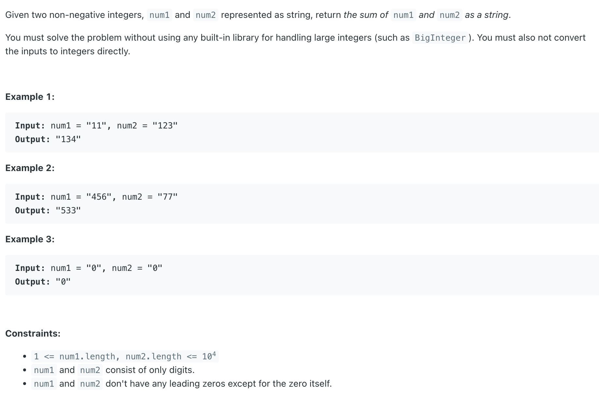

## 415. Add Strings

---

```java
class _415_AddStrings {
    public String addStrings(String num1, String num2) {
        StringBuilder sb = new StringBuilder();
        int i = num1.length() - 1;
        int j = num2.length() - 1;
        int carry = 0, sum = 0;

        while (i >= 0 || j >= 0 || carry > 0) {
            int digit1 = (i >= 0) ? num1.charAt(i) - '0' : 0;
            int digit2 = (j >= 0) ? num2.charAt(j) - '0' : 0;
            sum = digit1 + digit2 + carry;
            sb.append(sum % 10);
            carry = sum / 10;
            i--;
            j--;
        }

        return sb.reverse().toString();
    }
}

```

---

#### Python

```py
class Solution:
    def addStrings(self, num1: str, num2: str) -> str:
        res = []
        i, j = len(num1) - 1, len(num2) - 1
        carry, sum = 0, 0

        while i >= 0 or j >= 0 or carry > 0:
            digit1 = int(num1[i]) if i >= 0 else 0
            digit2 = int(num2[j]) if j >= 0 else 0
            sum = digit1 + digit2 + carry

            res.append(str(sum % 10))
            carry = sum // 10
            i -= 1
            j -= 1

        return "".join(res[::-1])
```