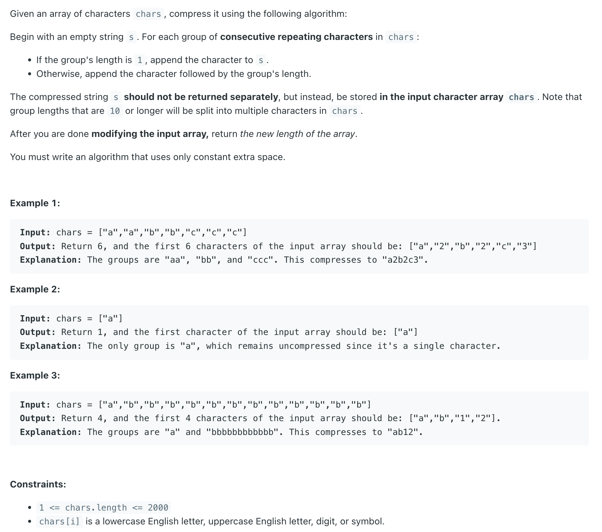
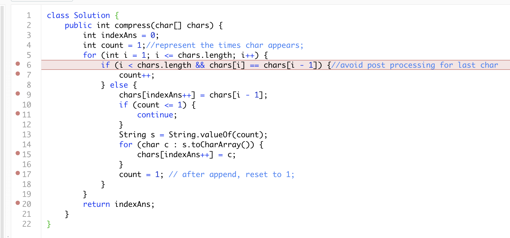

## 443. String Compression

---

- 可以 debug 找规律:


---

```java
class _443_StringCompression {
    public int compress(char[] chars) {
        int indexAns = 0;
        int count = 1;//represent the times char appears;
        for (int i = 1; i <= chars.length; i++) {
            if (i < chars.length && chars[i] == chars[i - 1]) {//avoid post processing for last char
                count++;
            } else {
                chars[indexAns++] = chars[i - 1];
                if (count <= 1) {
                    continue;
                }
                String s = String.valueOf(count);
                for (char c : s.toCharArray()) {
                    chars[indexAns++] = c;
                }
                count = 1; // after append, reset to 1;
            }
        }
        return indexAns;
    }

    public static void main(String[] args) {
        _443_StringCompression stringCompression = new _443_StringCompression();
        char[] chars = new char[]{'a', 'a', 'b', 'b', 'c', 'c', 'c'};
        int res = stringCompression.compress(chars);
        System.out.println(res);
    }
}
```