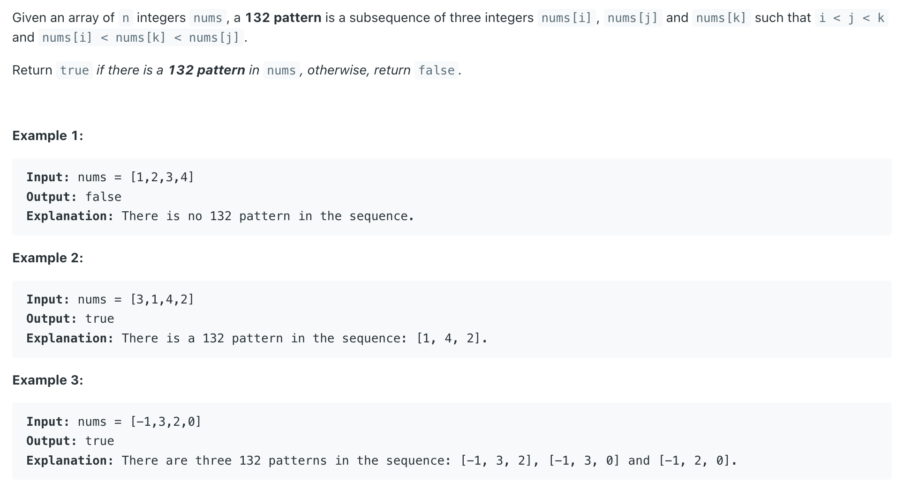

## 456. 132 Pattern


---

#### Brute Force

```java
class Solution {
    public boolean find132pattern(int[] nums) {
        int n = nums.length;
        for (int i = 0; i < n; i++) {
            for (int j = i + 1; j < n; j++) {
                for (int k = j + 1; k < n; k++) {
                    if (nums[i] < nums[k] && nums[k] < nums[j]) {
                        return true;
                    }
                }
            }
        }
        return false;
    }
}
```
---

### Monotone Stack

- [youtube](https://www.youtube.com/watch?v=q5ANAl8Z458&t=21s)

- For every elment in **Stack**, is a `new int[2]{num, LastMinLeft}`
- if **current num** is greater than **top of stack**, take pop() 
- if we can meet the condition **current num > LastMinLeft**, return true

---
```java
class _132Pattern {
    public boolean find132pattern(int[] nums) {
        Stack<int[]> stack = new Stack<>();  // Use Stack for [num, minLeft] pairs
        int curMin = nums[0];

        for (int i = 1; i < nums.length; i++) {
            int n = nums[i];
            while (!stack.isEmpty() && n >= stack.peek()[0]) {
                stack.pop(); // Pop while n >= stack top's num
            }
            if (!stack.isEmpty() && n > stack.peek()[1]) {
                return true; // Found 132 pattern
            }

            stack.push(new int[]{n, curMin}); // Push [n, curMin] onto the stack
            curMin = Math.min(curMin, n);     // Update curMin
        }

        return false; // No 132 pattern found
    }
}
```


#### Python

```py
class Solution:
    def find132pattern(self, nums: List[int]) -> bool:
        stack = [] # pair [num, minLeft], mono decreasing
        curMin = nums[0]

        for n in nums[1:]:
            while stack and n >= stack[-1][0]:
                stack.pop()
            if stack and n > stack[-1][1]:
                return True

            stack.append([n, curMin])
            curMin = min(curMin, n)

        return False
```

