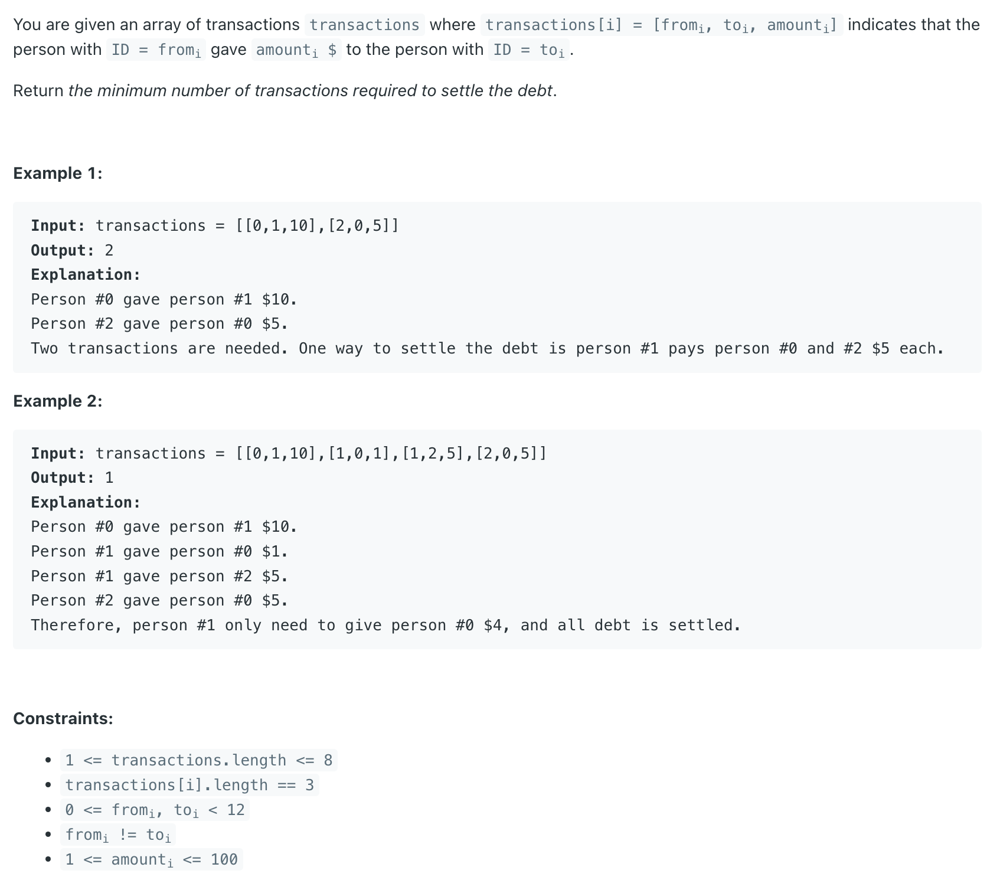
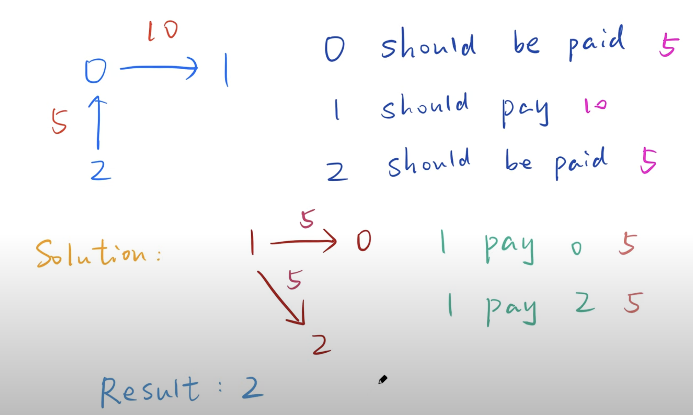
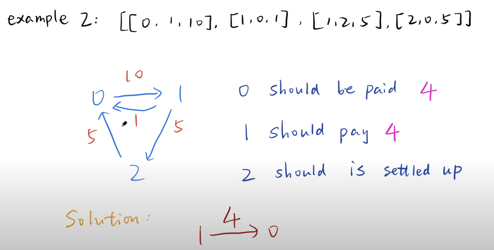

## 465. Optimal Account Balancing

---
- [youtube](https://youtu.be/HHKJPtsOGwk?t=595)

- [youtube](https://youtu.be/7pX-Jg6Z4jE?t=687)

- [0, 1, 10]
  [2, 0, 5]







- Algorithm:
  - start from first value (non-zero), try to settle up with the rest. compare all possible assignment, get a global minimum.

- pruning:
  - onece the **current balance + next balance == 0**, this should be an optimal assignment, end early.
  - when current balance * next balance, we should settle up. [在这里解释进入下一轮递归条件](https://www.youtube.com/watch?v=HHKJPtsOGwk&t=505s)


- Wrap Up:
  - get the balance of each account backtracking to get global minimum number of transacions
  - once **current account X next account < 0**, we can perform 1 transaction in order to get settled up.


- Time Complexity: O(n * 2^n) ,  in the worst case due to the DFS exploration of subsets.
- Space Complexity: O(N) for storing the map and list, plus O(n) for the recursion stack.

---

#### 感谢Up主的分享。这里我补充几点我个人的理解：

1. dfs的物理意义到底是啥？
   - 我认为dfs的物理意义是把从list的第k位开始到list结尾的所有账目清零的最小步数。所以dfs(list, 0) 代表了把list的全部账目清零的最小步数。

2. dfs到底做了啥事儿？如何确保是最小步数？
   - 我的理解是: 假设k=0, dfs(list, k) = 把第0位的账目清零的步数 + 把剩余所有账目(也就是从k = 1到list结束)清零的最小步数。 公式的第一项就是1, 
     因为我们只要找到另一个账目(和第0位符号相反) 就可以。公式的第二项，求从k+1位开始的剩余所有账目清零的最小步数，本身是一个子问题, 即dfs(list, k + 1). 

3. 如何理解第27行for循环里面的递归是dfs(list, k + 1) 不是dfs(list, i + 1)?
   - 上面已经解释过了，for 循环做的事情是要找出把第k位的账目清零的所有可能。
   - 举个例子：假设现在list = [-25, 30, 15, -20], k = 0,  我们要清0号的账。现在0号总共要还给别人25块钱。能让第k位也就是0号的账清零的操作有两种：
     - 1, 让0号还25块钱给1号， 这时候list变成了[-25, 5, 15, -20]， 此时1号还需要收回5块钱才能清零。
     - 2, 让0号还25块钱给2号，这个时候list变成了[-25, 30, -10, -20]，此时2号还需要再还给别人10块钱才能平衡。

以上这两种操作的步数为1. 并且这个时候0号的账已经清了，接下来我们只需要解决剩余1,2和3号的账目问题(k + 1的子问题)。对于操作1，
我们需要求解[5, 15, -20]的全体账目清零的最小步数a。对于操作2，我们需要求解[30, -10, -20]全体账目清零的最小步数b。
最终我们取min(a,b)， 返回min(a,b) + 1。

所以我们的dfs里传入的是k + 1 而不是i + 1. 

4. list.set 的时候为什么不把第k位的账目也更改？
   - 我觉得理论上应该给第k位清零。但是因为计算后续的操作数不需要用到第k位的值，所以改不改意义不大。如果要改还需要reset第k位的值才能保证不出错。

5. if (cur == 0) return dfs(list, k + 1)如何理解？
   - 如果cur == 0， 说明当前第k号的账已经清零，那么dfs(k, list) = dfs(k + 1, list)。 可以理解为既然k号的账已经清了，
     我们只需要把剩余从k + 1号的账清零即可。


总结：
这个题看上去是dfs的题，实际上的思想是DP。总的来说就是要解决几个人的账全部清零的最小步数这个问题，
可以化解为把第一个人的账清零 + 剩余人的账全部清零的最小步数 (子问题）。而把第一个人的账清零，我们还要通过for循环找出所有的可能性。。。


---

```java
class _465_OptimalAccountBalancing {
    public int minTransfers(int[][] transactions) {
        Map<Integer, Integer> map = new HashMap<>();
        for (int[] t : transactions) {
            map.put(t[0], map.getOrDefault(t[0], 0) + t[2]);
            map.put(t[1], map.getOrDefault(t[1], 0) - t[2]);
        }

        List<Integer> list = new ArrayList<>();
        for (int v : map.values()) {
            if (v != 0) {
                list.add(v);
            }
        }

        // from 0-index of list
        return dfs(0, list);
    }

    // return the total number of transactions
    private int dfs(int k, List<Integer> list) {
        if (k == list.size()) { // get the last index of list, don't need to do 
            return 0; // return 0 transaction
        }
        int cur = list.get(k);
        if (cur == 0) {
            return dfs(k + 1, list);
        }

        int min = Integer.MAX_VALUE;
        for (int i = k + 1; i < list.size(); i++) {
            int next = list.get(i);
            if (cur * next < 0) { // thcek if they are same sign
                list.set(i, cur + next);
                min = Math.min(min, 1 + dfs(k + 1, list));
                list.set(i, next);
            }

            if (cur + next == 0) {
                break;
            }
        }

        return min;
    }
}

```
---


---

```java
class _465_OptimalAccountBalancing {
    int res = Integer.MAX_VALUE;
    public int minTransfers(int[][] transactions) {
        Map<Integer, Integer> map = new HashMap<>();
        for (int[] t : transactions) {
            map.put(t[0], map.getOrDefault(t[0], 0) - t[2]);
            map.put(t[1], map.getOrDefault(t[1], 0) + t[2]);
        }

        List<Integer> list = new ArrayList<>();
        for (int v : map.values()) {
            if (v != 0) {
                list.add(v);
            }
        }
        dfs(0, 0, list);
        return res;
    }

    // return the total number of transactions
    private void dfs(int startIndex, int count, List<Integer> list) {
        while (startIndex < list.size() && list.get(startIndex) == 0) {
            startIndex++;
        }
        if (startIndex == list.size()) {
            res = Math.min(res, count);
            return;
        }

        for (int i = startIndex + 1; i < list.size(); i++) {
            // check if they are same sign
            if ((list.get(startIndex) < 0 && list.get(i) > 0) || (list.get(startIndex) > 0 && list.get(i) < 0)) {
                list.set(i, list.get(i) + list.get(startIndex));
                dfs(startIndex + 1, count + 1, list);
                list.set(i, list.get(i) - list.get(startIndex));
            }
        }
    }
}
```


