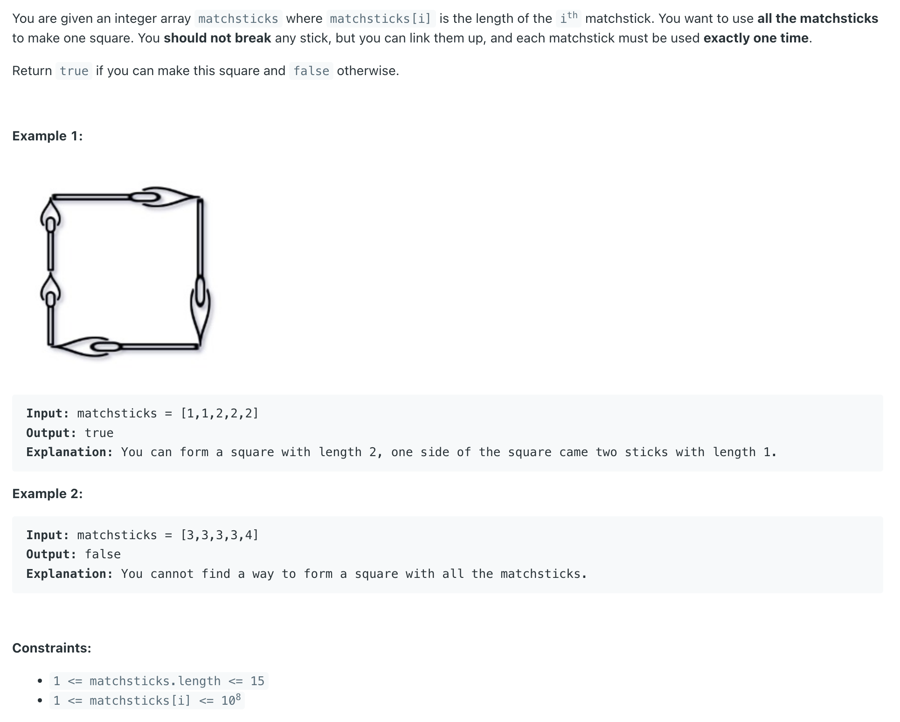
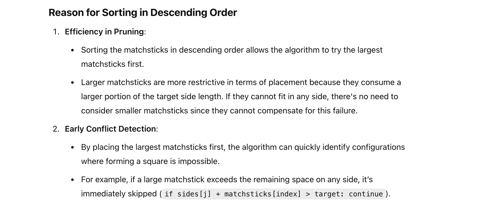
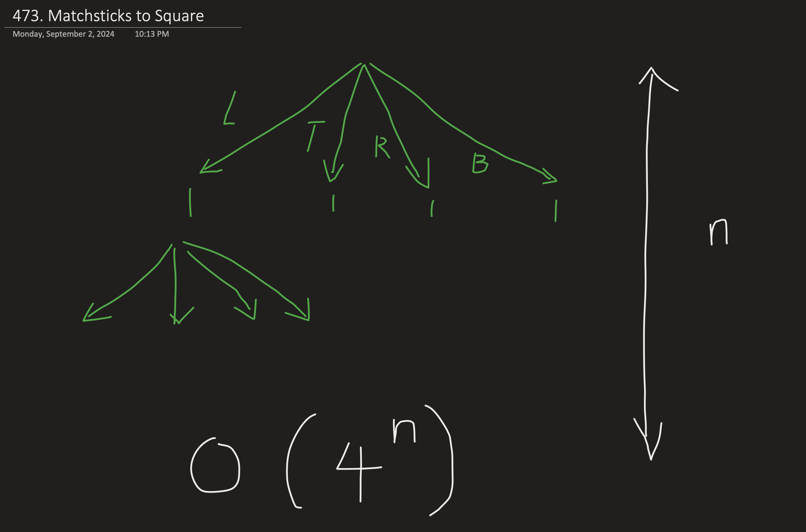

## 473. Matchsticks to Square


- should **not break**
- **used exactly one time**

---

- Sorting the input array **DESC** will make the DFS process run much faster. Reason behind this is we always try to put the next 
  matchstick in the first subset. If there is no solution, trying a longer matchstick first will get to negative conclusion earlier. 
  Following is the updated code. Runtime is improved from more than 1000ms to around 40ms. A big improvement.





---

```java
class _473_MatchsticksToSquare {
    public boolean makesquare(int[] matchsticks) {
        if (matchsticks == null || matchsticks.length < 4) return false;

        int sum = 0;
        for (int m : matchsticks) {
            sum += m;
        }
        if (sum % 4 != 0) {
            return false;
        }
        int len = sum / 4;
        Arrays.sort(matchsticks);
        reverse(matchsticks);

        return backtracking(matchsticks, new int[4], len, 0);
    }

    private boolean backtracking(int[] nums, int[] sides, int len, int index) {
        if (index == nums.length) {
            return true;
        }
        for (int j = 0; j < 4; j++) {
            if (sides[j] + nums[index] <= len) {
                sides[j] += nums[index];
                if (backtracking(nums, sides, len, index + 1)) {
                    return true;
                }
                sides[j] -= nums[index];
            }
        }
        return false;
    }

    private void reverse(int[] nums) {
        int left = 0, right = nums.length - 1;
        while (left <= right) {
            int tmp = nums[left];
            nums[left] = nums[right];
            nums[right] = tmp;
            left++;
            right--;
        }
    }
}
```
---

#### Python

```py
class Solution:
    def makesquare(self, matchsticks: List[int]) -> bool:
        size = len(matchsticks)
        if matchsticks is None or size < 4:
            return False
        total = sum(matchsticks)
        if total % 4 != 0:
            return False
        target = total / 4
        sides = [0] * 4
        matchsticks.sort(reverse=True)

        return self.backtracking(matchsticks, sides, target, 0)

    def backtracking(self, matchstricks, sides, target, index: int) -> bool:
        if index == len(matchstricks):
            return True

        for i in range(4):
            if sides[i] + matchstricks[index] <= target:
                sides[i] += matchstricks[index]
                if self.backtracking(matchstricks, sides, target, index + 1):
                    return True
                sides[i] -= matchstricks[index]
        return False
```