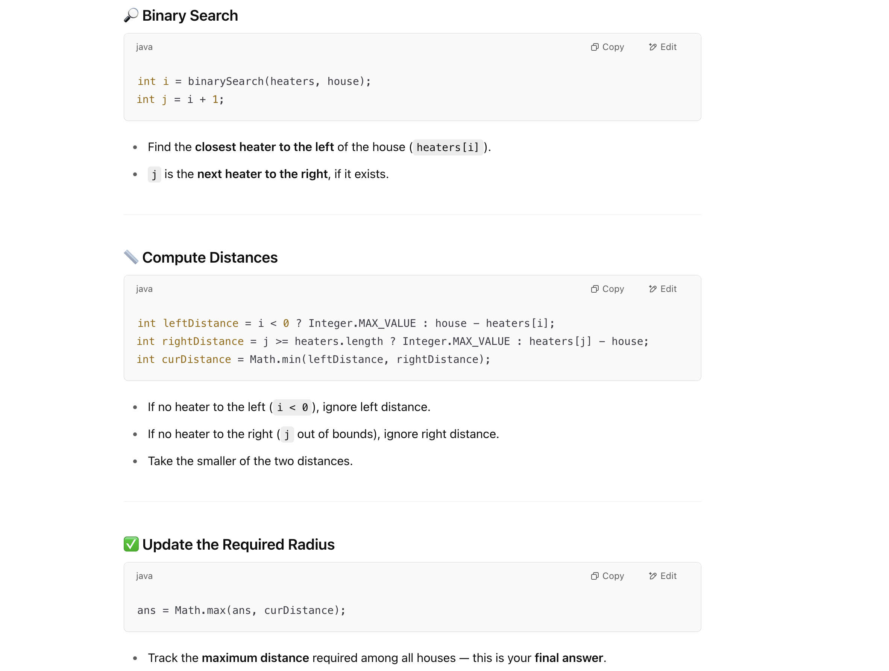

## 475. Heaters

---

- An array `houses`, representing the positions of houses.
- An array `heaters`, representing the positions of heaters.


- **Goal**: Find the **minimum** radius such that every house is **within the range of at least one heater**.
  Each heater covers a **radius**, so a heater at position `h` can warm any house between `[h - radius, h + radius]`.
  You need to return the **smallest possible radius** that works for all houses.

#### Steps:
- 1. **Sort** the heaters array so you can perform **binary search** on it.
- 2. For **each house**, find the **closest heater(s)** to it:
  - Use binary search to find the **rightmost heater <= house**.
  - Check both that heater and the next one (if it exists).
- 3. Compute the **distance from the house to both nearby heaters**, and take the smaller one.
- 4. The **maximum** of these distances (over all houses) is the **radius you need**.




---

```java
class _475_Heaters {
    public int findRadius(int[] houses, int[] heaters) {
        Arrays.sort(houses);
        int res = 0;
        for (int house : houses) {
            int i = binarySearch(heaters, house);
            int j = i + 1;
            int leftDistance = i < 0 ? Integer.MAX_VALUE : house - heaters[i];
            int rightDistance = j >= heaters.length ? Integer.MAX_VALUE : heaters[j] - house;
            int curDistance = Math.min(leftDistance, rightDistance);
            res = Math.max(res, curDistance);
        }
        return res;
    }

    private int binarySearch(int[] heaters, int target) {
        int left = 0, right = heaters.length - 1;
        if (heaters[left] > target) {
            return -1;
        }
        while (left < right - 1) {
            int mid = left + (right - left) / 2;
            if (heaters[mid] == target) {
                return mid;
            } else if (heaters[mid] < target) {
                left = mid;
            } else {
                right = mid - 1;
            }
        }
        return heaters[right] <= target ? right : left;
    }
}
```
---

```py
class Solution:
    def findRadius(self, houses: List[int], heaters: List[int]) -> int:
        # Sort the heaters list to efficiently find the nearest ones using binary search.
        heaters.sort()
        res = 0

        # Iterate through each house to find the minimum distance to a heater.
        for house in houses:
            # The binary search returns the index of the largest heater <= house
            i = self.binarySearch(heaters, house)
            # The heater potentially to the right of the house is at index i + 1.
            j = i + 1
            left_distance = float('inf') if i < 0 else house - heaters[i]
            right_distance = float('inf') if j >= len(heaters) else heaters[j] - house

            # The minimum radius required for the current house is the minimum of the distances to the left and right heaters.
            cur_distance = min(left_distance, right_distance)

            # Update the overall maximum radius needed if the current house requires a larger radius.
            res = max(res, cur_distance)
        return res

    def binarySearch(self, heaters: List[int], target: int) -> int:
        left, right = 0, len(heaters) - 1
        if heaters[left] > target:
            return -1
        while left < right - 1:
            mid = (left + right) >> 1
            if heaters[mid] == target:
                return mid
            elif heaters[mid] < target:
                left = mid
            else:
                right = mid - 1
                
        # After the loop, check the remaining one or two elements (at left and right).
        # Return the index of the largest heater that is less than or equal to the target.
        return right if heaters[right] <= target else left
```