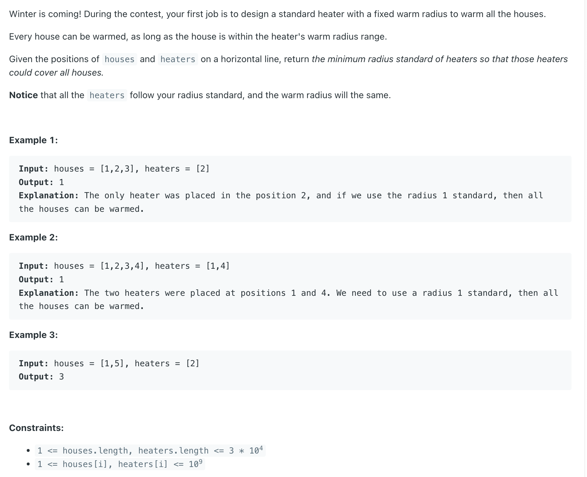

## 475. Heaters



- [youtube](https://www.youtube.com/watch?v=xRiOz7zFF_4)

---

```java
class Solution {
    public int findRadius(int[] houses, int[] heaters) {
        TreeSet<Integer> set = new TreeSet<>();
        for (int h : heaters) {
            set.add(h);
        }

        int res = 0;
        for (int house : houses) {
            Integer upper = set.ceiling(house);
            Integer lower = set.floor(house);
            
            int d1 = upper == null ? Integer.MAX_VALUE : upper - house;
            int d2 = lower == null ? Integer.MAX_VALUE: house - lower;

            res = Math.max(res, Math.min(d1, d2));
        }
        return res;
    }
}
```
---

#### Python

```py
class Solution:
    def findRadius(self, houses: List[int], heaters: List[int]) -> int:
        heater_set = []
        res = 0

        for h in houses:
            heater_set.add(h)

        for house in houses:
            upper = min(heater_set, key=lambda x: x if x >= house else None)
            lower = max(heater_set, key=lambda x: x if x <= house else None)

            d1 = upper - house if upper else float('inf')
            d2 = house - lower if lower else float('inf')

            res = max(res, min(d1, d2))

        return res
```