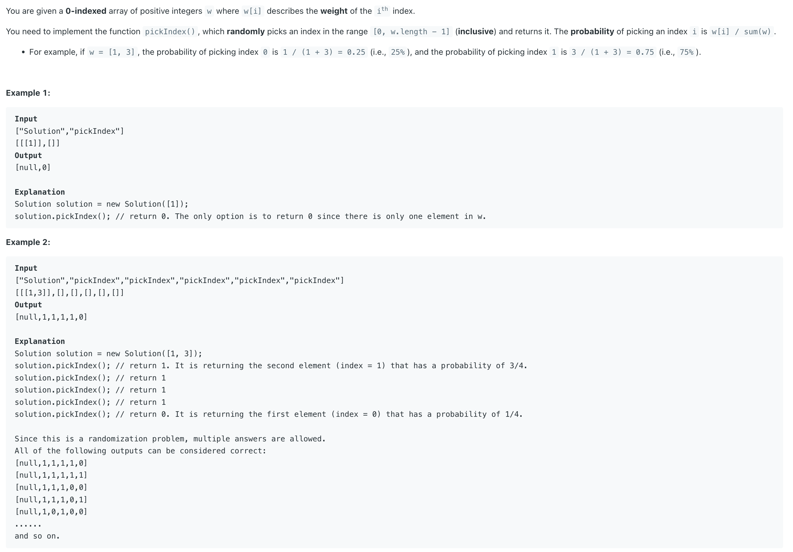

## 528. Random Pick with Weight

---

- 本题解体的时候是不需要考虑 **probability**, 它已经是一个 built into the way the prefix sum array wSums is created and used in the random selection.


---
```java
class Solution {
    Random random;
    int[] wSums;    

    public Solution(int[] w) {
        this.random = new Random();
        for (int i = 1; i < w.length; ++i) {
            w[i] += w[i - 1];
        }
        this.wSums = w;        
    }
    
    public int pickIndex() {
        int len = wSums.length;
        int idx = random.nextInt(wSums[len - 1]) + 1;
        int left = 0, right = len - 1;
        // search position
        while (left <= right) {
            int mid = left + (right - left) / 2;
            if (wSums[mid] == idx) {
                return mid;
            } else if (wSums[mid] < idx) {
                left = mid + 1;
            } else {
                right = mid - 1;
            }
        }
        return left;        
    }
}
```
---

#### Python

```py
from typing import List
import random

class Solution:

    def __init__(self, w: List[int]):
        for i in range(1, len(w)):
            w[i] += w[i - 1]
        self.wSums = w

    def pickIndex(self) -> int:
        # Generate a random number between 1 and the last element in wSums (inclusive)
        weight = random.randint(1, self.wSums[-1])
        left, right = 0, len(self.wSums) - 1

        while left <= right:
            mid = left + (right - left) // 2
            if self.wSums[mid] == weight:
                return mid
            elif self.wSums[mid] < weight:
                left = mid + 1
            else:
                right = mid - 1
        return left

# Your Solution object will be instantiated and called as such:
# obj = Solution(w)
# param_1 = obj.pickIndex()
```
---

## Why Return **left**?


