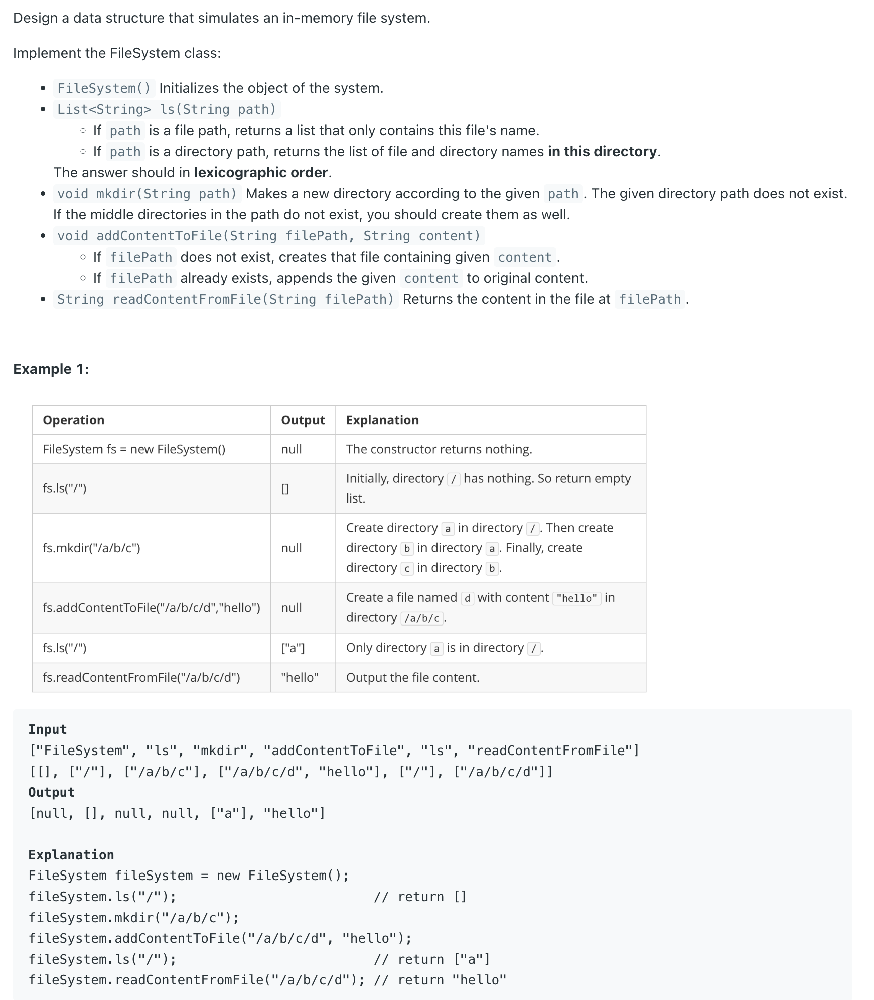
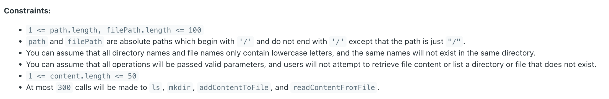

## 588. Design In-Memory File System


---
```java
    String s = "/a/b/c/d";
    String [] str = s.split("/");
    System.out.println(Arrays.toString(str)); // ["", a, b, c, d]
```
---
- assume `path = /`, 
  - `String[] dirs = path.split("/")`
  - if there is nothing in current path, return null
  - if there is a file, return file's name
  - if there is directories, return directories.
  - that's why 

```java
        String [] dirs = path.split("/");        
        for (String dir : dirs) {
            if (dir.length() == 0) {
                continue;
            }
```

- since path and **filePath** are absolute paths which **begin** `with '/'`
  - so we can skip index = 0 because **dirs[0] is ""**

---

- For `List<String> ls(String path)`, The answer should in **lexicographic order**.

- `addContentToFile /a/b/c/d "hello"`
- `addContentToFile /a/b/c/e "world"`
- `mkdir /a/b/f`

- Now listing `/a/b`, should show `["c", "f"]` because directories are sorted **lexicographically**.
- Listing `/a/b/c` should show `["d", "e"]` because files are sorted **lexicographically**.

---
```java
class FileSystem {
    class Node {
        String name;
        boolean isFile;
        StringBuilder content;
        Map<String, Node> children;

        public Node(String name) {
            this.name = name;
            isFile = false;
            content = new StringBuilder();
            children = new HashMap<>();
        }
    }

    Node root;

    public FileSystem() {
        root = new Node("/");
    }

    public List<String> ls(String path) {
        Node node = traverse(path);
        List<String> res = new ArrayList<>();
        if (node.isFile) {
            res.add(node.name);
        } else {
            /*
                ├── a
                │   ├── b
                │   └── c.txt
                └── d
                    ├── e
                    └── f
            */
            for (String key : node.children.keySet()) {
                res.add(key);
            }
        }
        Collections.sort(res); // compare `b` and `c.txt`
                               // compare `e`  and `f`
        return res;
    }

    public void mkdir(String path) {
        traverse(path);
    }

    public void addContentToFile(String filePath, String content) {
        Node node = traverse(filePath);
        node.isFile = true;
        node.content.append(content);
    }

    public String readContentFromFile(String filePath) {
        Node node = traverse(filePath);
        return node.content.toString();
    }

    private Node traverse(String filePath) {
        String[] paths = filePath.split("/");
        Node cur = root;
        // ["", a, b, c]
        for (int i = 1; i < paths.length; i++) {
            if (!cur.children.containsKey(paths[i])) {
                Node node = new Node(paths[i]);
                cur.children.put(paths[i], node);
            }
            cur = cur.children.get(paths[i]);
        }
        return cur;
    }
}
```
