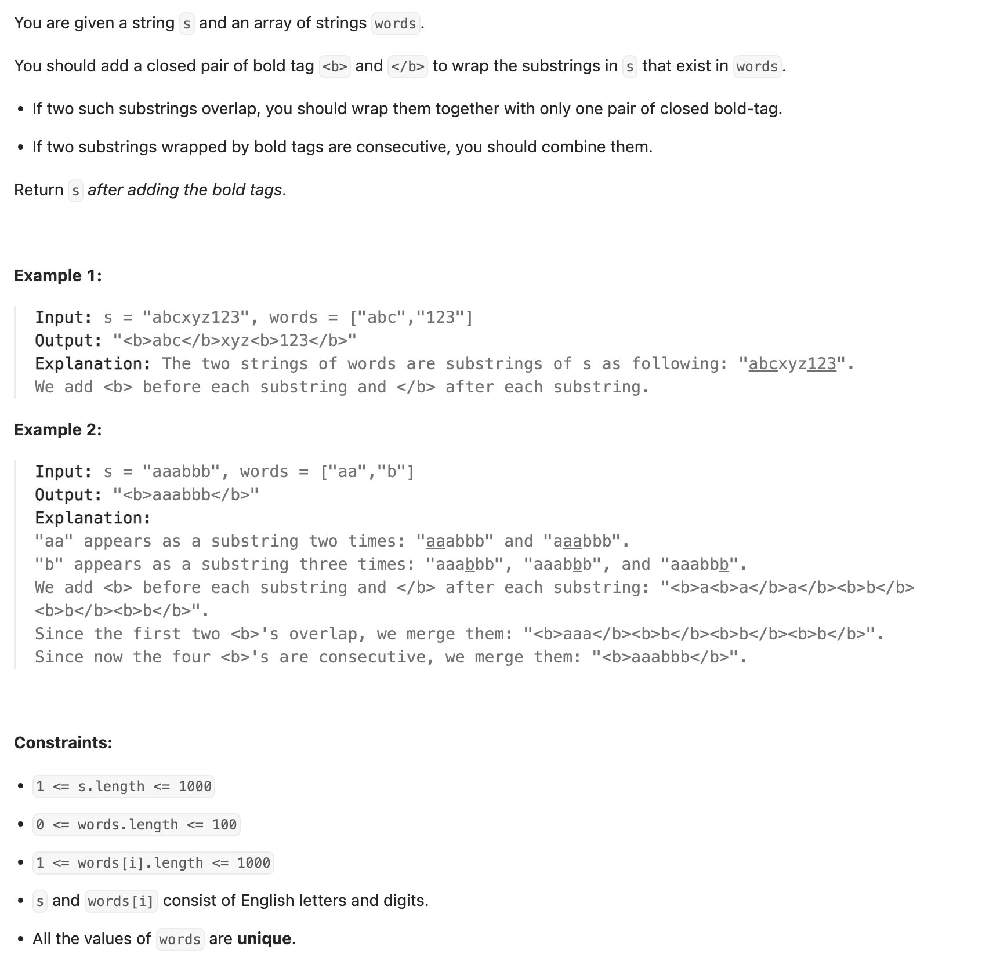
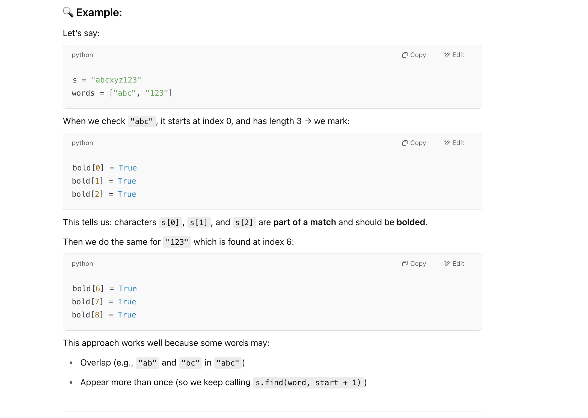

## 616. Add Bold Tag in String

---

- 本题可以依靠 debug 去阅读代码

- why set a **consecutive True‘s** of a word in **first while loop**?



- In the **second loop**, we build the final string by scanning **bold[]**. When we see a **True**, we know we are **inside a bold section** and keep 
  adding characters until it turns False, so we know **where to insert the closing </b> tag**.
- This way we don’t have to manage string indexes manually — we just scan the bold[] array and **group continuous True values into a bold block**.

---

```java
public class without_KMP {
    public String addBoldTag(String s, String[] words) {
        // bold[i] is true if s[i] is part of a word from the list
        boolean[] bold = new boolean[s.length()];

        for (String word : words) {
            // Find all occurrences of the current word in s
            int start = s.indexOf(word);
            while (start != -1) {
                // Mark all characters of the found occurrence as true in the bold array
                for (int i = start; i < start + word.length(); i++) {
                    bold[i] = true;
                }
                // Search for the next occurrence starting from the next position
                start = s.indexOf(word, start + 1);
            }
        }

        StringBuilder res = new StringBuilder();
        int i = 0;
        while (i < s.length()) {
            // If the current character should be bolded
            if (bold[i]) {
                // Append the opening bold tag
                res.append("<b>");
                // Append all consecutive characters that should be bolded
                while (i < s.length() && bold[i]) {
                    res.append(s.charAt(i));
                    i++;
                }
                // Append the closing bold tag
                res.append("</b>");
            } else {
                // if the current character should not be boled, just append it
                res.append(s.charAt(i));
                i++;
            }
        }

        return res.toString();
    }
}
```
---
```py
class Solution:
    def addBoldTag(self, s: str, words: List[str]) -> str:
        bold = [False] * len(s)

        for word in words:
            start = s.find(word)
            while start != -1:
                for i in range(start, start + len(word)):
                    bold[i] = True
                start = s.find(word, start + 1)

        res = []
        i = 0
        while i < len(s):
            if bold[i]:
                res.append("<b>")
                while i < len(s) and bold[i]:
                    res.append(s[i])
                    i += 1
                res.append("</b>")
            else:
                res.append(s[i])
                i += 1

        return ''.join(res)
```