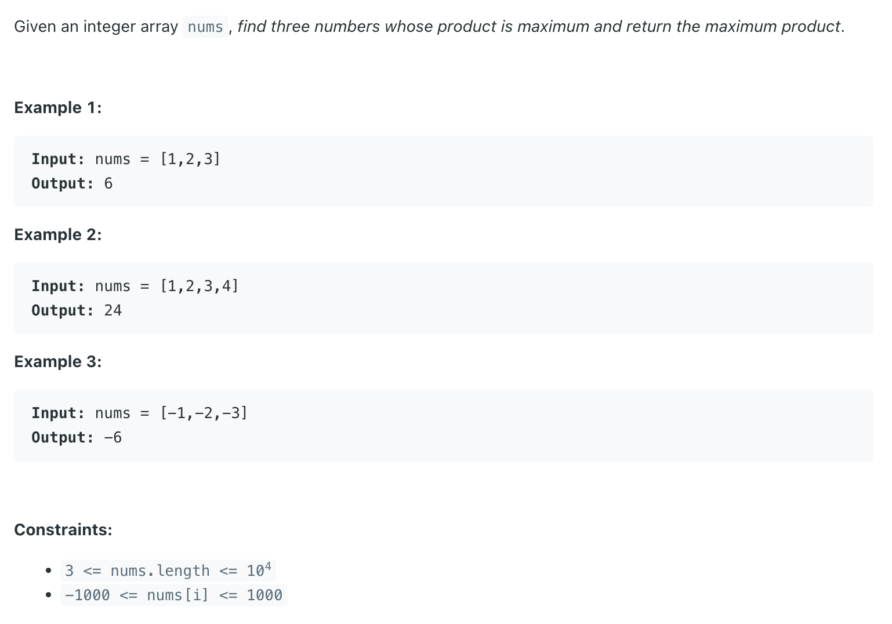

## 628. Maximum Product of Three Numbers

---

- **all scenarios** are listed as following:
- 3 positive -> 3 largest (+)
- 2 positive + 1 negative -> 1 largest (+) 2 smallest (-)
- 1 positive + 2 negative -> 1 largest (+) 2 smallest (-)
- 3 negative -> 3 largest (-)

---

```java
class _628_MaximumProduct_of_ThreeNumbers {
    public int maximumProduct(int[] nums) {
        int n = nums.length;
        Arrays.sort(nums);
        return Math.max(nums[n - 1] * nums[n - 2] * nums[n - 3], nums[0] * nums[1] * nums[n - 1]);
    }
}
```
---


#### Python

```py
class Solution:
    def maximumProduct(self, nums: List[int]) -> int:
        nums.sort()
        return max(nums[-1] * nums[-2] * nums[-3], nums[0] * nums[1] * nums[-1])

```
