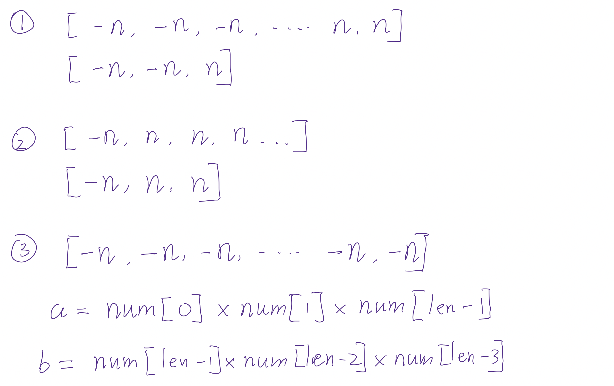

## 628. Maximum Product of Three Numbers

---




---

```java
class _628_MaximumProduct_of_ThreeNumbers {
    public int maximumProduct(int[] nums) {
        int n = nums.length;
        Arrays.sort(nums);
        int a = nums[0] * nums[1] * nums[n - 1];
        int b = nums[n - 1] * nums[n - 2] * nums[n - 3];
        return Math.max(a, b);
    }
}
```
---


#### Python

```py
class Solution:
    def maximumProduct(self, nums: List[int]) -> int:
        n = len(nums)
        nums.sort()
        a = nums[0] * nums[1] * nums[n - 1]
        b = nums[n - 1] * nums[n - 2] * nums[n - 3]
        return max(a, b)

```
